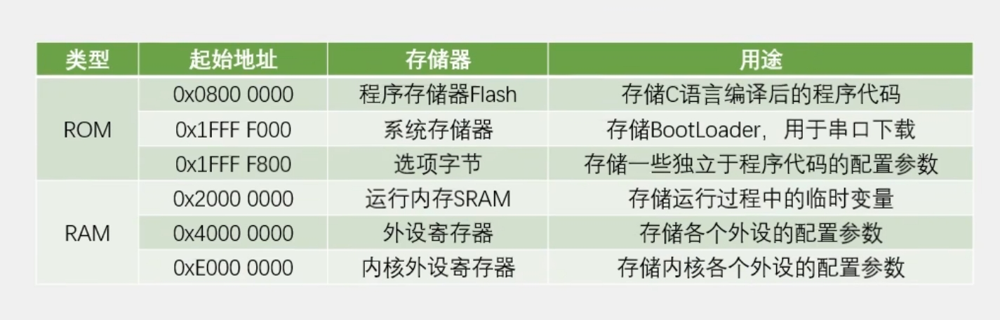
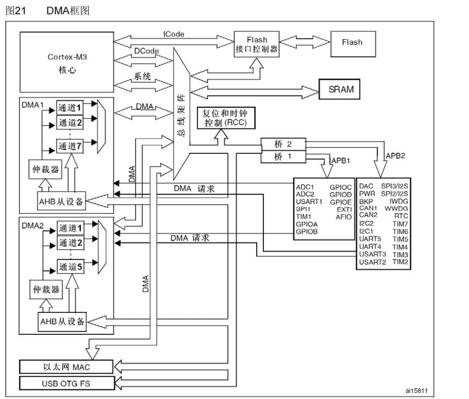
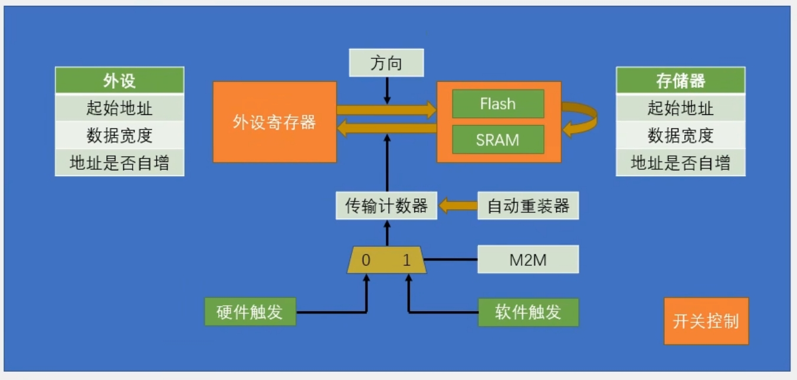
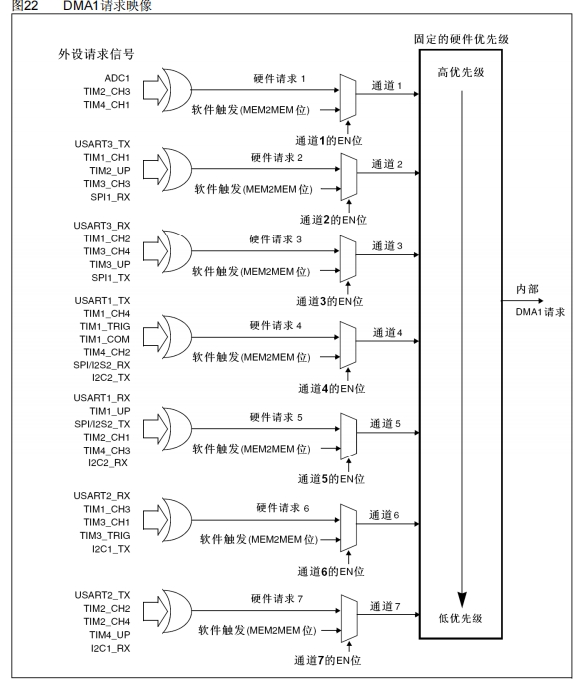
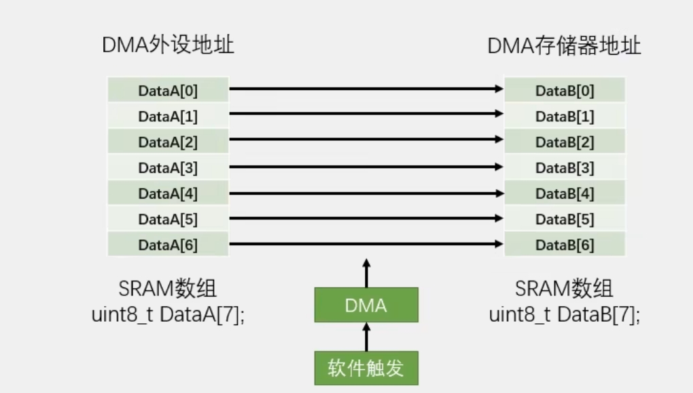
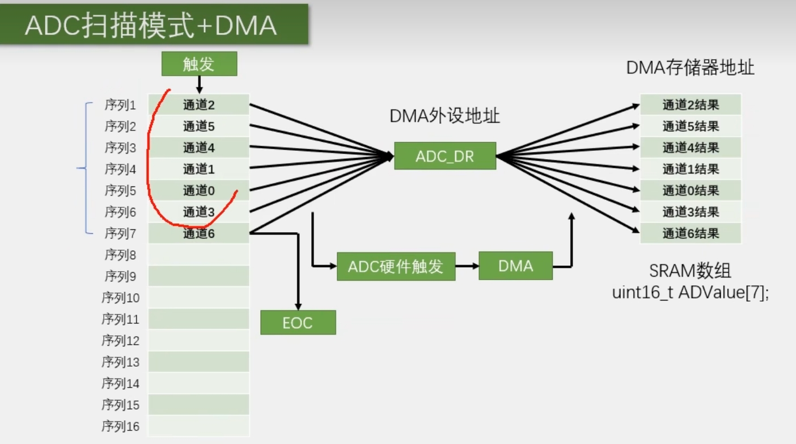

# ADC模数转化器

## ADC简介

ADC(Analog-Digital Converter)模拟-数字转换器

ADC可以将引脚上连续变化的模拟电压转换为内存中存储的数字量，建立模拟电路到数字电路的桥梁

12位逐次逼近型ADC，1us转换时间

输入电压范围:0~3.3V，转换结果范围:0~4095

18个输入通道，可测量16个外部和2个内部信号源（16个GPIO口，2个内部信号源是内部温度传感器（测量CPU的温度）和内部参考电压（一个1.2V左右的基准电压，不随外部供电电压变化而变化））

规则组和注入组两个转换单元

 模拟看门狗自动监测输入电压范围

STM32F103C8T6 ADC资源:ADC1、ADC2，10个外部输入通道

## 逐次逼近型ADC


### EOC（End of  Convert）

转化结束信号

### START

开始转换，给一个输入脉冲，开始转化

### CLOCK

ADC时钟

## ADC框图


### 规则通道

最多可以存16个通道，如果一次性输入16个通道，只能够识取第16个通道到寄存器，其他的会被覆盖，解决这个问题，需要配合DMA转运数据，一一将数据移出去

### 注入通道

最多可以存4个通道，有4个寄存器，转换出的数据不会被覆盖


EOC是规则组的完成信号，JEOC是注入组完成的信号

## ADC基本结构


### 输入通道


### 规则组

#### 单次转换-非扫描模式


#### 单次转换-扫描模式


#### 连续转换-非扫描模式


#### 连续转换-扫描模式


## 触发控制

### 规则通道的外部触发


### 注入通道的外部触发


## 数据对齐


## 转换时间

AD转换的步骤:采样，保持，量化,编码

STM32  ADC的总转换时间为：TcoNv=采样时间 +12.5个ADC周期

例如:当ADCCLK=14MHz，采样时间为1.5个ADC周期

TcoNv=1.5+12.5=14个ADC周期=1us

## 校准

ADC有一个内置自校准模式。校准可大幅减小因内部电容器组的变化而造成的准精度误差。校准期间，在每个电容器上都会计算出一个误差修正码(数字值)，这个码用于消除在随后的转换中每个电容器上产生的误差

建议在每次上电后执行一次校准

启动校准前，ADC必须处于关电状态超过至少两个ADC时钟周期

## 代码例程

### AD单通道

```c
#include "stm32f10x.h"                  // Device header

/**
  * 函    数：AD初始化
  * 参    数：无
  * 返 回 值：无
  */
void AD_Init(void)
{
	/*开启时钟*/
	RCC_APB2PeriphClockCmd(RCC_APB2Periph_ADC1, ENABLE);	//开启ADC1的时钟
	RCC_APB2PeriphClockCmd(RCC_APB2Periph_GPIOA, ENABLE);	//开启GPIOA的时钟
	
	/*设置ADC时钟*/
	RCC_ADCCLKConfig(RCC_PCLK2_Div6);						//选择时钟6分频，ADCCLK = 72MHz / 6 = 12MHz
	
	/*GPIO初始化*/
	GPIO_InitTypeDef GPIO_InitStructure;
	GPIO_InitStructure.GPIO_Mode = GPIO_Mode_AIN;//模拟输入模式，断开GPIO，防止对ADC的干扰，ADC的专属模式
	GPIO_InitStructure.GPIO_Pin = GPIO_Pin_0;
	GPIO_InitStructure.GPIO_Speed = GPIO_Speed_50MHz;
	GPIO_Init(GPIOA, &GPIO_InitStructure);					//将PA0引脚初始化为模拟输入
	
	/*规则组通道配置*/
	ADC_RegularChannelConfig(ADC1, ADC_Channel_0, 1, ADC_SampleTime_55Cycles5);		//规则组序列1的位置，配置为通道0    ADC_SampleTime_55Cycles5----->更快的转换就小一点的参数，更稳定就大一点的参数
	
	/*ADC初始化*/
	ADC_InitTypeDef ADC_InitStructure;						//定义结构体变量
	ADC_InitStructure.ADC_Mode = ADC_Mode_Independent;		//模式，选择独立模式，即单独使用ADC1
	ADC_InitStructure.ADC_DataAlign = ADC_DataAlign_Right;	//数据对齐，选择右对齐
	ADC_InitStructure.ADC_ExternalTrigConv = ADC_ExternalTrigConv_None;	//外部触发，使用软件触发，不需要外部触发
	ADC_InitStructure.ADC_ContinuousConvMode = DISABLE;		//连续转换，失能，每转换一次规则组序列后停止
	ADC_InitStructure.ADC_ScanConvMode = DISABLE;			//扫描模式，失能，只转换规则组的序列1这一个位置
	ADC_InitStructure.ADC_NbrOfChannel = 1;					//通道数，为1，仅在扫描模式下，才需要指定大于1的数，在非扫描模式下，只能是1
	ADC_Init(ADC1, &ADC_InitStructure);						//将结构体变量交给ADC_Init，配置ADC1
	
	/*ADC使能*/
	ADC_Cmd(ADC1, ENABLE);									//使能ADC1，ADC开始运行
	
	/*ADC校准*/
	ADC_ResetCalibration(ADC1);	///复位校准							//固定流程，内部有电路会自动执行校准
	while (ADC_GetResetCalibrationStatus(ADC1) == SET);//等待复位校准完成，硬件会自动清零  
	ADC_StartCalibration(ADC1);//开始校准
	while (ADC_GetCalibrationStatus(ADC1) == SET);//等待校准完成
}

/**
  * 函    数：获取AD转换的值
  * 参    数：无
  * 返 回 值：AD转换的值，范围：0~4095
  */
uint16_t AD_GetValue(void)
{
	ADC_SoftwareStartConvCmd(ADC1, ENABLE);					//软件触发AD转换一次
	while (ADC_GetFlagStatus(ADC1, ADC_FLAG_EOC) == RESET);	//等待EOC标志位，即等待AD转换结束
	return ADC_GetConversionValue(ADC1);					//读数据寄存器，得到AD转换的结果
}

```

### AD多通道

```c
#include "stm32f10x.h"                  // Device header

/**
  * 函    数：AD初始化
  * 参    数：无
  * 返 回 值：无
  */
void AD_Init(void)
{
	/*开启时钟*/
	RCC_APB2PeriphClockCmd(RCC_APB2Periph_ADC1, ENABLE);	//开启ADC1的时钟
	RCC_APB2PeriphClockCmd(RCC_APB2Periph_GPIOA, ENABLE);	//开启GPIOA的时钟
	
	/*设置ADC时钟*/
	RCC_ADCCLKConfig(RCC_PCLK2_Div6);						//选择时钟6分频，ADCCLK = 72MHz / 6 = 12MHz
	
	/*GPIO初始化*/
	GPIO_InitTypeDef GPIO_InitStructure;
	GPIO_InitStructure.GPIO_Mode = GPIO_Mode_AIN;
	GPIO_InitStructure.GPIO_Pin = GPIO_Pin_0 | GPIO_Pin_1 | GPIO_Pin_2 | GPIO_Pin_3;
	GPIO_InitStructure.GPIO_Speed = GPIO_Speed_50MHz;
	GPIO_Init(GPIOA, &GPIO_InitStructure);					//将PA0、PA1、PA2和PA3引脚初始化为模拟输入
	
	/*不在此处配置规则组序列，而是在每次AD转换前配置，这样可以灵活更改AD转换的通道*/
	
	/*ADC初始化*/
	ADC_InitTypeDef ADC_InitStructure;						//定义结构体变量
	ADC_InitStructure.ADC_Mode = ADC_Mode_Independent;		//模式，选择独立模式，即单独使用ADC1
	ADC_InitStructure.ADC_DataAlign = ADC_DataAlign_Right;	//数据对齐，选择右对齐
	ADC_InitStructure.ADC_ExternalTrigConv = ADC_ExternalTrigConv_None;	//外部触发，使用软件触发，不需要外部触发
	ADC_InitStructure.ADC_ContinuousConvMode = DISABLE;		//连续转换，失能，每转换一次规则组序列后停止
	ADC_InitStructure.ADC_ScanConvMode = DISABLE;			//扫描模式，失能，只转换规则组的序列1这一个位置
	ADC_InitStructure.ADC_NbrOfChannel = 1;					//通道数，为1，仅在扫描模式下，才需要指定大于1的数，在非扫描模式下，只能是1
	ADC_Init(ADC1, &ADC_InitStructure);						//将结构体变量交给ADC_Init，配置ADC1
	
	/*ADC使能*/
	ADC_Cmd(ADC1, ENABLE);									//使能ADC1，ADC开始运行
	
	/*ADC校准*/
	ADC_ResetCalibration(ADC1);								//固定流程，内部有电路会自动执行校准
	while (ADC_GetResetCalibrationStatus(ADC1) == SET);
	ADC_StartCalibration(ADC1);
	while (ADC_GetCalibrationStatus(ADC1) == SET);
}

/**
  * 函    数：获取AD转换的值
  * 参    数：ADC_Channel 指定AD转换的通道，范围：ADC_Channel_x，其中x可以是0/1/2/3
  * 返 回 值：AD转换的值，范围：0~4095
  */
uint16_t AD_GetValue(uint8_t ADC_Channel)
{
	ADC_RegularChannelConfig(ADC1, ADC_Channel, 1, ADC_SampleTime_55Cycles5);	//在每次转换前，根据函数形参灵活更改规则组的通道1
	ADC_SoftwareStartConvCmd(ADC1, ENABLE);					//软件触发AD转换一次
	while (ADC_GetFlagStatus(ADC1, ADC_FLAG_EOC) == RESET);	//等待EOC标志位，即等待AD转换结束
	return ADC_GetConversionValue(ADC1);					//读数据寄存器，得到AD转换的结果
}

```

# DMA简介

DMA(Direct Memory Access）直接存储器存取

DMA可以提供外设和存储器或者存储器和存储器之间的高速数据传输，无须CPU干预，节省了CPU的资源

12个独立可配置的通道:DMA1(7个通道)DMA2(5个通道)每个通道都支持软件触发和特定的硬件触发

STM32F103C8T6 DMA资源:DMA1(7个通道)

## 存储器映像



RAM随机存储器，ROM只读存储器

## DMA框图



## DMA基本结构



### 传输计数器

相当于自减计数器，比如你给它写一个5，那DMA就只能进行5次数据转运，每转运一次，计数器的数就会减一，当传输计数器减到0之后，DMA就不会再进行数据转运了

### 重装计数器

如果不使用自动重装器，那转运5次后，DMA就结束了,如果使用自动重装器，那转运5次,计数器减到0后，就会立即重装到初始值5,如果不重装，就是单次模式

## DMA请求



通道数越小，优先级越高

## 数据转运+DMA



## ADC扫描模式+DMA



## 代码例程

### DMA数据转运

#### MyDMA模块

```c
#include "stm32f10x.h"                  // Device header

uint16_t MyDMA_Size;					//定义全局变量，用于记住Init函数的Size，供Transfer函数使用

/**
  * 函    数：DMA初始化
  * 参    数：AddrA 原数组的首地址
  * 参    数：AddrB 目的数组的首地址
  * 参    数：Size 转运的数据大小（转运次数）
  * 返 回 值：无
  */
void MyDMA_Init(uint32_t AddrA, uint32_t AddrB, uint16_t Size)
{
	MyDMA_Size = Size;					//将Size写入到全局变量，记住参数Size
	
	/*开启时钟*/
	RCC_AHBPeriphClockCmd(RCC_AHBPeriph_DMA1, ENABLE);						//开启DMA的时钟
	
	/*DMA初始化*/
	DMA_InitTypeDef DMA_InitStructure;										//定义结构体变量
	DMA_InitStructure.DMA_PeripheralBaseAddr = AddrA;						//外设基地址，给定形参AddrA
	DMA_InitStructure.DMA_PeripheralDataSize = DMA_PeripheralDataSize_Byte;	//外设数据宽度，选择字节
	DMA_InitStructure.DMA_PeripheralInc = DMA_PeripheralInc_Enable;			//外设地址自增，选择使能
	DMA_InitStructure.DMA_MemoryBaseAddr = AddrB;							//存储器基地址，给定形参AddrB
	DMA_InitStructure.DMA_MemoryDataSize = DMA_MemoryDataSize_Byte;			//存储器数据宽度，选择字节
	DMA_InitStructure.DMA_MemoryInc = DMA_MemoryInc_Enable;					//存储器地址自增，选择使能
	DMA_InitStructure.DMA_DIR = DMA_DIR_PeripheralSRC;						//数据传输方向，选择由外设到存储器
	DMA_InitStructure.DMA_BufferSize = Size;								//转运的数据大小（转运次数）
	DMA_InitStructure.DMA_Mode = DMA_Mode_Normal;							//模式，选择正常模式，是否选择重装模式（自动重装和软件触发不可以同时进行）
	DMA_InitStructure.DMA_M2M = DMA_M2M_Enable;								//存储器到存储器，选择使能，选择硬件触发还是软件触发
	DMA_InitStructure.DMA_Priority = DMA_Priority_Medium;					//优先级，选择中等
	DMA_Init(DMA1_Channel1, &DMA_InitStructure);							//将结构体变量交给DMA_Init，配置DMA1的通道1
	
	/*DMA使能*/
	DMA_Cmd(DMA1_Channel1, DISABLE);	//这里先不给使能，初始化后不会立刻工作，等后续调用Transfer后，再开始
}

/**
  * 函    数：启动DMA数据转运
  * 参    数：无
  * 返 回 值：无
  */
void MyDMA_Transfer(void)
{
	DMA_Cmd(DMA1_Channel1, DISABLE);					//DMA失能，在写入传输计数器之前，需要DMA暂停工作
	DMA_SetCurrDataCounter(DMA1_Channel1, MyDMA_Size);	//写入传输计数器，指定将要转运的次数
	DMA_Cmd(DMA1_Channel1, ENABLE);						//DMA使能，开始工作
	
	while (DMA_GetFlagStatus(DMA1_FLAG_TC1) == RESET);	//等待DMA工作完成
	DMA_ClearFlag(DMA1_FLAG_TC1);						//清除工作完成标志位
}

```

#### main模块

```c
#include "stm32f10x.h"                  // Device header
#include "Delay.h"
#include "OLED.h"
#include "MyDMA.h"

uint8_t DataA[] = {0x01, 0x02, 0x03, 0x04};				//定义测试数组DataA，为数据源
uint8_t DataB[] = {0, 0, 0, 0};							//定义测试数组DataB，为数据目的地

int main(void)
{
	/*模块初始化*/
	OLED_Init();				//OLED初始化
	
	MyDMA_Init((uint32_t)DataA, (uint32_t)DataB, 4);	//DMA初始化，把源数组和目的数组的地址传入
	
	/*显示静态字符串*/
	OLED_ShowString(1, 1, "DataA");
	OLED_ShowString(3, 1, "DataB");
	
	/*显示数组的首地址*/
	OLED_ShowHexNum(1, 8, (uint32_t)DataA, 8);
	OLED_ShowHexNum(3, 8, (uint32_t)DataB, 8);
		
	while (1)
	{
		DataA[0] ++;		//变换测试数据
		DataA[1] ++;
		DataA[2] ++;
		DataA[3] ++;
		
		OLED_ShowHexNum(2, 1, DataA[0], 2);		//显示数组DataA
		OLED_ShowHexNum(2, 4, DataA[1], 2);
		OLED_ShowHexNum(2, 7, DataA[2], 2);
		OLED_ShowHexNum(2, 10, DataA[3], 2);
		OLED_ShowHexNum(4, 1, DataB[0], 2);		//显示数组DataB
		OLED_ShowHexNum(4, 4, DataB[1], 2);
		OLED_ShowHexNum(4, 7, DataB[2], 2);
		OLED_ShowHexNum(4, 10, DataB[3], 2);
		
		Delay_ms(1000);		//延时1s，观察转运前的现象
		
		MyDMA_Transfer();	//使用DMA转运数组，从DataA转运到DataB
		
		OLED_ShowHexNum(2, 1, DataA[0], 2);		//显示数组DataA
		OLED_ShowHexNum(2, 4, DataA[1], 2);
		OLED_ShowHexNum(2, 7, DataA[2], 2);
		OLED_ShowHexNum(2, 10, DataA[3], 2);
		OLED_ShowHexNum(4, 1, DataB[0], 2);		//显示数组DataB
		OLED_ShowHexNum(4, 4, DataB[1], 2);
		OLED_ShowHexNum(4, 7, DataB[2], 2);
		OLED_ShowHexNum(4, 10, DataB[3], 2);

		Delay_ms(1000);		//延时1s，观察转运后的现象
	}
}

```


### DMA+AD多通道

#### AD模块

```c
#include "stm32f10x.h"                  // Device header

uint16_t AD_Value[4];					//定义用于存放AD转换结果的全局数组

/**
  * 函    数：AD初始化
  * 参    数：无
  * 返 回 值：无
  */
void AD_Init(void)
{
	/*开启时钟*/
	RCC_APB2PeriphClockCmd(RCC_APB2Periph_ADC1, ENABLE);	//开启ADC1的时钟
	RCC_APB2PeriphClockCmd(RCC_APB2Periph_GPIOA, ENABLE);	//开启GPIOA的时钟
	RCC_AHBPeriphClockCmd(RCC_AHBPeriph_DMA1, ENABLE);		//开启DMA1的时钟
	
	/*设置ADC时钟*/
	RCC_ADCCLKConfig(RCC_PCLK2_Div6);						//选择时钟6分频，ADCCLK = 72MHz / 6 = 12MHz
	
	/*GPIO初始化*/
	GPIO_InitTypeDef GPIO_InitStructure;
	GPIO_InitStructure.GPIO_Mode = GPIO_Mode_AIN;
	GPIO_InitStructure.GPIO_Pin = GPIO_Pin_0 | GPIO_Pin_1 | GPIO_Pin_2 | GPIO_Pin_3;
	GPIO_InitStructure.GPIO_Speed = GPIO_Speed_50MHz;
	GPIO_Init(GPIOA, &GPIO_InitStructure);					//将PA0、PA1、PA2和PA3引脚初始化为模拟输入
	
	/*规则组通道配置*/
	ADC_RegularChannelConfig(ADC1, ADC_Channel_0, 1, ADC_SampleTime_55Cycles5);	//规则组序列1的位置，配置为通道0
	ADC_RegularChannelConfig(ADC1, ADC_Channel_1, 2, ADC_SampleTime_55Cycles5);	//规则组序列2的位置，配置为通道1
	ADC_RegularChannelConfig(ADC1, ADC_Channel_2, 3, ADC_SampleTime_55Cycles5);	//规则组序列3的位置，配置为通道2
	ADC_RegularChannelConfig(ADC1, ADC_Channel_3, 4, ADC_SampleTime_55Cycles5);	//规则组序列4的位置，配置为通道3
	
	/*ADC初始化*/
	ADC_InitTypeDef ADC_InitStructure;											//定义结构体变量
	ADC_InitStructure.ADC_Mode = ADC_Mode_Independent;							//模式，选择独立模式，即单独使用ADC1
	ADC_InitStructure.ADC_DataAlign = ADC_DataAlign_Right;						//数据对齐，选择右对齐
	ADC_InitStructure.ADC_ExternalTrigConv = ADC_ExternalTrigConv_None;			//外部触发，使用软件触发，不需要外部触发
	ADC_InitStructure.ADC_ContinuousConvMode = ENABLE;							//连续转换，使能，每转换一次规则组序列后立刻开始下一次转换
	ADC_InitStructure.ADC_ScanConvMode = ENABLE;								//扫描模式，使能，扫描规则组的序列，扫描数量由ADC_NbrOfChannel确定
	ADC_InitStructure.ADC_NbrOfChannel = 4;										//通道数，为4，扫描规则组的前4个通道
	ADC_Init(ADC1, &ADC_InitStructure);											//将结构体变量交给ADC_Init，配置ADC1
	
	/*DMA初始化*/
	DMA_InitTypeDef DMA_InitStructure;											//定义结构体变量
	DMA_InitStructure.DMA_PeripheralBaseAddr = (uint32_t)&ADC1->DR;				//外设基地址，给定形参AddrA
	DMA_InitStructure.DMA_PeripheralDataSize = DMA_PeripheralDataSize_HalfWord;	//外设数据宽度，选择半字，对应16为的ADC数据寄存器
	DMA_InitStructure.DMA_PeripheralInc = DMA_PeripheralInc_Disable;			//外设地址自增，选择失能，始终以ADC数据寄存器为源
	DMA_InitStructure.DMA_MemoryBaseAddr = (uint32_t)AD_Value;					//存储器基地址，给定存放AD转换结果的全局数组AD_Value
	DMA_InitStructure.DMA_MemoryDataSize = DMA_MemoryDataSize_HalfWord;			//存储器数据宽度，选择半字，与源数据宽度对应
	DMA_InitStructure.DMA_MemoryInc = DMA_MemoryInc_Enable;						//存储器地址自增，选择使能，每次转运后，数组移到下一个位置
	DMA_InitStructure.DMA_DIR = DMA_DIR_PeripheralSRC;							//数据传输方向，选择由外设到存储器，ADC数据寄存器转到数组
	DMA_InitStructure.DMA_BufferSize = 4;										//转运的数据大小（转运次数），与ADC通道数一致
	DMA_InitStructure.DMA_Mode = DMA_Mode_Circular;								//模式，选择循环模式，与ADC的连续转换一致
	DMA_InitStructure.DMA_M2M = DMA_M2M_Disable;								//存储器到存储器，选择失能，数据由ADC外设触发转运到存储器
	DMA_InitStructure.DMA_Priority = DMA_Priority_Medium;						//优先级，选择中等
	DMA_Init(DMA1_Channel1, &DMA_InitStructure);								//将结构体变量交给DMA_Init，配置DMA1的通道1
	
	/*DMA和ADC使能*/
	DMA_Cmd(DMA1_Channel1, ENABLE);							//DMA1的通道1使能
	ADC_DMACmd(ADC1, ENABLE);								//ADC1触发DMA1的信号使能
	ADC_Cmd(ADC1, ENABLE);									//ADC1使能
	
	/*ADC校准*/
	ADC_ResetCalibration(ADC1);								//固定流程，内部有电路会自动执行校准
	while (ADC_GetResetCalibrationStatus(ADC1) == SET);
	ADC_StartCalibration(ADC1);
	while (ADC_GetCalibrationStatus(ADC1) == SET);
	
	/*ADC触发*/
	ADC_SoftwareStartConvCmd(ADC1, ENABLE);	//软件触发ADC开始工作，由于ADC处于连续转换模式，故触发一次后ADC就可以一直连续不断地工作
}

```

