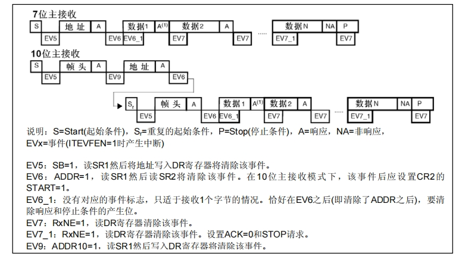

# I2C通信

12C总线(InterIC BUS)是由Philips公司开发的一种通用数据总线

两根通信线:SCL(Serial Clock)、SDA(Serial Data）

同步，半双工

带数据应答

支持总线挂载多设备(一主多从、多主多从)

## 硬件电路

所有I2C设备的SCL连在一起，SDA连在一起

设备的SCL和SDA均要配置成开漏输出模式

SCL和SDA各添加一个上拉电阻，阻值一般为4.7K左右


## I2C时序基本单元


当SCL处于高电平期间，SDA不允许发生变化，如果SDA在SCL高电平期间发生了变化，就相当于发送了终止信号或者开始信号，所以每个时序单元的SCL都是以低电平开始，低电平结束。

起始和终止都是由主机产生的，从机不允许产生。

### 发送一个字节

SCL低电平期间，主机将数据位依次放到SDA线上(高位先行)，然后释放SCL，从机将在SCL高电平期间读取数据位所以SCL高电平期间SDA不允许有数据变化，依次循环上述过程8次即可发送一个字节

```c
void MyI2C_SendByte(uint8_t Byte)
{
	uint8_t i;
	for (i = 0; i < 8; i ++)				//循环8次，主机依次发送数据的每一位
	{
		/*两个!可以对数据进行两次逻辑取反，作用是把非0值统一转换为1，即：!!(0) = 0，!!(非0) = 1*/
		MyI2C_W_SDA(!!(Byte & (0x80 >> i)));//使用掩码的方式取出Byte的指定一位数据并写入到SDA线
		MyI2C_W_SCL(1);						//释放SCL，从机在SCL高电平期间读取SDA
		MyI2C_W_SCL(0);						//拉低SCL，主机开始发送下一位数据
	}
}
```


### 接收一个字节

SCL低电平期间，从机将数据位依次放到SDA线上(高位先行)，然后释放SCL，主机将在SCL高电平期间读取数据位，所以SCL高电平期间SDA不允许有数据变化，依次循环上述过程8次即可接收一个字节(主机在接收之前，需要释放SDA（置高电平）)

```c
uint8_t MyI2C_ReceiveByte(void)
{
	uint8_t i, Byte = 0x00;					//定义接收的数据，并赋初值0x00，此处必须赋初值0x00，后面会用到
	MyI2C_W_SDA(1);							//接收前，主机先确保释放SDA，避免干扰从机的数据发送
	for (i = 0; i < 8; i ++)				//循环8次，主机依次接收数据的每一位
	{
		MyI2C_W_SCL(1);						//释放SCL，主机机在SCL高电平期间读取SDA
		if (MyI2C_R_SDA()){Byte |= (0x80 >> i);}	//读取SDA数据，并存储到Byte变量
													//当SDA为1时，置变量指定位为1，当SDA为0时，不做处理，指定位为默认的初值0
		MyI2C_W_SCL(0);						//拉低SCL，从机在SCL低电平期间写入SDA
	}
	return Byte;							//返回接收到的一个字节数据
}
```


### 发送应答

主机在接收完一个字节之后，在下一个时钟发送一位数据，数据0表示应答，数据1表示非应答

```c
void MyI2C_SendAck(uint8_t AckBit)
{
	MyI2C_W_SDA(AckBit);					//主机把应答位数据放到SDA线
	MyI2C_W_SCL(1);							//释放SCL，从机在SCL高电平期间，读取应答位
	MyI2C_W_SCL(0);							//拉低SCL，开始下一个时序模块
}
```


### 接收应答

主机在发送完一个字节之后，在下一个时钟接收一位数据，判断从机是否应答，数据0表示应答，数据1表示非应答(主机在接收之前，需要释放SDA)

```c
uint8_t MyI2C_ReceiveAck(void)
{
	uint8_t AckBit;							//定义应答位变量
	MyI2C_W_SDA(1);							//接收前，主机先确保释放SDA，避免干扰从机的数据发送
	MyI2C_W_SCL(1);							//释放SCL，主机机在SCL高电平期间读取SDA
	AckBit = MyI2C_R_SDA();					//将应答位存储到变量里
	MyI2C_W_SCL(0);							//拉低SCL，开始下一个时序模块
	return AckBit;							//返回定义应答位变量
}
```


### 指定地址写

对于指定设备(Slave Address)，在指定地址(Reg Address------>寄存器地址)下，写入指定数据(Data)


七位从机地址+最后一位读写位----->0表示写入操作，1表示读取操作

在应答位的时候，主机要释放SDA拉高，但是此时SDA也被从机拽住了，所以主机松手后，SDA并没有回弹到高电平，这个过程就代表从机产生了应答，最终在高电平期间，主机读取到是0，就说明有应答。在应答位之后，从机会释放SDA，交出SDA的控制权， SCL时钟线始终由主机控制。

### 指定地址读

对于指定设备(Slave Address），在指定地址(Reg Address)下，读取从机数据(Data)


这个Sr(Start Repeat)的意思就是重复起始条件，相当于另起一个时序

如果主机想连续读取多个字节，就需要在最后一个字节给非应答，之前的都要给应答，主机给非应答了，从机就不会再发了，交出SDA的控制权，从机控制SDA发送一个字节的权利，开始为读写位为1，结束于主机给应答为1 

### 当前地址读

对于指定设备(Slave Address)，在当前地址指针指示的地址下，读取从机数据(Data)

在从机中，所有的寄存器都被分配到了一个线性区域中，会有一个单独的指针变量，指示着其中一个寄存器，这个指针上电默认，一般指向0地址


发送完地址字节之后，主机要把SDA的控制权交给从机，主机调用接收一个字节的时序，进行接收操作，然后可以在SCL低电平期间写入SDA，主机在高电平期间读取SDA

# MPU6050简介

MPU6050是一个6轴姿态传感器，可以测量芯片自身X、Y、Z轴的加速度、角速度参数，通过数据融合，可进一步得到姿态角，常应用于平衡车、飞行器等需要检测自身姿态的场景

3轴加速度计(Accelerometer):测量X、Y、Z轴的加速度

3轴陀螺仪传感器(Gyroscope):测量X、Y、Z轴的角速度


## 参数

16位ADC采集传感器的模拟信号，量化范围:-32768~32767

加速度计满量程选择:±2、±4、±8、±16(g)

陀螺仪满量程选择:±250、+500、±1000、+2000(°/sec)

可配置的数字低通滤波器

可配置的时钟源可配置的采样分频

I2C从机地址:1101000------->0x68 (AD0=0)    所以0xD0是融合了写操作

​                      1101001(AD0=1)

## 硬件电路


XCL、XDA可以再连接其他外设，比如气压传感器，磁场传感器，

## MPU6050框图


每个传感器都有一个自测单元（self test ）

芯片上电之后默认是睡眠模式，写入寄存器数据是没用的，需要先解除

### 中断状态寄存器

interrupt status regiser,可以控制内部的哪些事件到中断引脚的输出

### 先入先出寄存器

FIFO ，可以对数据流进行缓存，

### 配置寄存器

config regiser,对内部的各个电路进行配置

### 传感器寄存器

Sensor regiser,也是数据寄存器，存储各个传感器的数据

### 工厂校准

factory  calibratior,对内部的传感器都进行校准

# 软件I2C读写MPU6050

## 代码例程

### I2C模块

```c
#include "stm32f10x.h"                  // Device header
#include "Delay.h"

/*引脚配置层*/

/**
  * 函    数：I2C写SCL引脚电平
  * 参    数：BitValue 协议层传入的当前需要写入SCL的电平，范围0~1
  * 返 回 值：无
  * 注意事项：此函数需要用户实现内容，当BitValue为0时，需要置SCL为低电平，当BitValue为1时，需要置SCL为高电平
  */
void MyI2C_W_SCL(uint8_t BitValue)
{
	GPIO_WriteBit(GPIOB, GPIO_Pin_10, (BitAction)BitValue);		//根据BitValue，设置SCL引脚的电平
	Delay_us(10);												//延时10us，防止时序频率超过要求
}

/**
  * 函    数：I2C写SDA引脚电平
  * 参    数：BitValue 协议层传入的当前需要写入SDA的电平，范围0~1
  * 返 回 值：无
  * 注意事项：此函数需要用户实现内容，当BitValue为0时，需要置SDA为低电平，当BitValue为1时，需要置SDA为高电平
  */
void MyI2C_W_SDA(uint8_t BitValue)
{
	GPIO_WriteBit(GPIOB, GPIO_Pin_11, (BitAction)BitValue);		//根据BitValue，设置SDA引脚的电平，BitValue要实现非0即1的特性
	Delay_us(10);												//延时10us，防止时序频率超过要求
}

/**
  * 函    数：I2C读SDA引脚电平
  * 参    数：无
  * 返 回 值：协议层需要得到的当前SDA的电平，范围0~1
  * 注意事项：此函数需要用户实现内容，当前SDA为低电平时，返回0，当前SDA为高电平时，返回1
  */
uint8_t MyI2C_R_SDA(void)
{
	uint8_t BitValue;
	BitValue = GPIO_ReadInputDataBit(GPIOB, GPIO_Pin_11);		//读取SDA电平
	Delay_us(10);												//延时10us，防止时序频率超过要求
	return BitValue;											//返回SDA电平
}

/**
  * 函    数：I2C初始化
  * 参    数：无
  * 返 回 值：无
  * 注意事项：此函数需要用户实现内容，实现SCL和SDA引脚的初始化
  */
void MyI2C_Init(void)
{
	/*开启时钟*/
	RCC_APB2PeriphClockCmd(RCC_APB2Periph_GPIOB, ENABLE);	//开启GPIOB的时钟
	
	/*GPIO初始化*/
	GPIO_InitTypeDef GPIO_InitStructure;
	GPIO_InitStructure.GPIO_Mode = GPIO_Mode_Out_OD;
	GPIO_InitStructure.GPIO_Pin = GPIO_Pin_10 | GPIO_Pin_11;
	GPIO_InitStructure.GPIO_Speed = GPIO_Speed_50MHz;
	GPIO_Init(GPIOB, &GPIO_InitStructure);					//将PB10和PB11引脚初始化为开漏输出
	
	/*设置默认电平*/
	GPIO_SetBits(GPIOB, GPIO_Pin_10 | GPIO_Pin_11);			//设置PB10和PB11引脚初始化后默认为高电平（释放总线状态）
}

/*协议层*/

/**
  * 函    数：I2C起始
  * 参    数：无
  * 返 回 值：无
  */
void MyI2C_Start(void)
{
	MyI2C_W_SDA(1);							//释放SDA，确保SDA为高电平
	MyI2C_W_SCL(1);							//释放SCL，确保SCL为高电平
	MyI2C_W_SDA(0);							//在SCL高电平期间，拉低SDA，产生起始信号
	MyI2C_W_SCL(0);							//起始后把SCL也拉低，即为了占用总线，也为了方便总线时序的拼接
}

/**
  * 函    数：I2C终止
  * 参    数：无
  * 返 回 值：无
  */
void MyI2C_Stop(void)
{
	MyI2C_W_SDA(0);							//拉低SDA，确保SDA为低电平
	MyI2C_W_SCL(1);							//释放SCL，使SCL呈现高电平
	MyI2C_W_SDA(1);							//在SCL高电平期间，释放SDA，产生终止信号
}

/**
  * 函    数：I2C发送一个字节
  * 参    数：Byte 要发送的一个字节数据，范围：0x00~0xFF
  * 返 回 值：无
  */
void MyI2C_SendByte(uint8_t Byte)
{
	uint8_t i;
	for (i = 0; i < 8; i ++)				//循环8次，主机依次发送数据的每一位
	{
		/*两个!可以对数据进行两次逻辑取反，作用是把非0值统一转换为1，即：!!(0) = 0，!!(非0) = 1*/
		MyI2C_W_SDA(!!(Byte & (0x80 >> i)));//使用掩码的方式取出Byte的指定一位数据并写入到SDA线
		MyI2C_W_SCL(1);						//释放SCL，从机在SCL高电平期间读取SDA
		MyI2C_W_SCL(0);						//拉低SCL，主机开始发送下一位数据
	}
}

/**
  * 函    数：I2C接收一个字节
  * 参    数：无
  * 返 回 值：接收到的一个字节数据，范围：0x00~0xFF
  */
uint8_t MyI2C_ReceiveByte(void)
{
	uint8_t i, Byte = 0x00;					//定义接收的数据，并赋初值0x00，此处必须赋初值0x00，后面会用到
	MyI2C_W_SDA(1);							//接收前，主机先确保释放SDA，避免干扰从机的数据发送
	for (i = 0; i < 8; i ++)				//循环8次，主机依次接收数据的每一位
	{
		MyI2C_W_SCL(1);						//释放SCL，主机机在SCL高电平期间读取SDA
		if (MyI2C_R_SDA()){Byte |= (0x80 >> i);}	//读取SDA数据，并存储到Byte变量
													//当SDA为1时，置变量指定位为1，当SDA为0时，不做处理，指定位为默认的初值0
		MyI2C_W_SCL(0);						//拉低SCL，从机在SCL低电平期间写入SDA
	}
	return Byte;							//返回接收到的一个字节数据
}

/**
  * 函    数：I2C发送应答位
  * 参    数：Byte 要发送的应答位，范围：0~1，0表示应答，1表示非应答
  * 返 回 值：无
  */
void MyI2C_SendAck(uint8_t AckBit)
{
	MyI2C_W_SDA(AckBit);					//主机把应答位数据放到SDA线
	MyI2C_W_SCL(1);							//释放SCL，从机在SCL高电平期间，读取应答位
	MyI2C_W_SCL(0);							//拉低SCL，开始下一个时序模块
}

/**
  * 函    数：I2C接收应答位
  * 参    数：无
  * 返 回 值：接收到的应答位，范围：0~1，0表示应答，1表示非应答
  */
uint8_t MyI2C_ReceiveAck(void)
{
	uint8_t AckBit;							//定义应答位变量
	MyI2C_W_SDA(1);							//接收前，主机先确保释放SDA，避免干扰从机的数据发送
	MyI2C_W_SCL(1);							//释放SCL，主机机在SCL高电平期间读取SDA
	AckBit = MyI2C_R_SDA();					//将应答位存储到变量里
	MyI2C_W_SCL(0);							//拉低SCL，开始下一个时序模块
	return AckBit;							//返回定义应答位变量
}

```


### MPU6050

```c
#include "stm32f10x.h"                  // Device header
#include "MyI2C.h"
#include "MPU6050_Reg.h"

#define MPU6050_ADDRESS		0xD0		//MPU6050的I2C从机地址

/**
  * 函    数：MPU6050写寄存器
  * 参    数：RegAddress 寄存器地址，范围：参考MPU6050手册的寄存器描述
  * 参    数：Data 要写入寄存器的数据，范围：0x00~0xFF
  * 返 回 值：无
  */
void MPU6050_WriteReg(uint8_t RegAddress, uint8_t Data)
{
	MyI2C_Start();						//I2C起始
	MyI2C_SendByte(MPU6050_ADDRESS);	//发送从机地址，读写位为0，表示即将写入
	MyI2C_ReceiveAck();					//接收应答
	MyI2C_SendByte(RegAddress);			//发送寄存器地址
	MyI2C_ReceiveAck();					//接收应答
	MyI2C_SendByte(Data);				//发送要写入寄存器的数据
	MyI2C_ReceiveAck();					//接收应答
	MyI2C_Stop();						//I2C终止
}

/**
  * 函    数：MPU6050读寄存器
  * 参    数：RegAddress 寄存器地址，范围：参考MPU6050手册的寄存器描述
  * 返 回 值：读取寄存器的数据，范围：0x00~0xFF
  */
uint8_t MPU6050_ReadReg(uint8_t RegAddress)
{
	uint8_t Data;
	
	MyI2C_Start();						//I2C起始
	MyI2C_SendByte(MPU6050_ADDRESS);	//发送从机地址，读写位为0，表示即将写入
	MyI2C_ReceiveAck();					//接收应答
	MyI2C_SendByte(RegAddress);			//发送寄存器地址
	MyI2C_ReceiveAck();					//接收应答
	
	MyI2C_Start();						//I2C重复起始
	MyI2C_SendByte(MPU6050_ADDRESS | 0x01);	//发送从机地址，读写位为1，表示即将读取
	MyI2C_ReceiveAck();					//接收应答
	Data = MyI2C_ReceiveByte();			//接收指定寄存器的数据
	MyI2C_SendAck(1);					//发送应答，给从机非应答，终止从机的数据输出
	MyI2C_Stop();						//I2C终止
	
	return Data;
}

/**
  * 函    数：MPU6050初始化
  * 参    数：无
  * 返 回 值：无
  */
void MPU6050_Init(void)
{
	MyI2C_Init();									//先初始化底层的I2C
	
	/*MPU6050寄存器初始化，需要对照MPU6050手册的寄存器描述配置，此处仅配置了部分重要的寄存器*/
	MPU6050_WriteReg(MPU6050_PWR_MGMT_1, 0x01);		//电源管理寄存器1，取消睡眠模式，选择时钟源为X轴陀螺仪
	MPU6050_WriteReg(MPU6050_PWR_MGMT_2, 0x00);		//电源管理寄存器2，保持默认值0，所有轴均不待机
	MPU6050_WriteReg(MPU6050_SMPLRT_DIV, 0x09);	//十分频	//采样率分频寄存器，配置采样率，决定了数据输出的快慢，值越小越快
	MPU6050_WriteReg(MPU6050_CONFIG, 0x06);			//配置寄存器，配置DLPF
	MPU6050_WriteReg(MPU6050_GYRO_CONFIG, 0x18);	//陀螺仪配置寄存器，选择满量程为±2000°/s
	MPU6050_WriteReg(MPU6050_ACCEL_CONFIG, 0x18);	//加速度计配置寄存器，选择满量程为±16g
}

/**
  * 函    数：MPU6050获取ID号
  * 参    数：无
  * 返 回 值：MPU6050的ID号
  */
uint8_t MPU6050_GetID(void)
{
	return MPU6050_ReadReg(MPU6050_WHO_AM_I);		//返回WHO_AM_I寄存器的值
}

/**
  * 函    数：MPU6050获取数据
  * 参    数：AccX AccY AccZ 加速度计X、Y、Z轴的数据，使用输出参数的形式返回，范围：-32768~32767
  * 参    数：GyroX GyroY GyroZ 陀螺仪X、Y、Z轴的数据，使用输出参数的形式返回，范围：-32768~32767
  * 返 回 值：无
  */
void MPU6050_GetData(int16_t *AccX, int16_t *AccY, int16_t *AccZ, 
						int16_t *GyroX, int16_t *GyroY, int16_t *GyroZ)
{
	uint8_t DataH, DataL;								//定义数据高8位和低8位的变量
	
	DataH = MPU6050_ReadReg(MPU6050_ACCEL_XOUT_H);		//读取加速度计X轴的高8位数据
	DataL = MPU6050_ReadReg(MPU6050_ACCEL_XOUT_L);		//读取加速度计X轴的低8位数据
	*AccX = (DataH << 8) | DataL;						//数据拼接，通过输出参数返回
	
	DataH = MPU6050_ReadReg(MPU6050_ACCEL_YOUT_H);		//读取加速度计Y轴的高8位数据
	DataL = MPU6050_ReadReg(MPU6050_ACCEL_YOUT_L);		//读取加速度计Y轴的低8位数据
	*AccY = (DataH << 8) | DataL;						//数据拼接，通过输出参数返回
	
	DataH = MPU6050_ReadReg(MPU6050_ACCEL_ZOUT_H);		//读取加速度计Z轴的高8位数据
	DataL = MPU6050_ReadReg(MPU6050_ACCEL_ZOUT_L);		//读取加速度计Z轴的低8位数据
	*AccZ = (DataH << 8) | DataL;						//数据拼接，通过输出参数返回
	
	DataH = MPU6050_ReadReg(MPU6050_GYRO_XOUT_H);		//读取陀螺仪X轴的高8位数据
	DataL = MPU6050_ReadReg(MPU6050_GYRO_XOUT_L);		//读取陀螺仪X轴的低8位数据
	*GyroX = (DataH << 8) | DataL;						//数据拼接，通过输出参数返回
	
	DataH = MPU6050_ReadReg(MPU6050_GYRO_YOUT_H);		//读取陀螺仪Y轴的高8位数据
	DataL = MPU6050_ReadReg(MPU6050_GYRO_YOUT_L);		//读取陀螺仪Y轴的低8位数据
	*GyroY = (DataH << 8) | DataL;						//数据拼接，通过输出参数返回
	
	DataH = MPU6050_ReadReg(MPU6050_GYRO_ZOUT_H);		//读取陀螺仪Z轴的高8位数据
	DataL = MPU6050_ReadReg(MPU6050_GYRO_ZOUT_L);		//读取陀螺仪Z轴的低8位数据
	*GyroZ = (DataH << 8) | DataL;						//数据拼接，通过输出参数返回
}

```


### Main

```c
#include "stm32f10x.h"                  // Device header
#include "Delay.h"
#include "OLED.h"
#include "MPU6050.h"

uint8_t ID;								//定义用于存放ID号的变量
int16_t AX, AY, AZ, GX, GY, GZ;			//定义用于存放各个数据的变量

int main(void)
{
	/*模块初始化*/
	OLED_Init();		//OLED初始化
	MPU6050_Init();		//MPU6050初始化
	
	/*显示ID号*/
	OLED_ShowString(1, 1, "ID:");		//显示静态字符串
	ID = MPU6050_GetID();				//获取MPU6050的ID号
	OLED_ShowHexNum(1, 4, ID, 2);		//OLED显示ID号
	
	while (1)
	{
		MPU6050_GetData(&AX, &AY, &AZ, &GX, &GY, &GZ);		//获取MPU6050的数据
		OLED_ShowSignedNum(2, 1, AX, 5);					//OLED显示数据
		OLED_ShowSignedNum(3, 1, AY, 5);
		OLED_ShowSignedNum(4, 1, AZ, 5);
		OLED_ShowSignedNum(2, 8, GX, 5);
		OLED_ShowSignedNum(3, 8, GY, 5);
		OLED_ShowSignedNum(4, 8, GZ, 5);
	}
}

```

# I2C外设

STM32内部集成了硬件I2C收发电路，可以由硬件自动执行时钟生成、起始终止条件生成、应答位收发、数据收发等功能，减轻CPU的负担

支持多主机模型

支持7位/10位地址模式

支持不同的通讯速度，标准速度(高达100 KHz)，快速(高达400 kHz)

支持DMA

兼容SMBus协议

STM32F103C8T6 硬件I2C资源:12C1、I2C2

## I2C框图


比较器和地址寄存器这是从机模式使用的，stm32不进行通信的时候就是从机，从机地址可以由自身地址寄存器来指定，自定一个从机地址，写到这个寄存器，当stm32作为从机，在被寻址时，如果收到的寻址通过比较器判断，和自身地址相同，那STM32就作为从机，响应外部主机的召唤，并且这个STM32支持同时响应两个从机地址

## I2C基本结构图


向左移位，高位先行

都要配制成复用开漏输出模式

## 主机发送


### 7位主发送

寻址之后，数据1为指定寄存器地址，数据2为指定寄存器地址下的数据

BTF:字节发送结束标志位

### 10位主发送

帧头：内容是5位的标志位11110+2位地址+1位读写位，然后后一个字节，内容就是纯粹的8位地址了，两个字节加一起，构成10位的寻址

## 主机接收



# 硬件I2C读写MPU6050

## 代码例程

### MPU6050_Reg

```
#ifndef __MPU6050_REG_H
#define __MPU6050_REG_H

#define	MPU6050_SMPLRT_DIV		0x19
#define	MPU6050_CONFIG			0x1A
#define	MPU6050_GYRO_CONFIG		0x1B
#define	MPU6050_ACCEL_CONFIG	0x1C

#define	MPU6050_ACCEL_XOUT_H	0x3B
#define	MPU6050_ACCEL_XOUT_L	0x3C
#define	MPU6050_ACCEL_YOUT_H	0x3D
#define	MPU6050_ACCEL_YOUT_L	0x3E
#define	MPU6050_ACCEL_ZOUT_H	0x3F
#define	MPU6050_ACCEL_ZOUT_L	0x40
#define	MPU6050_TEMP_OUT_H		0x41
#define	MPU6050_TEMP_OUT_L		0x42
#define	MPU6050_GYRO_XOUT_H		0x43
#define	MPU6050_GYRO_XOUT_L		0x44
#define	MPU6050_GYRO_YOUT_H		0x45
#define	MPU6050_GYRO_YOUT_L		0x46
#define	MPU6050_GYRO_ZOUT_H		0x47
#define	MPU6050_GYRO_ZOUT_L		0x48

#define	MPU6050_PWR_MGMT_1		0x6B
#define	MPU6050_PWR_MGMT_2		0x6C
#define	MPU6050_WHO_AM_I		0x75

#endif

```

### MPU6050

```
#include "stm32f10x.h"                  // Device header
#include "MPU6050_Reg.h"

#define MPU6050_ADDRESS		0xD0		//MPU6050的I2C从机地址

/**
  * 函    数：MPU6050等待事件
  * 参    数：同I2C_CheckEvent
  * 返 回 值：无
  */
void MPU6050_WaitEvent(I2C_TypeDef* I2Cx, uint32_t I2C_EVENT)
{
	uint32_t Timeout;
	Timeout = 10000;									//给定超时计数时间
	while (I2C_CheckEvent(I2Cx, I2C_EVENT) != SUCCESS)	//循环等待指定事件
	{
		Timeout --;										//等待时，计数值自减
		if (Timeout == 0)								//自减到0后，等待超时
		{
			/*超时的错误处理代码，可以添加到此处*/
			break;										//跳出等待，不等了
		}
	}
}

/**
  * 函    数：MPU6050写寄存器
  * 参    数：RegAddress 寄存器地址，范围：参考MPU6050手册的寄存器描述
  * 参    数：Data 要写入寄存器的数据，范围：0x00~0xFF
  * 返 回 值：无
  */
void MPU6050_WriteReg(uint8_t RegAddress, uint8_t Data)
{
	I2C_GenerateSTART(I2C2, ENABLE);										//硬件I2C生成起始条件
	MPU6050_WaitEvent(I2C2, I2C_EVENT_MASTER_MODE_SELECT);					//等待EV5
	
	I2C_Send7bitAddress(I2C2, MPU6050_ADDRESS, I2C_Direction_Transmitter);	//硬件I2C发送从机地址，方向为发送
	MPU6050_WaitEvent(I2C2, I2C_EVENT_MASTER_TRANSMITTER_MODE_SELECTED);	//等待EV6
	
	I2C_SendData(I2C2, RegAddress);											//硬件I2C发送寄存器地址
	MPU6050_WaitEvent(I2C2, I2C_EVENT_MASTER_BYTE_TRANSMITTING);			//等待EV8
	
	I2C_SendData(I2C2, Data);												//硬件I2C发送数据
	MPU6050_WaitEvent(I2C2, I2C_EVENT_MASTER_BYTE_TRANSMITTED);				//等待EV8_2
	
	I2C_GenerateSTOP(I2C2, ENABLE);											//硬件I2C生成终止条件
}

/**
  * 函    数：MPU6050读寄存器
  * 参    数：RegAddress 寄存器地址，范围：参考MPU6050手册的寄存器描述
  * 返 回 值：读取寄存器的数据，范围：0x00~0xFF
  */
uint8_t MPU6050_ReadReg(uint8_t RegAddress)
{
	uint8_t Data;
	
	I2C_GenerateSTART(I2C2, ENABLE);										//硬件I2C生成起始条件
	MPU6050_WaitEvent(I2C2, I2C_EVENT_MASTER_MODE_SELECT);					//等待EV5
	
	I2C_Send7bitAddress(I2C2, MPU6050_ADDRESS, I2C_Direction_Transmitter);	//硬件I2C发送从机地址，方向为发送
	MPU6050_WaitEvent(I2C2, I2C_EVENT_MASTER_TRANSMITTER_MODE_SELECTED);	//等待EV6
	
	I2C_SendData(I2C2, RegAddress);											//硬件I2C发送寄存器地址
	MPU6050_WaitEvent(I2C2, I2C_EVENT_MASTER_BYTE_TRANSMITTED);				//等待EV8_2
	
	I2C_GenerateSTART(I2C2, ENABLE);										//硬件I2C生成重复起始条件
	MPU6050_WaitEvent(I2C2, I2C_EVENT_MASTER_MODE_SELECT);					//等待EV5
	
	I2C_Send7bitAddress(I2C2, MPU6050_ADDRESS, I2C_Direction_Receiver);		//硬件I2C发送从机地址，方向为接收
	MPU6050_WaitEvent(I2C2, I2C_EVENT_MASTER_RECEIVER_MODE_SELECTED);		//等待EV6
	
	I2C_AcknowledgeConfig(I2C2, DISABLE);									//在接收最后一个字节之前提前将应答失能
	I2C_GenerateSTOP(I2C2, ENABLE);											//在接收最后一个字节之前提前申请停止条件
	
	MPU6050_WaitEvent(I2C2, I2C_EVENT_MASTER_BYTE_RECEIVED);				//等待EV7
	Data = I2C_ReceiveData(I2C2);											//接收数据寄存器
	
	I2C_AcknowledgeConfig(I2C2, ENABLE);									//将应答恢复为使能，为了不影响后续可能产生的读取多字节操作
	
	return Data;
}

/**
  * 函    数：MPU6050初始化
  * 参    数：无
  * 返 回 值：无
  */
void MPU6050_Init(void)
{
	/*开启时钟*/
	RCC_APB1PeriphClockCmd(RCC_APB1Periph_I2C2, ENABLE);		//开启I2C2的时钟
	RCC_APB2PeriphClockCmd(RCC_APB2Periph_GPIOB, ENABLE);		//开启GPIOB的时钟
	
	/*GPIO初始化*/
	GPIO_InitTypeDef GPIO_InitStructure;
	GPIO_InitStructure.GPIO_Mode = GPIO_Mode_AF_OD;
	GPIO_InitStructure.GPIO_Pin = GPIO_Pin_10 | GPIO_Pin_11;
	GPIO_InitStructure.GPIO_Speed = GPIO_Speed_50MHz;
	GPIO_Init(GPIOB, &GPIO_InitStructure);					//将PB10和PB11引脚初始化为复用开漏输出
	
	/*I2C初始化*/
	I2C_InitTypeDef I2C_InitStructure;						//定义结构体变量
	I2C_InitStructure.I2C_Mode = I2C_Mode_I2C;				//模式，选择为I2C模式
	I2C_InitStructure.I2C_ClockSpeed = 50000;				//时钟速度，选择为50KHz
	I2C_InitStructure.I2C_DutyCycle = I2C_DutyCycle_2;		//时钟占空比，选择Tlow/Thigh = 2//当频率小于100KHZ时候，此处的占空比都是1:1，所以此处的参数无用
	I2C_InitStructure.I2C_Ack = I2C_Ack_Enable;				//应答，选择使能
	I2C_InitStructure.I2C_AcknowledgedAddress = I2C_AcknowledgedAddress_7bit;	//应答地址，选择7位，从机模式下才有效
	I2C_InitStructure.I2C_OwnAddress1 = 0x00;				//自身地址，从机模式下才有效
	I2C_Init(I2C2, &I2C_InitStructure);						//将结构体变量交给I2C_Init，配置I2C2
	
	/*I2C使能*/
	I2C_Cmd(I2C2, ENABLE);									//使能I2C2，开始运行
	
	/*MPU6050寄存器初始化，需要对照MPU6050手册的寄存器描述配置，此处仅配置了部分重要的寄存器*/
	MPU6050_WriteReg(MPU6050_PWR_MGMT_1, 0x01);				//电源管理寄存器1，取消睡眠模式，选择时钟源为X轴陀螺仪
	MPU6050_WriteReg(MPU6050_PWR_MGMT_2, 0x00);				//电源管理寄存器2，保持默认值0，所有轴均不待机
	MPU6050_WriteReg(MPU6050_SMPLRT_DIV, 0x09);				//采样率分频寄存器，配置采样率
	MPU6050_WriteReg(MPU6050_CONFIG, 0x06);					//配置寄存器，配置DLPF
	MPU6050_WriteReg(MPU6050_GYRO_CONFIG, 0x18);			//陀螺仪配置寄存器，选择满量程为±2000°/s
	MPU6050_WriteReg(MPU6050_ACCEL_CONFIG, 0x18);			//加速度计配置寄存器，选择满量程为±16g
}


/**
  * 函    数：MPU6050获取ID号
  * 参    数：无
  * 返 回 值：MPU6050的ID号
  */
uint8_t MPU6050_GetID(void)
{
	return MPU6050_ReadReg(MPU6050_WHO_AM_I);		//返回WHO_AM_I寄存器的值
}

/**
  * 函    数：MPU6050获取数据
  * 参    数：AccX AccY AccZ 加速度计X、Y、Z轴的数据，使用输出参数的形式返回，范围：-32768~32767
  * 参    数：GyroX GyroY GyroZ 陀螺仪X、Y、Z轴的数据，使用输出参数的形式返回，范围：-32768~32767
  * 返 回 值：无
  */
void MPU6050_GetData(int16_t *AccX, int16_t *AccY, int16_t *AccZ, 
						int16_t *GyroX, int16_t *GyroY, int16_t *GyroZ)
{
	uint8_t DataH, DataL;								//定义数据高8位和低8位的变量
	
	DataH = MPU6050_ReadReg(MPU6050_ACCEL_XOUT_H);		//读取加速度计X轴的高8位数据
	DataL = MPU6050_ReadReg(MPU6050_ACCEL_XOUT_L);		//读取加速度计X轴的低8位数据
	*AccX = (DataH << 8) | DataL;						//数据拼接，通过输出参数返回
	
	DataH = MPU6050_ReadReg(MPU6050_ACCEL_YOUT_H);		//读取加速度计Y轴的高8位数据
	DataL = MPU6050_ReadReg(MPU6050_ACCEL_YOUT_L);		//读取加速度计Y轴的低8位数据
	*AccY = (DataH << 8) | DataL;						//数据拼接，通过输出参数返回
	
	DataH = MPU6050_ReadReg(MPU6050_ACCEL_ZOUT_H);		//读取加速度计Z轴的高8位数据
	DataL = MPU6050_ReadReg(MPU6050_ACCEL_ZOUT_L);		//读取加速度计Z轴的低8位数据
	*AccZ = (DataH << 8) | DataL;						//数据拼接，通过输出参数返回
	
	DataH = MPU6050_ReadReg(MPU6050_GYRO_XOUT_H);		//读取陀螺仪X轴的高8位数据
	DataL = MPU6050_ReadReg(MPU6050_GYRO_XOUT_L);		//读取陀螺仪X轴的低8位数据
	*GyroX = (DataH << 8) | DataL;						//数据拼接，通过输出参数返回
	
	DataH = MPU6050_ReadReg(MPU6050_GYRO_YOUT_H);		//读取陀螺仪Y轴的高8位数据
	DataL = MPU6050_ReadReg(MPU6050_GYRO_YOUT_L);		//读取陀螺仪Y轴的低8位数据
	*GyroY = (DataH << 8) | DataL;						//数据拼接，通过输出参数返回
	
	DataH = MPU6050_ReadReg(MPU6050_GYRO_ZOUT_H);		//读取陀螺仪Z轴的高8位数据
	DataL = MPU6050_ReadReg(MPU6050_GYRO_ZOUT_L);		//读取陀螺仪Z轴的低8位数据
	*GyroZ = (DataH << 8) | DataL;						//数据拼接，通过输出参数返回
}

```

### main

```
#include "stm32f10x.h"                  // Device header
#include "Delay.h"
#include "OLED.h"
#include "MPU6050.h"

uint8_t ID;								//定义用于存放ID号的变量
int16_t AX, AY, AZ, GX, GY, GZ;			//定义用于存放各个数据的变量

int main(void)
{
	/*模块初始化*/
	OLED_Init();		//OLED初始化
	MPU6050_Init();		//MPU6050初始化
	
	/*显示ID号*/
	OLED_ShowString(1, 1, "ID:");		//显示静态字符串
	ID = MPU6050_GetID();				//获取MPU6050的ID号
	OLED_ShowHexNum(1, 4, ID, 2);		//OLED显示ID号
	
	while (1)
	{
		MPU6050_GetData(&AX, &AY, &AZ, &GX, &GY, &GZ);		//获取MPU6050的数据
		OLED_ShowSignedNum(2, 1, AX, 5);					//OLED显示数据
		OLED_ShowSignedNum(3, 1, AY, 5);
		OLED_ShowSignedNum(4, 1, AZ, 5);
		OLED_ShowSignedNum(2, 8, GX, 5);
		OLED_ShowSignedNum(3, 8, GY, 5);
		OLED_ShowSignedNum(4, 8, GZ, 5);
	}
}

```

