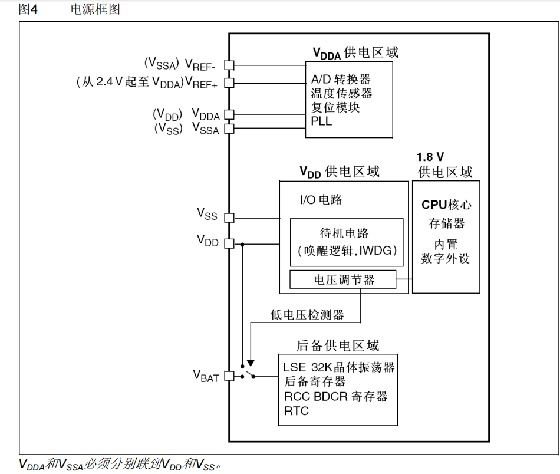
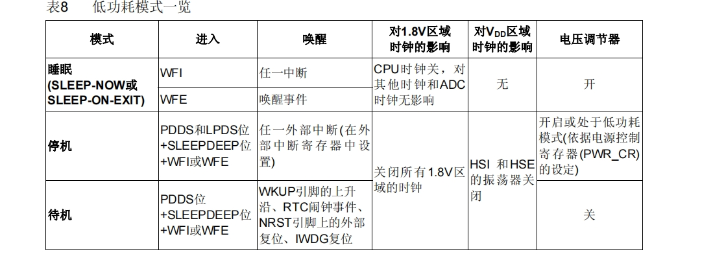
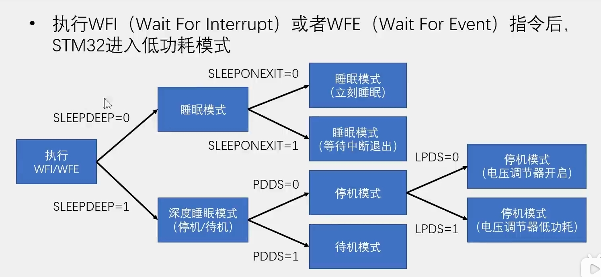

# PWR电源控制

## PWR简介

PWR(Power Control)电源控制

PWR负责管理STM32内部的电源供电部分，可以实现可编程电压监测器和低功耗模式的功能

可编程电压监测器(PVD)可以监控VDD电源电压，当VDD下降到PVD阀值以下或上升到PVD阀值之上时，PVD会触发中断，用于执行紧急关闭任务

低功耗模式包括睡眠模式(Sleep)停机模式(Stop)和待机模式(Standby)，可在系统空闲时，降低STM32的功耗，延长设备使用时间

## 电源框图

## 低功耗模式

PDDS位为0时，处于停机模式，为1时处于待机状态

## 模式选择

### 睡眠模式

执行完WFI/WFE指令后，STM32进入睡眠模式，程序暂停运行，唤醒后程序从暂停的地方继续运行

SLEEPONEXIT位决定STM32执行完WFI或WFE后，是立刻进入睡眠还是等STM32从最低优先级的中断处理程序中退出时进入睡眠

在睡眠模式下，所有的I/0引脚都保持它们在运行模式时的状态

WFI指令进入睡眠模式，可被任意一个NVIC响应的中断唤醒

WFE指令进入睡眠模式，可被唤醒事件唤醒

### 停机模式

执行完WP/WFE指令后，STM32进入停止模式，程序暂停运行，唤醒后程序从暂停的地方继续运行

1.8V供电区域的所有时钟都被停止，PLL、HSI和HSE被禁止，SRAM和寄存器内容被保留下来

在停止模式下，所有的I/0引脚都保持它们在运行模式时的状态

当一个中断或唤醒事件导致退出停止模式时，HSI被选为系统时钟

当电压调节器处于低功耗模式下，系统从停止模式退出时，会有一段额外的启动延时

WFI指令进入停止模式，可被任意一个EXTI中断唤醒

WFE指令进入停止模式，可被任意一个EXTI事件唤醒

### 待机模式

执行完WFI/WFE指令后，STM32进入待机模式，唤醒后程序从头开始运行

整个1.8V供电区域被断电，PLL、HSI和HSE也被断电，SRAM和寄存器内容丢失，只有备份的寄存器和待机电路维持供电

在待机模式下，所有的1/0引脚变为高阻态(浮空输入)

WKUP引脚的上升沿、RTC闹钟事件的上升沿、NRST引脚上外部复位、IWDG复位退出待机模式