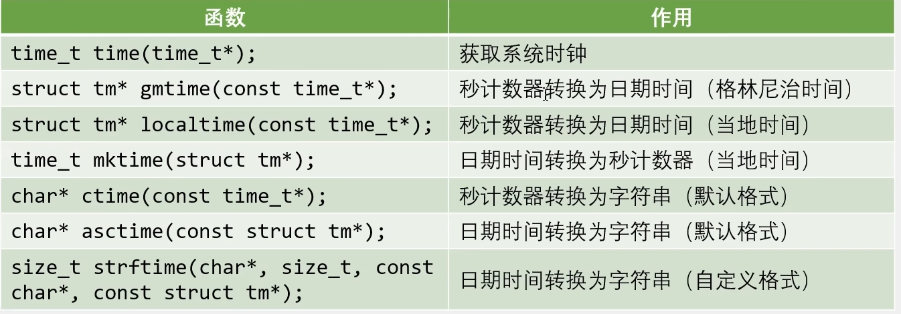
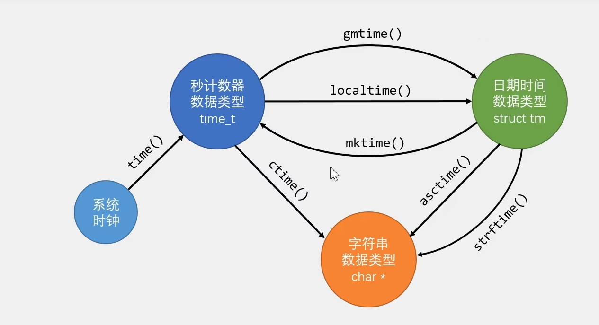
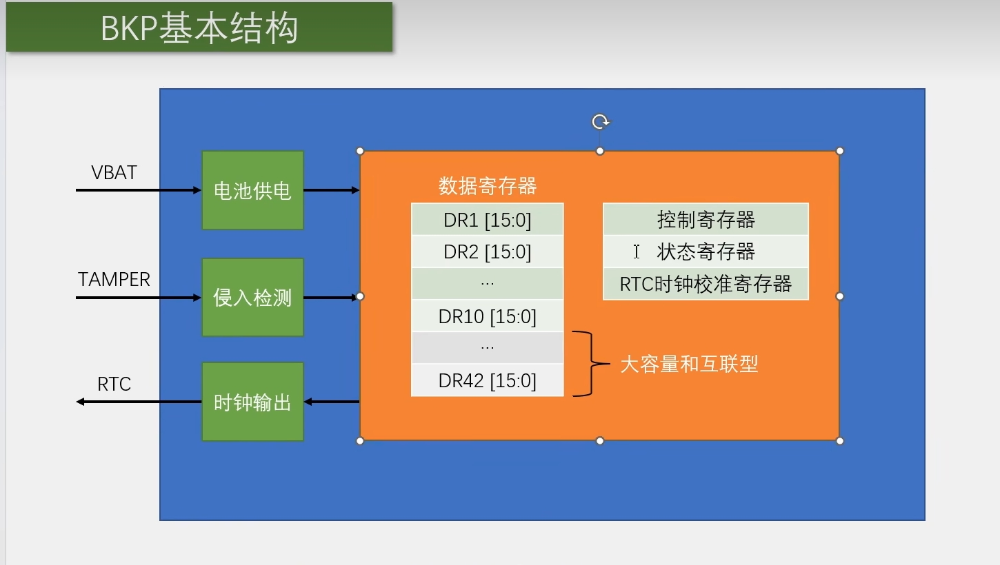
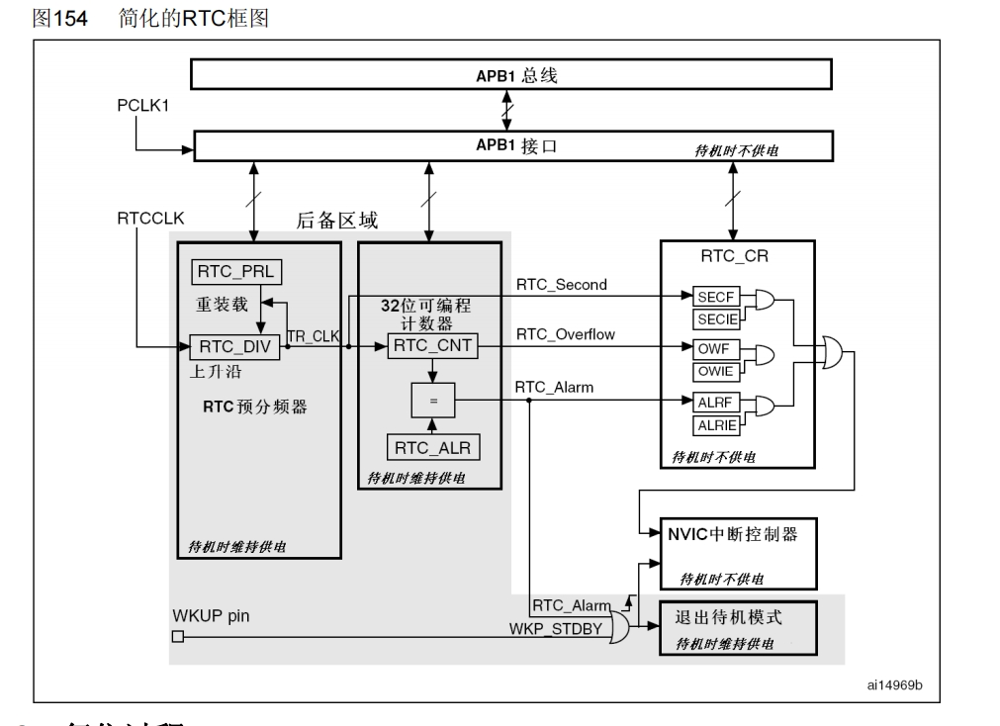
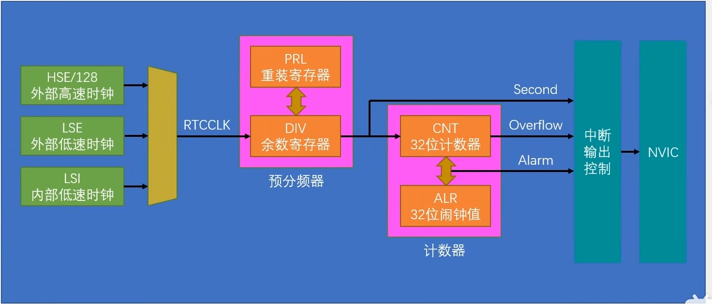

# Unix时间戳

Unix 时间戳(UnixTimestamp)定义为从UTC/GMT的1970年1月1日0时0分0秒开始所经过的秒数，不考虑闰秒

时间戳存储在一个秒计数器中，秒计数器为32位/64位的整型变量

世界上所有时区的秒计数器相同，不同时区通过添加偏移来得到当地时间

## 时间戳转换





# BKB备份寄存器

## BKB简介

BKP(Backup Registers)备份寄存器

BKP可用于存储用户应用程序数据。当VDD(2.0~3.6V)电源被切断，他们仍然由VBAT(1.8~3.6V)维持供电。当系统在待机模式下被唤醒，或系统复位或电源复位时，他们也不会被复位

TAMPER引脚产生的侵入事件将所有备份寄存器内容清除

RTC引脚输出RTC校准时钟、RTC闹钟脉冲或者秒脉冲

存储RTC时钟校准寄存器

用户数据存储容量:
	20字节(中容量和小容量)/84字节(大容量和互联型)

## BKP基本结构



当VDD供电时候，VBAT连接VDD，不供电时候，VBAT供电

TAMPER产生上升沿或者下降沿的时候，进行侵入检测，删除寄存器数据

# RTC实时时钟

## RTC简介

RTC(Real Time Clock)实时时钟

RTC是一个独立的定时器，可为系统提供时钟和日历的功能

RTC和时钟配置系统处于后备区域，系统复位时数据不清零，VDD(2.0~3.6V)断电后可借助VBAT(1.8~3.6V)供电继续走时

32位的可编程计数器，可对应Unix时间戳的秒计数器

20位的可编程预分频器，可适配不同频率的输入时钟

可选择三种RTC时钟源:

​	HSE时钟除以128(通常为8MHz/128)

​	LSE振荡器时钟(通常为32.768KHz)

​	LSI振荡器时钟(40KHz)

## 简化的RTC框图



PRL---->对RTCCLK进行分频操作，就是相当于一个计数器，DIV不断自减

## RTC基本结构



余数寄存器就是一个自减计数器

## RTC操作注意事项

执行以下操作将使能对BKP和RTC的访问:

​	设置RCC APB1ENR的PWREN和BKPEN，使能PWR和BKP时钟

​	设置PWR CR的DBP.使能对BKP和RTC的访问

若在读取RTC寄存器时，RTC的APB1接口曾经处于禁止状态，则软件首先必须等待RTCCRL寄存器中的RSF位(寄存器同步标志)被硬件置1

必须设置RTC CRL寄存器中的CNF位，使RTC进入配置模式后，才能写入RTC PRL、RTC CNT、RTC ALR寄存器

对RTC任何寄存器的写操作，都必须在前一次写操作结束后进行。可以通过查询RTC CR寄存器中的RTOFF状态位，判断RTC寄存器是否处于更新中。仅当RTOFF状态位是1时，才可以写入RTC寄存器

# 读写备份寄存器

## 代码例程

```c
#include "stm32f10x.h"                  // Device header
#include "Delay.h"
#include "OLED.h"
#include "Key.h"

uint8_t KeyNum;					//定义用于接收按键键码的变量

uint16_t ArrayWrite[] = {0x1234, 0x5678};	//定义要写入数据的测试数组
uint16_t ArrayRead[2];						//定义要读取数据的测试数组

int main(void)
{
	/*模块初始化*/
	OLED_Init();				//OLED初始化
	Key_Init();					//按键初始化
	
	/*显示静态字符串*/
	OLED_ShowString(1, 1, "W:");
	OLED_ShowString(2, 1, "R:");
	
	/*开启时钟*/
	RCC_APB1PeriphClockCmd(RCC_APB1Periph_PWR, ENABLE);		//开启PWR的时钟
	RCC_APB1PeriphClockCmd(RCC_APB1Periph_BKP, ENABLE);		//开启BKP的时钟
	
	/*备份寄存器访问使能*/
	PWR_BackupAccessCmd(ENABLE);							//使用PWR开启对备份寄存器的访问
	
	while (1)
	{
		KeyNum = Key_GetNum();		//获取按键键码
		
		if (KeyNum == 1)			//按键1按下
		{
			ArrayWrite[0] ++;		//测试数据自增
			ArrayWrite[1] ++;
			
			BKP_WriteBackupRegister(BKP_DR1, ArrayWrite[0]);	//写入测试数据到备份寄存器
			BKP_WriteBackupRegister(BKP_DR2, ArrayWrite[1]);
			
			OLED_ShowHexNum(1, 3, ArrayWrite[0], 4);		//显示写入的测试数据
			OLED_ShowHexNum(1, 8, ArrayWrite[1], 4);
		}
		
		ArrayRead[0] = BKP_ReadBackupRegister(BKP_DR1);		//读取备份寄存器的数据
		ArrayRead[1] = BKP_ReadBackupRegister(BKP_DR2);
		
		OLED_ShowHexNum(2, 3, ArrayRead[0], 4);				//显示读取的备份寄存器数据
		OLED_ShowHexNum(2, 8, ArrayRead[1], 4);
	}
}

```

# 实时时钟

## 代码例程

### MyRTC

```c
#include "stm32f10x.h"                  // Device header
#include <time.h>

uint16_t MyRTC_Time[] = {2023, 1, 1, 23, 59, 55};	//定义全局的时间数组，数组内容分别为年、月、日、时、分、秒

void MyRTC_SetTime(void);				//函数声明

/**
  * 函    数：RTC初始化
  * 参    数：无
  * 返 回 值：无
  */
void MyRTC_Init(void)
{
	/*开启时钟*/
	RCC_APB1PeriphClockCmd(RCC_APB1Periph_PWR, ENABLE);		//开启PWR的时钟
	RCC_APB1PeriphClockCmd(RCC_APB1Periph_BKP, ENABLE);		//开启BKP的时钟
	
	/*备份寄存器访问使能*/
	PWR_BackupAccessCmd(ENABLE);							//使用PWR开启对备份寄存器的访问
	
	if (BKP_ReadBackupRegister(BKP_DR1) != 0xA5A5)			//通过写入备份寄存器的标志位，判断RTC是否是第一次配置
															//if成立则执行第一次的RTC配置
	{
		RCC_LSEConfig(RCC_LSE_ON);							//开启LSE时钟
		while (RCC_GetFlagStatus(RCC_FLAG_LSERDY) != SET);	//等待LSE准备就绪
		
		RCC_RTCCLKConfig(RCC_RTCCLKSource_LSE);				//选择RTCCLK来源为LSE
		RCC_RTCCLKCmd(ENABLE);								//RTCCLK使能
		
		RTC_WaitForSynchro();								//等待同步
		RTC_WaitForLastTask();								//等待上一次操作完成
		
		RTC_SetPrescaler(32768 - 1);						//设置RTC预分频器，预分频后的计数频率为1Hz
		RTC_WaitForLastTask();								//等待上一次操作完成
		
		MyRTC_SetTime();									//设置时间，调用此函数，全局数组里时间值刷新到RTC硬件电路
		
		BKP_WriteBackupRegister(BKP_DR1, 0xA5A5);			//在备份寄存器写入自己规定的标志位，用于判断RTC是不是第一次执行配置
	}
	else													//RTC不是第一次配置
	{
		RTC_WaitForSynchro();								//等待同步
		RTC_WaitForLastTask();								//等待上一次操作完成
	}
}

//如果LSE无法起振导致程序卡死在初始化函数中
//可将初始化函数替换为下述代码，使用LSI当作RTCCLK
//LSI无法由备用电源供电，故主电源掉电时，RTC走时会暂停
/* 
void MyRTC_Init(void)
{
	RCC_APB1PeriphClockCmd(RCC_APB1Periph_PWR, ENABLE);
	RCC_APB1PeriphClockCmd(RCC_APB1Periph_BKP, ENABLE);
	
	PWR_BackupAccessCmd(ENABLE);
	
	if (BKP_ReadBackupRegister(BKP_DR1) != 0xA5A5)
	{
		RCC_LSICmd(ENABLE);
		while (RCC_GetFlagStatus(RCC_FLAG_LSIRDY) != SET);
		
		RCC_RTCCLKConfig(RCC_RTCCLKSource_LSI);
		RCC_RTCCLKCmd(ENABLE);
		
		RTC_WaitForSynchro();
		RTC_WaitForLastTask();
		
		RTC_SetPrescaler(40000 - 1);
		RTC_WaitForLastTask();
		
		MyRTC_SetTime();
		
		BKP_WriteBackupRegister(BKP_DR1, 0xA5A5);
	}
	else
	{
		RCC_LSICmd(ENABLE);				//即使不是第一次配置，也需要再次开启LSI时钟
		while (RCC_GetFlagStatus(RCC_FLAG_LSIRDY) != SET);
		
		RCC_RTCCLKConfig(RCC_RTCCLKSource_LSI);
		RCC_RTCCLKCmd(ENABLE);
		
		RTC_WaitForSynchro();
		RTC_WaitForLastTask();
	}
}*/

/**
  * 函    数：RTC设置时间
  * 参    数：无
  * 返 回 值：无
  * 说    明：调用此函数后，全局数组里时间值将刷新到RTC硬件电路
  */
void MyRTC_SetTime(void)
{
	time_t time_cnt;		//定义秒计数器数据类型
	struct tm time_date;	//定义日期时间数据类型
	
	time_date.tm_year = MyRTC_Time[0] - 1900;		//将数组的时间赋值给日期时间结构体
	time_date.tm_mon = MyRTC_Time[1] - 1;
	time_date.tm_mday = MyRTC_Time[2];
	time_date.tm_hour = MyRTC_Time[3];
	time_date.tm_min = MyRTC_Time[4];
	time_date.tm_sec = MyRTC_Time[5];
	
	time_cnt = mktime(&time_date) - 8 * 60 * 60;	//调用mktime函数，将日期时间转换为秒计数器格式
													//- 8 * 60 * 60为东八区的时区调整
	
	RTC_SetCounter(time_cnt);						//将秒计数器写入到RTC的CNT中
	RTC_WaitForLastTask();							//等待上一次操作完成
}

/**
  * 函    数：RTC读取时间
  * 参    数：无
  * 返 回 值：无
  * 说    明：调用此函数后，RTC硬件电路里时间值将刷新到全局数组
  */
void MyRTC_ReadTime(void)
{
	time_t time_cnt;		//定义秒计数器数据类型
	struct tm time_date;	//定义日期时间数据类型
	
	time_cnt = RTC_GetCounter() + 8 * 60 * 60;		//读取RTC的CNT，获取当前的秒计数器
													//+ 8 * 60 * 60为东八区的时区调整
	
	time_date = *localtime(&time_cnt);				//使用localtime函数，将秒计数器转换为日期时间格式
	
	MyRTC_Time[0] = time_date.tm_year + 1900;		//将日期时间结构体赋值给数组的时间
	MyRTC_Time[1] = time_date.tm_mon + 1;
	MyRTC_Time[2] = time_date.tm_mday;
	MyRTC_Time[3] = time_date.tm_hour;
	MyRTC_Time[4] = time_date.tm_min;
	MyRTC_Time[5] = time_date.tm_sec;
}

```

### Main

```c
#include "stm32f10x.h"                  // Device header
#include "Delay.h"
#include "OLED.h"
#include "MyRTC.h"

int main(void)
{
	/*模块初始化*/
	OLED_Init();		//OLED初始化
	MyRTC_Init();		//RTC初始化
	
	/*显示静态字符串*/
	OLED_ShowString(1, 1, "Date:XXXX-XX-XX");
	OLED_ShowString(2, 1, "Time:XX:XX:XX");
	OLED_ShowString(3, 1, "CNT :");
	OLED_ShowString(4, 1, "DIV :");
	
	while (1)
	{
		MyRTC_ReadTime();							//RTC读取时间，最新的时间存储到MyRTC_Time数组中
		
		OLED_ShowNum(1, 6, MyRTC_Time[0], 4);		//显示MyRTC_Time数组中的时间值，年
		OLED_ShowNum(1, 11, MyRTC_Time[1], 2);		//月
		OLED_ShowNum(1, 14, MyRTC_Time[2], 2);		//日
		OLED_ShowNum(2, 6, MyRTC_Time[3], 2);		//时
		OLED_ShowNum(2, 9, MyRTC_Time[4], 2);		//分
		OLED_ShowNum(2, 12, MyRTC_Time[5], 2);		//秒
		
		OLED_ShowNum(3, 6, RTC_GetCounter(), 10);	//显示32位的秒计数器
		OLED_ShowNum(4, 6, RTC_GetDivider(), 10);	//显示余数寄存器
	}
}

```

