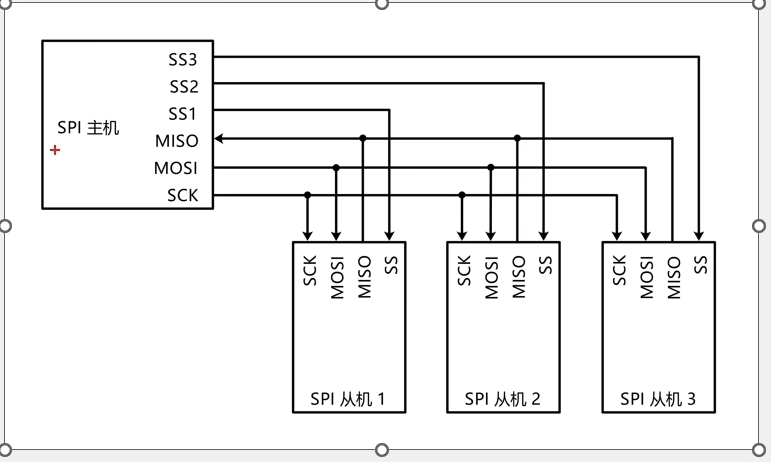
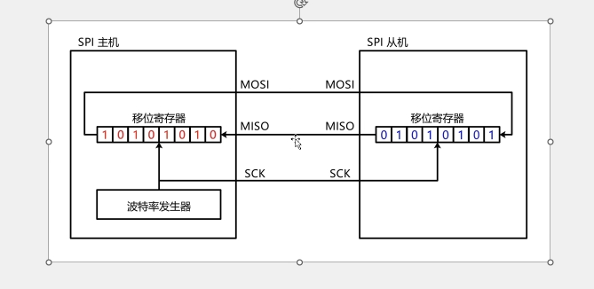
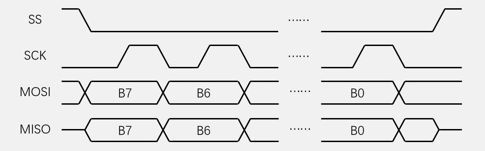
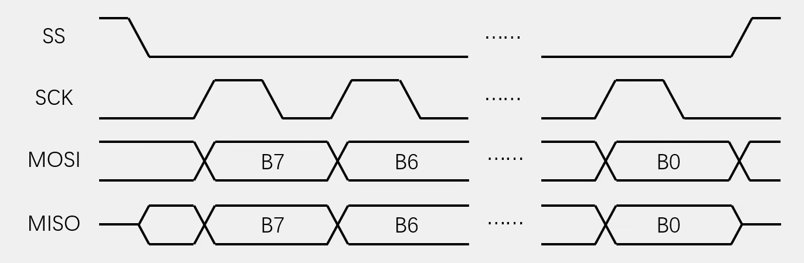
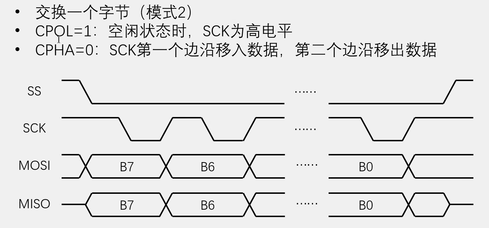
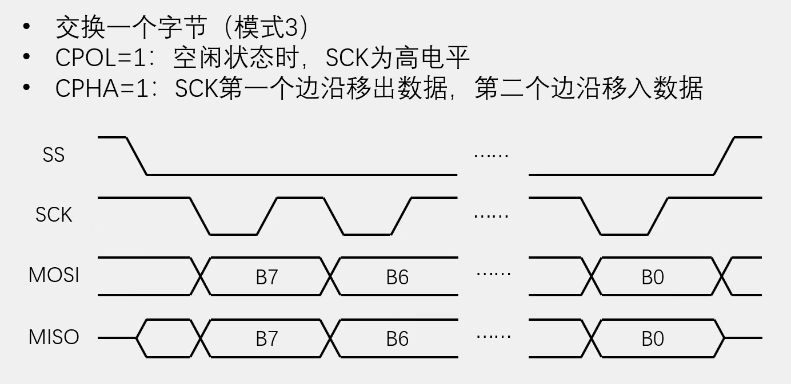
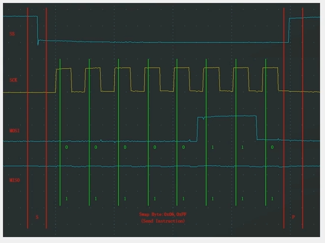
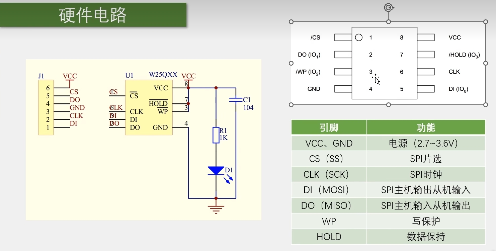
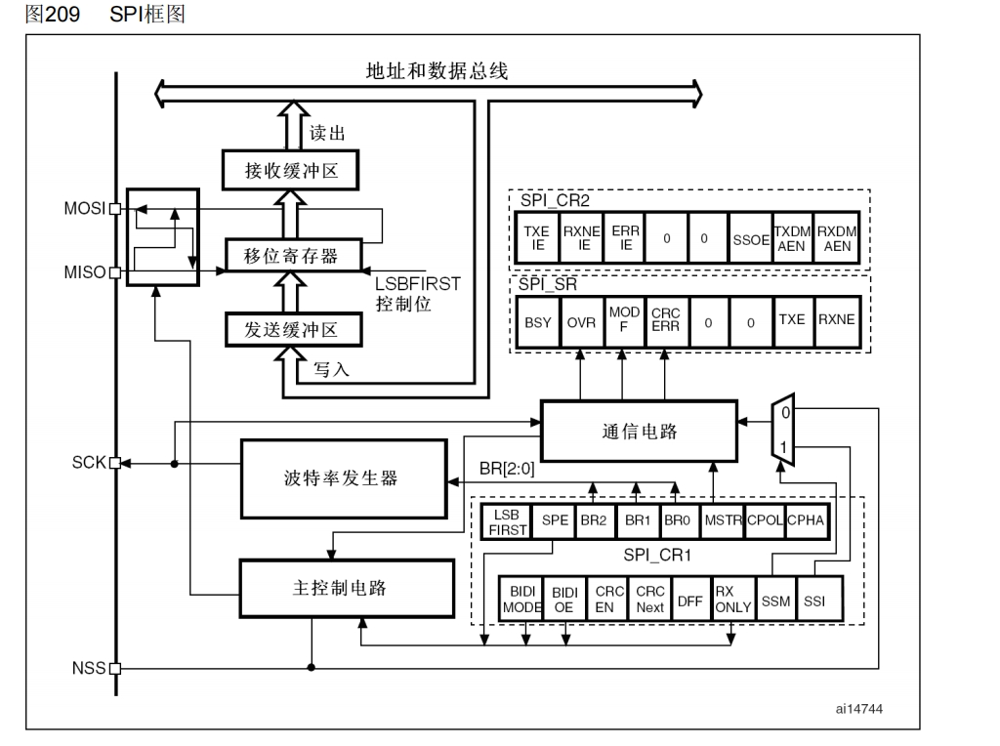
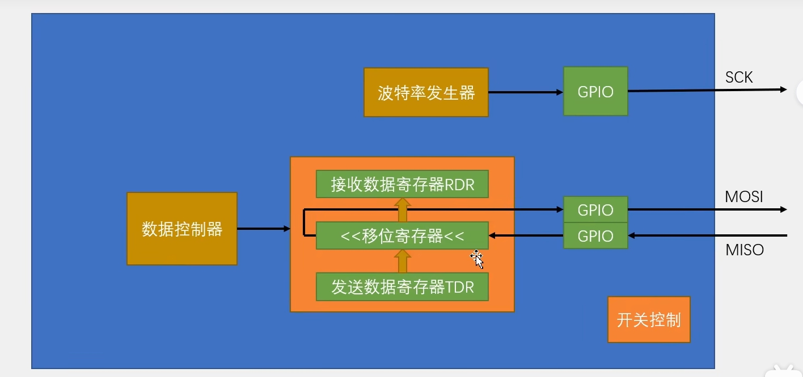

# SPI通信协议

## SPI通信

SPl(Serial Peripheral Interface)串行外设接口是由Motorola公司开发的一种通用数据总线

四根通信线:SCK(SerialClock)、MOSl(Master Output SlaveInput)主机输出从机输入、MISO(MasterInput Slave Output)主机输入从机输出、SS(Slave Select)从机选择

同步，全双工

支持总线挂载多设备(一主多从)

## 硬件电路

所有SPI设备的SCK、MOSI、MISO分别连在一起

主机另外引出多条SS控制线，分别接到各从机的SS引脚

输出引脚配置为推挽输出，输入引脚配置为浮空或上拉输入



SS线是低电平有效，主机想指定谁，就把对应的SS输出线置低电平就行了

但是主机只能选择一个从机，只能让一个SS为低电平

## 移位示意图



当SCK产生上升沿时，移位寄存器的数据的最高位将会进行输出放在输出线上，当产生下降沿时，会进行输入，输入到各个寄存器

## SPI时序基本单元

### 起始条件

SS从高电平切换到低电平

### 终止条件

SS从低电平切换到高电平

### 交换一个字节

#### 模式0（用的最多）

CPOL(Clock Polarity)时钟极性=0:空闲状态时，SCK为低电平

CPHA(Clock Phase)时钟相位=0:第一个边沿移入数据，第二个边沿移出数据

每一位可以配置为1或0



#### 模式1

CPOL=0:空闲状态时，SCK为低电平

CPHA=1:SCK第一个边沿移出数据，第二个边沿移入数据



#### 模式2



#### 模式3



### 发送指令

向SS指定的设备，发送指令(0x06)



### 指定地址写

向SS指定的设备，发送写指令(0x02)

随后在指定地址(Address[23:0])下，写入指定数据(Data)，地址是24位的，分三个字节传输

### 指定地址读

向SS指定的设备，发送读指令(0x03

随后在指定地址(Address[23:0])读取从机数据(Data)

# W25Q64简介

W25Qxx系列是一种低成本、小型化、使用简单的非易失性存储器常应用于数据存储、字库存储、固件程序存储等场景

存储介质:NorFlash(闪存)

时钟频率:80MHz/160MHz(Dual SPl)/320MHz (Quad SPl) 

## 硬件电路



## Flash操作注意事项

写入操作时:
写入操作前，必须先进行写使能

每个数据位只能由1改写为0，不能由0改写为1

写入数据前必须先擦除，擦除后，所有数据位变为1擦除必须按最小擦除单元进行

连续写入多字节时，最多写入一页的数据，超过页尾位置的数据，会回到页首覆盖写入

写入操作结束后，芯片进入忙状态，不响应新的读写操作读取操作时:
直接调用读取时序，无需使能，无需额外操作，没有页的限制读取操作结束后不会进入忙状态，但不能在忙状态时读取

## 软件SPI读写W25Q64

### 代码例程

#### MySPI

```c
#include "stm32f10x.h"                  // Device header

/*引脚配置层*/

/**
  * 函    数：SPI写SS引脚电平
  * 参    数：BitValue 协议层传入的当前需要写入SS的电平，范围0~1
  * 返 回 值：无
  * 注意事项：此函数需要用户实现内容，当BitValue为0时，需要置SS为低电平，当BitValue为1时，需要置SS为高电平
  */
void MySPI_W_SS(uint8_t BitValue)
{
	GPIO_WriteBit(GPIOA, GPIO_Pin_4, (BitAction)BitValue);		//根据BitValue，设置SS引脚的电平
}

/**
  * 函    数：SPI写SCK引脚电平
  * 参    数：BitValue 协议层传入的当前需要写入SCK的电平，范围0~1
  * 返 回 值：无
  * 注意事项：此函数需要用户实现内容，当BitValue为0时，需要置SCK为低电平，当BitValue为1时，需要置SCK为高电平
  */
void MySPI_W_SCK(uint8_t BitValue)
{
	GPIO_WriteBit(GPIOA, GPIO_Pin_5, (BitAction)BitValue);		//根据BitValue，设置SCK引脚的电平
}

/**
  * 函    数：SPI写MOSI引脚电平
  * 参    数：BitValue 协议层传入的当前需要写入MOSI的电平，范围0~1
  * 返 回 值：无
  * 注意事项：此函数需要用户实现内容，当BitValue为0时，需要置MOSI为低电平，当BitValue为1时，需要置MOSI为高电平
  */
void MySPI_W_MOSI(uint8_t BitValue)
{
	GPIO_WriteBit(GPIOA, GPIO_Pin_7, (BitAction)BitValue);		//根据BitValue，设置MOSI引脚的电平，BitValue要实现非0即1的特性
}

/**
  * 函    数：I2C读MISO引脚电平
  * 参    数：无
  * 返 回 值：协议层需要得到的当前MISO的电平，范围0~1
  * 注意事项：此函数需要用户实现内容，当前MISO为低电平时，返回0，当前MISO为高电平时，返回1
  */
uint8_t MySPI_R_MISO(void)
{
	return GPIO_ReadInputDataBit(GPIOA, GPIO_Pin_6);			//读取MISO电平并返回
}

/**
  * 函    数：SPI初始化
  * 参    数：无
  * 返 回 值：无
  * 注意事项：此函数需要用户实现内容，实现SS、SCK、MOSI和MISO引脚的初始化
  */
void MySPI_Init(void)
{
	/*开启时钟*/
	RCC_APB2PeriphClockCmd(RCC_APB2Periph_GPIOA, ENABLE);	//开启GPIOA的时钟
	
	/*GPIO初始化*/
	GPIO_InitTypeDef GPIO_InitStructure;
	GPIO_InitStructure.GPIO_Mode = GPIO_Mode_Out_PP;
	GPIO_InitStructure.GPIO_Pin = GPIO_Pin_4 | GPIO_Pin_5 | GPIO_Pin_7;
	GPIO_InitStructure.GPIO_Speed = GPIO_Speed_50MHz;
	GPIO_Init(GPIOA, &GPIO_InitStructure);					//将PA4、PA5和PA7引脚初始化为推挽输出
	
	GPIO_InitStructure.GPIO_Mode = GPIO_Mode_IPU;
	GPIO_InitStructure.GPIO_Pin = GPIO_Pin_6;
	GPIO_InitStructure.GPIO_Speed = GPIO_Speed_50MHz;
	GPIO_Init(GPIOA, &GPIO_InitStructure);					//将PA6引脚初始化为上拉输入
	
	/*设置默认电平*/
	MySPI_W_SS(1);											//SS默认高电平
	MySPI_W_SCK(0);											//SCK默认低电平
}

/*协议层*/

/**
  * 函    数：SPI起始
  * 参    数：无
  * 返 回 值：无
  */
void MySPI_Start(void)
{
	MySPI_W_SS(0);				//拉低SS，开始时序
}

/**
  * 函    数：SPI终止
  * 参    数：无
  * 返 回 值：无
  */
void MySPI_Stop(void)
{
	MySPI_W_SS(1);				//拉高SS，终止时序
}

/**
  * 函    数：SPI交换传输一个字节，使用SPI模式0
  * 参    数：ByteSend 要发送的一个字节
  * 返 回 值：接收的一个字节
  */
uint8_t MySPI_SwapByte(uint8_t ByteSend)
{
	uint8_t i, ByteReceive = 0x00;					//定义接收的数据，并赋初值0x00，此处必须赋初值0x00，后面会用到
	
	for (i = 0; i < 8; i ++)						//循环8次，依次交换每一位数据
	{
		/*两个!可以对数据进行两次逻辑取反，作用是把非0值统一转换为1，即：!!(0) = 0，!!(非0) = 1*/
		MySPI_W_MOSI(!!(ByteSend & (0x80 >> i)));	//使用掩码的方式取出ByteSend的指定一位数据并写入到MOSI线
		MySPI_W_SCK(1);								//拉高SCK，上升沿移出数据
		if (MySPI_R_MISO()){ByteReceive |= (0x80 >> i);}	//读取MISO数据，并存储到Byte变量
															//当MISO为1时，置变量指定位为1，当MISO为0时，不做处理，指定位为默认的初值0
		MySPI_W_SCK(0);								//拉低SCK，下降沿移入数据
	}
	
	return ByteReceive;								//返回接收到的一个字节数据
}

//第二种写法
uint8_t MySPI_SwapByte2(uint8_t ByteSend)
{
	uint8_t i;					
	
	for (i = 0; i < 8; i ++)						//循环8次，依次交换每一位数据
	{
		/*两个!可以对数据进行两次逻辑取反，作用是把非0值统一转换为1，即：!!(0) = 0，!!(非0) = 1*/
		MySPI_W_MOSI(!!(ByteSend & 0x80));	
		MySPI_W_SCK(1);								//拉高SCK，上升沿移出数据
		if (MySPI_R_MISO()){ByteSend |= 0x01;}	
															
		MySPI_W_SCK(0);								//拉低SCK，下降沿移入数据
	}
	
	return ByteSend;								//返回接收到的一个字节数据
}

```


#### W25Q64

```c
#include "stm32f10x.h"                  // Device header
#include "MySPI.h"
#include "W25Q64_Ins.h"

/**
  * 函    数：W25Q64初始化
  * 参    数：无
  * 返 回 值：无
  */
void W25Q64_Init(void)
{
	MySPI_Init();					//先初始化底层的SPI
}

/**
  * 函    数：MPU6050读取ID号
  * 参    数：MID 工厂ID，使用输出参数的形式返回
  * 参    数：DID 设备ID，使用输出参数的形式返回
  * 返 回 值：无
  */
void W25Q64_ReadID(uint8_t *MID, uint16_t *DID)
{
	MySPI_Start();								//SPI起始
	MySPI_SwapByte(W25Q64_JEDEC_ID);			//交换发送读取ID的指令
	*MID = MySPI_SwapByte(W25Q64_DUMMY_BYTE);	//交换接收MID，通过输出参数返回
	*DID = MySPI_SwapByte(W25Q64_DUMMY_BYTE);	//交换接收DID高8位
	*DID <<= 8;									//高8位移到高位
	*DID |= MySPI_SwapByte(W25Q64_DUMMY_BYTE);	//或上交换接收DID的低8位，通过输出参数返回
	MySPI_Stop();								//SPI终止
}

/**
  * 函    数：W25Q64写使能
  * 参    数：无
  * 返 回 值：无
  */
void W25Q64_WriteEnable(void)
{
	MySPI_Start();								//SPI起始
	MySPI_SwapByte(W25Q64_WRITE_ENABLE);		//交换发送写使能的指令
	MySPI_Stop();								//SPI终止
}

/**
  * 函    数：W25Q64等待忙
  * 参    数：无
  * 返 回 值：无
  */
void W25Q64_WaitBusy(void)
{
	uint32_t Timeout;
	MySPI_Start();								//SPI起始
	MySPI_SwapByte(W25Q64_READ_STATUS_REGISTER_1);				//交换发送读状态寄存器1的指令
	Timeout = 100000;							//给定超时计数时间
	while ((MySPI_SwapByte(W25Q64_DUMMY_BYTE) & 0x01) == 0x01)	//循环等待忙标志位
	{
		Timeout --;								//等待时，计数值自减
		if (Timeout == 0)						//自减到0后，等待超时
		{
			/*超时的错误处理代码，可以添加到此处*/
			break;								//跳出等待，不等了
		}
	}
	MySPI_Stop();								//SPI终止
}

/**
  * 函    数：W25Q64页编程
  * 参    数：Address 页编程的起始地址，范围：0x000000~0x7FFFFF
  * 参    数：DataArray	用于写入数据的数组
  * 参    数：Count 要写入数据的数量，范围：0~256
  * 返 回 值：无
  * 注意事项：写入的地址范围不能跨页
  */
void W25Q64_PageProgram(uint32_t Address, uint8_t *DataArray, uint16_t Count)
{
	uint16_t i;
	
	W25Q64_WriteEnable();						//写使能
	
	MySPI_Start();								//SPI起始
	MySPI_SwapByte(W25Q64_PAGE_PROGRAM);		//交换发送页编程的指令
	MySPI_SwapByte(Address >> 16);				//交换发送地址23~16位
	MySPI_SwapByte(Address >> 8);				//交换发送地址15~8位
	MySPI_SwapByte(Address);					//交换发送地址7~0位
	for (i = 0; i < Count; i ++)				//循环Count次
	{
		MySPI_SwapByte(DataArray[i]);			//依次在起始地址后写入数据
	}
	MySPI_Stop();								//SPI终止
	
	W25Q64_WaitBusy();							//等待忙
}

/**
  * 函    数：W25Q64扇区擦除（4KB）
  * 参    数：Address 指定扇区的地址，范围：0x000000~0x7FFFFF
  * 返 回 值：无
  */
void W25Q64_SectorErase(uint32_t Address)
{
	W25Q64_WriteEnable();						//写使能
	
	MySPI_Start();								//SPI起始
	MySPI_SwapByte(W25Q64_SECTOR_ERASE_4KB);	//交换发送扇区擦除的指令
	MySPI_SwapByte(Address >> 16);				//交换发送地址23~16位
	MySPI_SwapByte(Address >> 8);				//交换发送地址15~8位
	MySPI_SwapByte(Address);					//交换发送地址7~0位
	MySPI_Stop();								//SPI终止
	
	W25Q64_WaitBusy();							//等待忙
}

/**
  * 函    数：W25Q64读取数据
  * 参    数：Address 读取数据的起始地址，范围：0x000000~0x7FFFFF
  * 参    数：DataArray 用于接收读取数据的数组，通过输出参数返回
  * 参    数：Count 要读取数据的数量，范围：0~0x800000
  * 返 回 值：无
  */
void W25Q64_ReadData(uint32_t Address, uint8_t *DataArray, uint32_t Count)
{
	uint32_t i;
	MySPI_Start();								//SPI起始
	MySPI_SwapByte(W25Q64_READ_DATA);			//交换发送读取数据的指令
	MySPI_SwapByte(Address >> 16);				//交换发送地址23~16位
	MySPI_SwapByte(Address >> 8);				//交换发送地址15~8位
	MySPI_SwapByte(Address);					//交换发送地址7~0位
	for (i = 0; i < Count; i ++)				//循环Count次
	{
		DataArray[i] = MySPI_SwapByte(W25Q64_DUMMY_BYTE);	//依次在起始地址后读取数据
	}
	MySPI_Stop();								//SPI终止
}

```


#### main

```c 
#include "stm32f10x.h"                  // Device header
#include "Delay.h"
#include "OLED.h"
#include "W25Q64.h"

uint8_t MID;							//定义用于存放MID号的变量
uint16_t DID;							//定义用于存放DID号的变量

uint8_t ArrayWrite[] = {0x01, 0x02, 0x03, 0x04};	//定义要写入数据的测试数组
uint8_t ArrayRead[4];								//定义要读取数据的测试数组

int main(void)
{
	/*模块初始化*/
	OLED_Init();						//OLED初始化
	W25Q64_Init();						//W25Q64初始化
	
	/*显示静态字符串*/
	OLED_ShowString(1, 1, "MID:   DID:");
	OLED_ShowString(2, 1, "W:");
	OLED_ShowString(3, 1, "R:");
	
	/*显示ID号*/
	W25Q64_ReadID(&MID, &DID);			//获取W25Q64的ID号
	OLED_ShowHexNum(1, 5, MID, 2);		//显示MID
	OLED_ShowHexNum(1, 12, DID, 4);		//显示DID
	
	/*W25Q64功能函数测试*/
	W25Q64_SectorErase(0x000000);					//扇区擦除
	W25Q64_PageProgram(0x000000, ArrayWrite, 4);	//将写入数据的测试数组写入到W25Q64中
	
	W25Q64_ReadData(0x000000, ArrayRead, 4);		//读取刚写入的测试数据到读取数据的测试数组中
	
	/*显示数据*/
	OLED_ShowHexNum(2, 3, ArrayWrite[0], 2);		//显示写入数据的测试数组
	OLED_ShowHexNum(2, 6, ArrayWrite[1], 2);
	OLED_ShowHexNum(2, 9, ArrayWrite[2], 2);
	OLED_ShowHexNum(2, 12, ArrayWrite[3], 2);
	
	OLED_ShowHexNum(3, 3, ArrayRead[0], 2);			//显示读取数据的测试数组
	OLED_ShowHexNum(3, 6, ArrayRead[1], 2);
	OLED_ShowHexNum(3, 9, ArrayRead[2], 2);
	OLED_ShowHexNum(3, 12, ArrayRead[3], 2);
	
	while (1)
	{
		
	}
}

```

# SPI外设

STM32内部集成了硬件SPI收发电路，可以由硬件自动执行时钟生成、数据收发等功能，减轻CPU的负担

可配置8位/16位数据帧、高位先行/低位先行

时钟频率:fpcLk/(2,4,8,16,32,64,128,256)

支持多主机模型、主或从操作可精简为半双工/单工通信

支持DMA

兼容12S协议

STM32F103C8T6 硬件SPI资源:SPI1、SPI2

## SPI框图



### LSBFIRST

控制低位先行还是高位先行，1是低位先行，0是高位先行

### SPE

(SPl Enable)，是SPI使能，就是SPlCmd函数配置的位

### BR

(Baud Rate)配置波特率，就是SCK时钟频率

### MSTR

(Master)，配置主从模式，1是主模式，0是从模式

### CPOL和CPHA

用来选择SPI的4种模式

### SSOE

当为1时候，NSS作为输出引脚，变为主机，当主机结束后，SSOE要清零，NSS变为输入

## SPI基本结构



## 硬件SPI读写W25Q64

### 代码例程

#### MySPI

```c
#include "stm32f10x.h"                  // Device header

/**
  * 函    数：SPI写SS引脚电平，SS仍由软件模拟
  * 参    数：BitValue 协议层传入的当前需要写入SS的电平，范围0~1
  * 返 回 值：无
  * 注意事项：此函数需要用户实现内容，当BitValue为0时，需要置SS为低电平，当BitValue为1时，需要置SS为高电平
  */
void MySPI_W_SS(uint8_t BitValue)
{
	GPIO_WriteBit(GPIOA, GPIO_Pin_4, (BitAction)BitValue);		//根据BitValue，设置SS引脚的电平
}

/**
  * 函    数：SPI初始化
  * 参    数：无
  * 返 回 值：无
  */
void MySPI_Init(void)
{
	/*开启时钟*/
	RCC_APB2PeriphClockCmd(RCC_APB2Periph_GPIOA, ENABLE);	//开启GPIOA的时钟
	RCC_APB2PeriphClockCmd(RCC_APB2Periph_SPI1, ENABLE);	//开启SPI1的时钟
	
	/*GPIO初始化*/
	GPIO_InitTypeDef GPIO_InitStructure;
	GPIO_InitStructure.GPIO_Mode = GPIO_Mode_Out_PP;
	GPIO_InitStructure.GPIO_Pin = GPIO_Pin_4;
	GPIO_InitStructure.GPIO_Speed = GPIO_Speed_50MHz;
	GPIO_Init(GPIOA, &GPIO_InitStructure);					//将PA4引脚初始化为推挽输出
	
	GPIO_InitStructure.GPIO_Mode = GPIO_Mode_AF_PP;
	GPIO_InitStructure.GPIO_Pin = GPIO_Pin_5 | GPIO_Pin_7;
	GPIO_InitStructure.GPIO_Speed = GPIO_Speed_50MHz;
	GPIO_Init(GPIOA, &GPIO_InitStructure);					//将PA5和PA7引脚初始化为复用推挽输出
	
	GPIO_InitStructure.GPIO_Mode = GPIO_Mode_IPU;
	GPIO_InitStructure.GPIO_Pin = GPIO_Pin_6;
	GPIO_InitStructure.GPIO_Speed = GPIO_Speed_50MHz;
	GPIO_Init(GPIOA, &GPIO_InitStructure);					//将PA6引脚初始化为上拉输入
	
	/*SPI初始化*/
	SPI_InitTypeDef SPI_InitStructure;						//定义结构体变量
	SPI_InitStructure.SPI_Mode = SPI_Mode_Master;			//模式，选择为SPI主模式
	SPI_InitStructure.SPI_Direction = SPI_Direction_2Lines_FullDuplex;	//方向，选择2线全双工
	SPI_InitStructure.SPI_DataSize = SPI_DataSize_8b;		//数据宽度，选择为8位
	SPI_InitStructure.SPI_FirstBit = SPI_FirstBit_MSB;		//先行位，选择高位先行
	SPI_InitStructure.SPI_BaudRatePrescaler = SPI_BaudRatePrescaler_128;	//波特率分频，选择128分频
	SPI_InitStructure.SPI_CPOL = SPI_CPOL_Low;				//SPI极性，选择低极性
	SPI_InitStructure.SPI_CPHA = SPI_CPHA_1Edge;			//SPI相位，选择第一个时钟边沿采样，极性和相位决定选择SPI模式0
	SPI_InitStructure.SPI_NSS = SPI_NSS_Soft;				//NSS，选择由软件控制
	SPI_InitStructure.SPI_CRCPolynomial = 7;				//CRC多项式，暂时用不到，给默认值7
	SPI_Init(SPI1, &SPI_InitStructure);						//将结构体变量交给SPI_Init，配置SPI1
	
	/*SPI使能*/
	SPI_Cmd(SPI1, ENABLE);									//使能SPI1，开始运行
	
	/*设置默认电平*/
	MySPI_W_SS(1);											//SS默认高电平
}

/**
  * 函    数：SPI起始
  * 参    数：无
  * 返 回 值：无
  */
void MySPI_Start(void)
{
	MySPI_W_SS(0);				//拉低SS，开始时序
}

/**
  * 函    数：SPI终止
  * 参    数：无
  * 返 回 值：无
  */
void MySPI_Stop(void)
{
	MySPI_W_SS(1);				//拉高SS，终止时序
}

/**
  * 函    数：SPI交换传输一个字节，使用SPI模式0
  * 参    数：ByteSend 要发送的一个字节
  * 返 回 值：接收的一个字节
  */
uint8_t MySPI_SwapByte(uint8_t ByteSend)
{
	while (SPI_I2S_GetFlagStatus(SPI1, SPI_I2S_FLAG_TXE) != SET);	//等待发送数据寄存器空
	
	SPI_I2S_SendData(SPI1, ByteSend);								//写入数据到发送数据寄存器，开始产生时序
	
	while (SPI_I2S_GetFlagStatus(SPI1, SPI_I2S_FLAG_RXNE) != SET);	//等待接收数据寄存器非空
	
	return SPI_I2S_ReceiveData(SPI1);								//读取接收到的数据并返回
}

```

#### Main

```c
#include "stm32f10x.h"                  // Device header
#include "Delay.h"
#include "OLED.h"
#include "W25Q64.h"

uint8_t MID;							//定义用于存放MID号的变量
uint16_t DID;							//定义用于存放DID号的变量

uint8_t ArrayWrite[] = {0x01, 0x02, 0x03, 0x04};	//定义要写入数据的测试数组
uint8_t ArrayRead[4];								//定义要读取数据的测试数组

int main(void)
{
	/*模块初始化*/
	OLED_Init();						//OLED初始化
	W25Q64_Init();						//W25Q64初始化
	
	/*显示静态字符串*/
	OLED_ShowString(1, 1, "MID:   DID:");
	OLED_ShowString(2, 1, "W:");
	OLED_ShowString(3, 1, "R:");
	
	/*显示ID号*/
	W25Q64_ReadID(&MID, &DID);			//获取W25Q64的ID号
	OLED_ShowHexNum(1, 5, MID, 2);		//显示MID
	OLED_ShowHexNum(1, 12, DID, 4);		//显示DID
	
	/*W25Q64功能函数测试*/
	W25Q64_SectorErase(0x000000);					//扇区擦除
	W25Q64_PageProgram(0x000000, ArrayWrite, 4);	//将写入数据的测试数组写入到W25Q64中
	
	W25Q64_ReadData(0x000000, ArrayRead, 4);		//读取刚写入的测试数据到读取数据的测试数组中
	
	/*显示数据*/
	OLED_ShowHexNum(2, 3, ArrayWrite[0], 2);		//显示写入数据的测试数组
	OLED_ShowHexNum(2, 6, ArrayWrite[1], 2);
	OLED_ShowHexNum(2, 9, ArrayWrite[2], 2);
	OLED_ShowHexNum(2, 12, ArrayWrite[3], 2);
	
	OLED_ShowHexNum(3, 3, ArrayRead[0], 2);			//显示读取数据的测试数组
	OLED_ShowHexNum(3, 6, ArrayRead[1], 2);
	OLED_ShowHexNum(3, 9, ArrayRead[2], 2);
	OLED_ShowHexNum(3, 12, ArrayRead[3], 2);
	
	while (1)
	{
		
	}
}

```

#### W25Q64

```c
#include "stm32f10x.h"                  // Device header
#include "MySPI.h"
#include "W25Q64_Ins.h"

/**
  * 函    数：W25Q64初始化
  * 参    数：无
  * 返 回 值：无
  */
void W25Q64_Init(void)
{
	MySPI_Init();					//先初始化底层的SPI
}

/**
  * 函    数：MPU6050读取ID号
  * 参    数：MID 工厂ID，使用输出参数的形式返回
  * 参    数：DID 设备ID，使用输出参数的形式返回
  * 返 回 值：无
  */
void W25Q64_ReadID(uint8_t *MID, uint16_t *DID)
{
	MySPI_Start();								//SPI起始
	MySPI_SwapByte(W25Q64_JEDEC_ID);			//交换发送读取ID的指令
	*MID = MySPI_SwapByte(W25Q64_DUMMY_BYTE);	//交换接收MID，通过输出参数返回
	*DID = MySPI_SwapByte(W25Q64_DUMMY_BYTE);	//交换接收DID高8位
	*DID <<= 8;									//高8位移到高位
	*DID |= MySPI_SwapByte(W25Q64_DUMMY_BYTE);	//或上交换接收DID的低8位，通过输出参数返回
	MySPI_Stop();								//SPI终止
}

/**
  * 函    数：W25Q64写使能
  * 参    数：无
  * 返 回 值：无
  */
void W25Q64_WriteEnable(void)
{
	MySPI_Start();								//SPI起始
	MySPI_SwapByte(W25Q64_WRITE_ENABLE);		//交换发送写使能的指令
	MySPI_Stop();								//SPI终止
}

/**
  * 函    数：W25Q64等待忙
  * 参    数：无
  * 返 回 值：无
  */
void W25Q64_WaitBusy(void)
{
	uint32_t Timeout;
	MySPI_Start();								//SPI起始
	MySPI_SwapByte(W25Q64_READ_STATUS_REGISTER_1);				//交换发送读状态寄存器1的指令
	Timeout = 100000;							//给定超时计数时间
	while ((MySPI_SwapByte(W25Q64_DUMMY_BYTE) & 0x01) == 0x01)	//循环等待忙标志位
	{
		Timeout --;								//等待时，计数值自减
		if (Timeout == 0)						//自减到0后，等待超时
		{
			/*超时的错误处理代码，可以添加到此处*/
			break;								//跳出等待，不等了
		}
	}
	MySPI_Stop();								//SPI终止
}

/**
  * 函    数：W25Q64页编程
  * 参    数：Address 页编程的起始地址，范围：0x000000~0x7FFFFF
  * 参    数：DataArray	用于写入数据的数组
  * 参    数：Count 要写入数据的数量，范围：0~256
  * 返 回 值：无
  * 注意事项：写入的地址范围不能跨页
  */
void W25Q64_PageProgram(uint32_t Address, uint8_t *DataArray, uint16_t Count)
{
	uint16_t i;
	
	W25Q64_WriteEnable();						//写使能
	
	MySPI_Start();								//SPI起始
	MySPI_SwapByte(W25Q64_PAGE_PROGRAM);		//交换发送页编程的指令
	MySPI_SwapByte(Address >> 16);				//交换发送地址23~16位
	MySPI_SwapByte(Address >> 8);				//交换发送地址15~8位
	MySPI_SwapByte(Address);					//交换发送地址7~0位
	for (i = 0; i < Count; i ++)				//循环Count次
	{
		MySPI_SwapByte(DataArray[i]);			//依次在起始地址后写入数据
	}
	MySPI_Stop();								//SPI终止
	
	W25Q64_WaitBusy();							//等待忙
}

/**
  * 函    数：W25Q64扇区擦除（4KB）
  * 参    数：Address 指定扇区的地址，范围：0x000000~0x7FFFFF
  * 返 回 值：无
  */
void W25Q64_SectorErase(uint32_t Address)
{
	W25Q64_WriteEnable();						//写使能
	
	MySPI_Start();								//SPI起始
	MySPI_SwapByte(W25Q64_SECTOR_ERASE_4KB);	//交换发送扇区擦除的指令
	MySPI_SwapByte(Address >> 16);				//交换发送地址23~16位
	MySPI_SwapByte(Address >> 8);				//交换发送地址15~8位
	MySPI_SwapByte(Address);					//交换发送地址7~0位
	MySPI_Stop();								//SPI终止
	
	W25Q64_WaitBusy();							//等待忙
}

/**
  * 函    数：W25Q64读取数据
  * 参    数：Address 读取数据的起始地址，范围：0x000000~0x7FFFFF
  * 参    数：DataArray 用于接收读取数据的数组，通过输出参数返回
  * 参    数：Count 要读取数据的数量，范围：0~0x800000
  * 返 回 值：无
  */
void W25Q64_ReadData(uint32_t Address, uint8_t *DataArray, uint32_t Count)
{
	uint32_t i;
	MySPI_Start();								//SPI起始
	MySPI_SwapByte(W25Q64_READ_DATA);			//交换发送读取数据的指令
	MySPI_SwapByte(Address >> 16);				//交换发送地址23~16位
	MySPI_SwapByte(Address >> 8);				//交换发送地址15~8位
	MySPI_SwapByte(Address);					//交换发送地址7~0位
	for (i = 0; i < Count; i ++)				//循环Count次
	{
		DataArray[i] = MySPI_SwapByte(W25Q64_DUMMY_BYTE);	//依次在起始地址后读取数据
	}
	MySPI_Stop();								//SPI终止
}

```

