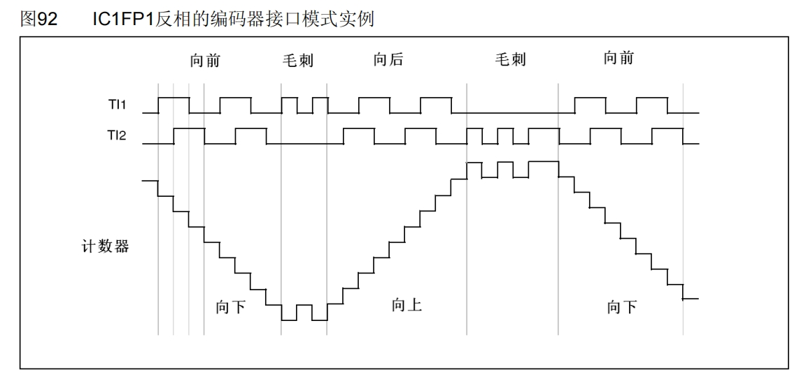

# TIM(Timer)定时器

可以对输入的时钟进行计数，并在计数值达到设定值时触发中断

根据复杂程度和应用场景可以分为：高级定时器，通用定时器，基本定时器

16位计数器，在72MHz计数时钟下可以实现最大59.65s的定时

最大定时=（）（最大计数器数）*（最大自动重装数）/72M

65536*65536/72M=59.65

## 定时器类型


### 基本定时器


#### PSC（预分频器）

对72MHz的计数时钟进行预分频

比如这个寄存器写0，那就是不分频，或者说是1分频（输出频率=输入频率=72MHZ）

预分频器写1，那就是2分频（输出频率=输入频率/2=36MHZ）

预分频器写2，那就是3分频（输出频率=输入频率/3=24MHZ）

**计数器计数频率:CK_CNT=CK_PSC/(PSC+1)**

**预分频系数 = 预分频数值+1**

**计数器溢出频率：CK_CNT_OV= CK_CNT/(ARR + 1)=CK_PSC/(PSC+1)/(ARR + 1);ARR---->自动重装器**

这个预分频器是16位的，所以最大值可以写65535（2^16），也就是65536分频

如图为预分频器的参数从1变到2时，计数器的时序图


#### CK_CNT（计数器）

可以对预分频后的计数时钟进行计数

每一次来一个上升沿，就可以对计数器进行加一（只有向上计数模式）

计数器是16位的，可以从0加到65535

计数器时序图


**计数器溢出频率：CK_CNT_OV= CK_CNT/(ARR + 1)=CK_PSC/(PSC+1)/(ARR + 1);ARR---->自动重装器**

内部时钟分频因子为1，就是分频系数为1

#### ARR（自动重装寄存器）

存储写入的计数目标值，当计数值等于自动重装值时，就是计时时间到了，就会产生一个中断信号，并且清零计数器，计数器开始下一次的计数器计时

#### UI（更新中断）

表示产生的中断信号，更新中断之后就会通往NVIC，再配置好NVIC的定时器通道

#### U（更新事件）

表示产生一个事件，不会触发中断，会触发内部其他电路的工作

#### DAC（数模转换器）

主模式触发的作用：把更新事件通过主模式映射到TRGO，然后TRGO就会直接去触发DAC，整个过程不需要软件的参与，实现了硬件的自动化

### 通用定时器


相对于基本定时器的计数器，通用定时器和高级定时器还支持向下计数模式和中央对齐模式

#### CK_CNT计数器

向下计数模式：从重装值开始，向下自减，减到0之后，回到重装值同时申请中断

中央对齐模式：从0开始，先向上自增，计到重装值，申请中断，然后再向下自减，减到0，再申请中断，依次循环

#### 外部时钟

##### TIMx_ETR(external)

###### ETRF（**External Trigger Filtered**）

指滤波后的外部触发输入

ETRF--->触发控制器---->时基单元时钟，如果在ETR外部引脚提供时钟，或者把这个定时器当做计数器来用，就可以配置这一路的电路，叫做（外部时钟模式2）

###### TRGI（Trigger In）

trigger----->触发器

主要是用作触发输入来使用,可以触发定时器的从模式

1.TRGI当做外部时钟来使用的时候，这一路就叫做（外部时钟模式1）

###### TRGO（Trigger Out）

当其通向其他定时器的时候，就接到了其他定时器的ITR引脚上来（ITR0-ITR4）

##### ITR信号

此部分信号来自于其他定时器，此图中的ITR0到ITR3分别来自于其他4个定时器的TRGO输出，具体连接方式如图：


例如：TIM2的ITR0是接在了TIM1的TRGO上的

定时器的级联：比如可以先初始化TIM3，然后使用主模式把它的更新事件映射到TRGO上，接着再初始化TIM2,选择ITR2，对应的就是TIM3的TRGO，然后再选择时钟为外部时钟模式1，这样TIM3的更新事件就可以驱动TIM2的是基单元，实现定时器的级联

##### 输出比较电路（TIMx_CH1-TIMx_CH4）

用于输出PWM波形，驱动电机

##### 输入捕获电路

与输出比较电路公用引脚，可用于测输入方波的频率等

### 高级定时器


#### 重复次数计数器

可以实现每隔几个计数周期才发生一次更新事件，和更新中断，原来的结构是每个计数周期完成后都会发生更新，相当于对输出信号又做了一次分频

#### DTG（Dead Time Generate）

死区生成电路，图示的右边引脚由原来的一个变为了两个互补的输出，可以输出一对互补的PWM波，这些电路是为了驱动三相无刷电机

#### TIMx_BKIN(刹车输入)

为了给电机驱动提供安全保障

## 定时中断基本结构


时钟源选择：

```c
void TIM_InternalClockConfig(TIM_TypeDef* TIMx);
void TIM_ITRxExternalClockConfig(TIM_TypeDef* TIMx, uint16_t TIM_InputTriggerSource);
void TIM_TIxExternalClockConfig(TIM_TypeDef* TIMx, uint16_t TIM_TIxExternalCLKSource,
                                uint16_t TIM_ICPolarity, uint16_t ICFilter);
void TIM_ETRClockMode1Config(TIM_TypeDef* TIMx, uint16_t TIM_ExtTRGPrescaler, uint16_t TIM_ExtTRGPolarity,
                             uint16_t ExtTRGFilter);
void TIM_ETRClockMode2Config(TIM_TypeDef* TIMx, uint16_t TIM_ExtTRGPrescaler, 
                             uint16_t TIM_ExtTRGPolarity, uint16_t ExtTRGFilter);
void TIM_ETRConfig(TIM_TypeDef* TIMx, uint16_t TIM_ExtTRGPrescaler, uint16_t TIM_ExtTRGPolarity,
                   uint16_t ExtTRGFilter);
```

时基单元：

```c
void TIM_TimeBaseInit(TIM_TypeDef* TIMx, TIM_TimeBaseInitTypeDef* TIM_TimeBaseInitStruct);
```

中断输出控制：

```c
void TIM_ITConfig(TIM_TypeDef* TIMx, uint16_t TIM_IT, FunctionalState NewState);
```

运行控制：

```c
void TIM_Cmd(TIM_TypeDef* TIMx, FunctionalState NewState);
```


## 代码例程

### 定时器定时中断（内部时钟）

```c
/**
  * 函    数：定时中断初始化
  * 参    数：无
  * 返 回 值：无
  */
void Timer_Init(void)
{
	/*开启时钟*/
	RCC_APB1PeriphClockCmd(RCC_APB1Periph_TIM2, ENABLE);			//开启TIM2的时钟
	
	/*配置时钟源*/
	TIM_InternalClockConfig(TIM2);		//选择TIM2为内部时钟，若不调用此函数，TIM默认也为内部时钟
	
	/*时基单元初始化*/
	TIM_TimeBaseInitTypeDef TIM_TimeBaseInitStructure;				//定义结构体变量
	TIM_TimeBaseInitStructure.TIM_ClockDivision = TIM_CKD_DIV1;		//时钟分频，选择不分频，此参数用于配置滤波器时钟，不影响时基单元功能
	TIM_TimeBaseInitStructure.TIM_CounterMode = TIM_CounterMode_Up;	//计数器模式，选择向上计数
	/*************定时一个1s的定时器********************/
	TIM_TimeBaseInitStructure.TIM_Period = 10000 - 1;				//计数周期，即ARR的值
	TIM_TimeBaseInitStructure.TIM_Prescaler = 7200 - 1;				//预分频器，即PSC的值
	TIM_TimeBaseInitStructure.TIM_RepetitionCounter = 0;			//重复计数器，高级定时器才会用到
	TIM_TimeBaseInit(TIM2, &TIM_TimeBaseInitStructure);				//将结构体变量交给TIM_TimeBaseInit，配置TIM2的时基单元	
	
	/*中断输出配置*/
	TIM_ClearFlag(TIM2, TIM_FLAG_Update);						//清除定时器更新标志位
																//TIM_TimeBaseInit函数末尾，手动产生了更新事件
																//若不清除此标志位，则开启中断后，会立刻进入一次中断
																//如果不介意此问题，则不清除此标志位也可
	
	TIM_ITConfig(TIM2, TIM_IT_Update, ENABLE);					//开启TIM2的更新中断
	
	/*NVIC中断分组*/
	NVIC_PriorityGroupConfig(NVIC_PriorityGroup_2);				//配置NVIC为分组2
																//即抢占优先级范围：0~3，响应优先级范围：0~3
																//此分组配置在整个工程中仅需调用一次
																//若有多个中断，可以把此代码放在main函数内，while循环之前
																//若调用多次配置分组的代码，则后执行的配置会覆盖先执行的配置
	
	/*NVIC配置*/
	NVIC_InitTypeDef NVIC_InitStructure;						//定义结构体变量
	NVIC_InitStructure.NVIC_IRQChannel = TIM2_IRQn;				//选择配置NVIC的TIM2线
	NVIC_InitStructure.NVIC_IRQChannelCmd = ENABLE;				//指定NVIC线路使能
	NVIC_InitStructure.NVIC_IRQChannelPreemptionPriority = 2;	//指定NVIC线路的抢占优先级为2
	NVIC_InitStructure.NVIC_IRQChannelSubPriority = 1;			//指定NVIC线路的响应优先级为1
	NVIC_Init(&NVIC_InitStructure);								//将结构体变量交给NVIC_Init，配置NVIC外设
	
	/*TIM使能*/
	TIM_Cmd(TIM2, ENABLE);			//使能TIM2，定时器开始运行
}

/* 定时器中断函数，可以复制到使用它的地方
void TIM2_IRQHandler(void)
{
	if (TIM_GetITStatus(TIM2, TIM_IT_Update) == SET)//检查中断标志位
	{
		
		TIM_ClearITPendingBit(TIM2, TIM_IT_Update);//清除标志位
	}
}
*/
```

### 定时器外部时钟

```c
/**
  * 函    数：定时中断初始化
  * 参    数：无
  * 返 回 值：无
  * 注意事项：此函数配置为外部时钟，定时器相当于计数器
  */
void Timer_Init(void)
{
	/*开启时钟*/
	RCC_APB1PeriphClockCmd(RCC_APB1Periph_TIM2, ENABLE);			//开启TIM2的时钟
	RCC_APB2PeriphClockCmd(RCC_APB2Periph_GPIOA, ENABLE);			//开启GPIOA的时钟
	
	/*GPIO初始化*/
	GPIO_InitTypeDef GPIO_InitStructure;
	GPIO_InitStructure.GPIO_Mode = GPIO_Mode_IPU;
	GPIO_InitStructure.GPIO_Pin = GPIO_Pin_0;
	GPIO_InitStructure.GPIO_Speed = GPIO_Speed_50MHz;
	GPIO_Init(GPIOA, &GPIO_InitStructure);						//将PA0引脚初始化为上拉输入
	
	/*外部时钟配置*/
	TIM_ETRClockMode2Config(TIM2, TIM_ExtTRGPSC_OFF, TIM_ExtTRGPolarity_NonInverted, 0x0F);//1.时钟选择2.外部触发预分频器3.外部触发的极性，此处为高电平或上升沿有效4.外部触发滤波器
																//选择外部时钟模式2，时钟从TIM_ETR引脚输入
																//注意TIM2的ETR引脚固定为PA0，无法随意更改
																//最后一个滤波器参数加到最大0x0F，可滤除时钟信号抖动
	
	/*时基单元初始化*/
	TIM_TimeBaseInitTypeDef TIM_TimeBaseInitStructure;				//定义结构体变量
	TIM_TimeBaseInitStructure.TIM_ClockDivision = TIM_CKD_DIV1;		//时钟分频，选择不分频，此参数用于配置滤波器时钟，不影响时基单元功能
	TIM_TimeBaseInitStructure.TIM_CounterMode = TIM_CounterMode_Up;	//计数器模式，选择向上计数
	TIM_TimeBaseInitStructure.TIM_Period = 10 - 1;					//计数周期，即ARR的值
	TIM_TimeBaseInitStructure.TIM_Prescaler = 1 - 1;				//预分频器，即PSC的值
	TIM_TimeBaseInitStructure.TIM_RepetitionCounter = 0;			//重复计数器，高级定时器才会用到
	TIM_TimeBaseInit(TIM2, &TIM_TimeBaseInitStructure);				//将结构体变量交给TIM_TimeBaseInit，配置TIM2的时基单元	
	
	/*中断输出配置*/
	TIM_ClearFlag(TIM2, TIM_FLAG_Update);						//清除定时器更新标志位
																//TIM_TimeBaseInit函数末尾，手动产生了更新事件
																//若不清除此标志位，则开启中断后，会立刻进入一次中断
																//如果不介意此问题，则不清除此标志位也可
																
	TIM_ITConfig(TIM2, TIM_IT_Update, ENABLE);					//开启TIM2的更新中断
	
	/*NVIC中断分组*/
	NVIC_PriorityGroupConfig(NVIC_PriorityGroup_2);				//配置NVIC为分组2
																//即抢占优先级范围：0~3，响应优先级范围：0~3
																//此分组配置在整个工程中仅需调用一次
																//若有多个中断，可以把此代码放在main函数内，while循环之前
																//若调用多次配置分组的代码，则后执行的配置会覆盖先执行的配置
	
	/*NVIC配置*/
	NVIC_InitTypeDef NVIC_InitStructure;						//定义结构体变量
	NVIC_InitStructure.NVIC_IRQChannel = TIM2_IRQn;				//选择配置NVIC的TIM2线
	NVIC_InitStructure.NVIC_IRQChannelCmd = ENABLE;				//指定NVIC线路使能
	NVIC_InitStructure.NVIC_IRQChannelPreemptionPriority = 2;	//指定NVIC线路的抢占优先级为2
	NVIC_InitStructure.NVIC_IRQChannelSubPriority = 1;			//指定NVIC线路的响应优先级为1
	NVIC_Init(&NVIC_InitStructure);								//将结构体变量交给NVIC_Init，配置NVIC外设
	
	/*TIM使能*/
	TIM_Cmd(TIM2, ENABLE);			//使能TIM2，定时器开始运行
}

/**
  * 函    数：返回定时器CNT的值
  * 参    数：无
  * 返 回 值：定时器CNT的值，范围：0~65535
  */
uint16_t Timer_GetCounter(void)
{
	return TIM_GetCounter(TIM2);	//返回定时器TIM2的CNT
}

/* 定时器中断函数，可以复制到使用它的地方
void TIM2_IRQHandler(void)
{
	if (TIM_GetITStatus(TIM2, TIM_IT_Update) == SET)
	{
		
		TIM_ClearITPendingBit(TIM2, TIM_IT_Update);
	}
}
*/
```

## TIM输出比较

OC(Output Compare)输出比较

输出比较可以通过比较CNT与CCR（Capture/Compare Register--->捕获/比较寄存器）寄存器值的关系，来对输出电平进行置1、置0或翻转的操作，用于输出一定频率和占空比的PWM波形

每个高级定时器和通用定时器都拥有4个输出比较通道

高级定时器的前3个通道额外 拥有死区生成和互补输出的功能

只有高级定时器和通用定时器才有这个功能，基本定时器没有

### PWM简介

PWM(Pulse Width Modulation)脉冲宽度调制

在具有惯性的系统中，可以通过对一系列脉冲的宽度进行调制，来等效地获得所需要的模拟参量，常应用于电机控速等领域

PWM参数:  频率=1/Ts     占空比=Ton/Ts         分辨率 =占空比变化步距


有图一可知，实际的电压变化值，可以等效于紫色虚线的模拟电压值

#### 基本结构

例程：以PWM1模式，向上计数为例


蓝色线位CNT的值，黄色线为ARR的值，红色线为CCR的值

#### 参数计算

PWM频率:	Freq =CK PSC/(PSC + 1)/(ARR + 1)

PWM占空比:     Duty=CCR/(ARR +1)

PWM分辨率：   Reso=1/(ARR+1)

### 输出比较通道（高级）


### 输出比较通道（通用）


oc1ref(Output Compare 1 reference ):输出比较通道1的参考信号，可以将其映射到主模式的TRGO输出上去

CCIP:极性选择，写0时候，信号往上走，写1，信号往下走

### 输出比较模式


## 代码例程

### PWM驱动LED呼吸灯

#### PWM头文件

```c
#ifndef __PWM_H
#define __PWM_H

void PWM_Init(void);
void PWM_SetCompare1(uint16_t Compare);

#endif

```

#### PWM

```c
#include "stm32f10x.h"                  // Device header

/**
  * 函    数：PWM初始化
  * 参    数：无
  * 返 回 值：无
  */
void PWM_Init(void)
{
	/*开启时钟*/
	RCC_APB1PeriphClockCmd(RCC_APB1Periph_TIM2, ENABLE);			//开启TIM2的时钟
	RCC_APB2PeriphClockCmd(RCC_APB2Periph_GPIOA, ENABLE);			//开启GPIOA的时钟
	
	/*GPIO重映射*/
//	RCC_APB2PeriphClockCmd(RCC_APB2Periph_AFIO, ENABLE);			//开启AFIO的时钟，重映射必须先开启AFIO的时钟
//	GPIO_PinRemapConfig(GPIO_PartialRemap1_TIM2, ENABLE);			//将TIM2的引脚部分重映射，具体的映射方案需查看参考手册
//	GPIO_PinRemapConfig(GPIO_Remap_SWJ_JTAGDisable, ENABLE);		//将JTAG引脚失能，作为普通GPIO引脚使用
	
	/*GPIO初始化*/
	GPIO_InitTypeDef GPIO_InitStructure;
	GPIO_InitStructure.GPIO_Mode = GPIO_Mode_AF_PP;
	GPIO_InitStructure.GPIO_Pin = GPIO_Pin_0;		//GPIO_Pin_15;
	GPIO_InitStructure.GPIO_Speed = GPIO_Speed_50MHz;
	GPIO_Init(GPIOA, &GPIO_InitStructure);							//将PA0引脚初始化为复用推挽输出	
																	//受外设控制的引脚，均需要配置为复用模式		
	
	/*配置时钟源*/
	TIM_InternalClockConfig(TIM2);		//选择TIM2为内部时钟，若不调用此函数，TIM默认也为内部时钟
	
	/*时基单元初始化*/
	TIM_TimeBaseInitTypeDef TIM_TimeBaseInitStructure;				//定义结构体变量
	TIM_TimeBaseInitStructure.TIM_ClockDivision = TIM_CKD_DIV1;     //时钟分频，选择不分频，此参数用于配置滤波器时钟，不影响时基单元功能
	TIM_TimeBaseInitStructure.TIM_CounterMode = TIM_CounterMode_Up; //计数器模式，选择向上计数
	TIM_TimeBaseInitStructure.TIM_Period = 100 - 1;					//计数周期，即ARR的值
	TIM_TimeBaseInitStructure.TIM_Prescaler = 720 - 1;				//预分频器，即PSC的值
	TIM_TimeBaseInitStructure.TIM_RepetitionCounter = 0;            //重复计数器，高级定时器才会用到
	TIM_TimeBaseInit(TIM2, &TIM_TimeBaseInitStructure);             //将结构体变量交给TIM_TimeBaseInit，配置TIM2的时基单元
	
	/*输出比较初始化*/
	TIM_OCInitTypeDef TIM_OCInitStructure;							//定义结构体变量
	TIM_OCStructInit(&TIM_OCInitStructure);							//结构体初始化，若结构体没有完整赋值
																	//则最好执行此函数，给结构体所有成员都赋一个默认值
																	//避免结构体初值不确定的问题
	TIM_OCInitStructure.TIM_OCMode = TIM_OCMode_PWM1;				//输出比较模式，选择PWM模式1
	TIM_OCInitStructure.TIM_OCPolarity = TIM_OCPolarity_High;		//输出极性，选择为高，若选择极性为低，则输出高低电平取反
	TIM_OCInitStructure.TIM_OutputState = TIM_OutputState_Enable;	//输出使能
	TIM_OCInitStructure.TIM_Pulse = 0;								//初始的CCR值
	TIM_OC1Init(TIM2, &TIM_OCInitStructure);						//将结构体变量交给TIM_OC1Init，配置TIM2的输出比较通道1
	
	/*TIM使能*/
	TIM_Cmd(TIM2, ENABLE);			//使能TIM2，定时器开始运行
}

/**
  * 函    数：PWM设置CCR
  * 参    数：Compare 要写入的CCR的值，范围：0~100
  * 返 回 值：无
  * 注意事项：CCR和ARR共同决定占空比，此函数仅设置CCR的值，并不直接是占空比
  *           占空比Duty = CCR / (ARR + 1)
  */
void PWM_SetCompare1(uint16_t Compare)
{
	TIM_SetCompare1(TIM2, Compare);		//设置CCR1的值
}

```

## TIM输入捕获

IC(Input Capture)输入捕获

输入捕获模式下，当通道输入引脚出现指定电平跳变时，当前CNT的值将被锁存到CCR中，可用于测量PWM波形的频率、占空比、脉冲间隔、电平持续时间等参数

每个高级定时器和通用定时器都拥有4个输入捕获通道

可配置为PWMI模式，同时测量频率和占空比

可配合主从触发模式，实现硬件全自动测量

### 频率测量


测周法适用于低频率（fx<fm）

测频法适用于高频率（fx>fm）

### 输入捕获通道


输入的TI1,就是ch1的引脚，输出的TI1F是滤波后的信号

fDTS是滤波器的采样时钟来源

CCMR1寄存器里的ICF位可以控制滤波器的参数

CC1S位可以对数据选择器进行选择

ICPS位，可以配置分频器

CC1E位，控制输出使能或失能

TIFP1上升沿触发

### 主从触发模式


TRGO用于触发别的外设------>主模式

接受其他外设或者自身外设的信号--->从模式

选择从模式的触发信号源-，去触发从模式------>触发源选择

### 输入捕获基本结构


###  PWMI基本结构


使用了两个通道同时捕获一个引脚，可以同时测量周期和占空比

TI1FP1------>上升沿触发

TI1FP2------>下降沿触发

占空比=ARR2/ARR1

### 代码例程

#### 输入捕获模式测频率

##### PWM模块

```c
#include "stm32f10x.h"                  // Device header

/**
  * 函    数：PWM初始化
  * 参    数：无
  * 返 回 值：无
  */
void PWM_Init(void)
{
	/*开启时钟*/
	RCC_APB1PeriphClockCmd(RCC_APB1Periph_TIM2, ENABLE);			//开启TIM2的时钟
	RCC_APB2PeriphClockCmd(RCC_APB2Periph_GPIOA, ENABLE);			//开启GPIOA的时钟
	
	/*GPIO重映射*/
//	RCC_APB2PeriphClockCmd(RCC_APB2Periph_AFIO, ENABLE);			//开启AFIO的时钟，重映射必须先开启AFIO的时钟
//	GPIO_PinRemapConfig(GPIO_PartialRemap1_TIM2, ENABLE);			//将TIM2的引脚部分重映射，具体的映射方案需查看参考手册
//	GPIO_PinRemapConfig(GPIO_Remap_SWJ_JTAGDisable, ENABLE);		//将JTAG引脚失能，作为普通GPIO引脚使用
	
	/*GPIO初始化*/
	GPIO_InitTypeDef GPIO_InitStructure;
	GPIO_InitStructure.GPIO_Mode = GPIO_Mode_AF_PP;
	GPIO_InitStructure.GPIO_Pin = GPIO_Pin_0;		//GPIO_Pin_15;
	GPIO_InitStructure.GPIO_Speed = GPIO_Speed_50MHz;
	GPIO_Init(GPIOA, &GPIO_InitStructure);							//将PA0引脚初始化为复用推挽输出	
																	//受外设控制的引脚，均需要配置为复用模式		
	
	/*配置时钟源*/
	TIM_InternalClockConfig(TIM2);		//选择TIM2为内部时钟，若不调用此函数，TIM默认也为内部时钟
	
	/*时基单元初始化*/
	TIM_TimeBaseInitTypeDef TIM_TimeBaseInitStructure;				//定义结构体变量
	TIM_TimeBaseInitStructure.TIM_ClockDivision = TIM_CKD_DIV1;     //时钟分频，选择不分频，此参数用于配置滤波器时钟，不影响时基单元功能
	TIM_TimeBaseInitStructure.TIM_CounterMode = TIM_CounterMode_Up; //计数器模式，选择向上计数
	TIM_TimeBaseInitStructure.TIM_Period = 100 - 1;					//计数周期，即ARR的值
	TIM_TimeBaseInitStructure.TIM_Prescaler = 720 - 1;				//预分频器，即PSC的值
	TIM_TimeBaseInitStructure.TIM_RepetitionCounter = 0;            //重复计数器，高级定时器才会用到
	TIM_TimeBaseInit(TIM2, &TIM_TimeBaseInitStructure);             //将结构体变量交给TIM_TimeBaseInit，配置TIM2的时基单元
	
	/*输出比较初始化*/
	TIM_OCInitTypeDef TIM_OCInitStructure;							//定义结构体变量
	TIM_OCStructInit(&TIM_OCInitStructure);							//结构体初始化，若结构体没有完整赋值
																	//则最好执行此函数，给结构体所有成员都赋一个默认值
																	//避免结构体初值不确定的问题
	TIM_OCInitStructure.TIM_OCMode = TIM_OCMode_PWM1;				//输出比较模式，选择PWM模式1
	TIM_OCInitStructure.TIM_OCPolarity = TIM_OCPolarity_High;		//输出极性，选择为高，若选择极性为低，则输出高低电平取反
	TIM_OCInitStructure.TIM_OutputState = TIM_OutputState_Enable;	//输出使能
	TIM_OCInitStructure.TIM_Pulse = 0;								//初始的CCR值
	TIM_OC1Init(TIM2, &TIM_OCInitStructure);						//将结构体变量交给TIM_OC1Init，配置TIM2的输出比较通道1
	
	/*TIM使能*/
	TIM_Cmd(TIM2, ENABLE);			//使能TIM2，定时器开始运行
}

/**
  * 函    数：PWM设置CCR
  * 参    数：Compare 要写入的CCR的值，范围：0~100
  * 返 回 值：无
  * 注意事项：CCR和ARR共同决定占空比，此函数仅设置CCR的值，并不直接是占空比
  *           占空比Duty = CCR / (ARR + 1)
  */
void PWM_SetCompare1(uint16_t Compare)
{
	TIM_SetCompare1(TIM2, Compare);		//设置CCR1的值
}

/**
  * 函    数：PWM设置PSC
  * 参    数：Prescaler 要写入的PSC的值，范围：0~65535
  * 返 回 值：无
  * 注意事项：PSC和ARR共同决定频率，此函数仅设置PSC的值，并不直接是频率
  *           频率Freq = CK_PSC / (PSC + 1) / (ARR + 1)
  */
void PWM_SetPrescaler(uint16_t Prescaler)
{
	TIM_PrescalerConfig(TIM2, Prescaler, TIM_PSCReloadMode_Immediate);		//设置PSC的值
}

```

##### IC模块

```c
#include "stm32f10x.h"                  // Device header

/**
  * 函    数：输入捕获初始化
  * 参    数：无
  * 返 回 值：无
  */
void IC_Init(void)
{
	/*开启时钟*/
	RCC_APB1PeriphClockCmd(RCC_APB1Periph_TIM3, ENABLE);			//开启TIM3的时钟
	RCC_APB2PeriphClockCmd(RCC_APB2Periph_GPIOA, ENABLE);			//开启GPIOA的时钟
	
	/*GPIO初始化*/
	GPIO_InitTypeDef GPIO_InitStructure;
	GPIO_InitStructure.GPIO_Mode = GPIO_Mode_IPU;
	GPIO_InitStructure.GPIO_Pin = GPIO_Pin_6;
	GPIO_InitStructure.GPIO_Speed = GPIO_Speed_50MHz;
	GPIO_Init(GPIOA, &GPIO_InitStructure);							//将PA6引脚初始化为上拉输入
	
	/*配置时钟源*/
	TIM_InternalClockConfig(TIM3);		//选择TIM3为内部时钟，若不调用此函数，TIM默认也为内部时钟
	
	/*时基单元初始化*/
	TIM_TimeBaseInitTypeDef TIM_TimeBaseInitStructure;				//定义结构体变量
	TIM_TimeBaseInitStructure.TIM_ClockDivision = TIM_CKD_DIV1;     //时钟分频，选择不分频，此参数用于配置滤波器时钟，不影响时基单元功能
	TIM_TimeBaseInitStructure.TIM_CounterMode = TIM_CounterMode_Up; //计数器模式，选择向上计数
	TIM_TimeBaseInitStructure.TIM_Period = 65536 - 1;               //计数周期，即ARR的值,塞设置大一些，防止计数溢出
	TIM_TimeBaseInitStructure.TIM_Prescaler = 72 - 1;               //预分频器，即PSC的值
	TIM_TimeBaseInitStructure.TIM_RepetitionCounter = 0;            //重复计数器，高级定时器才会用到
	TIM_TimeBaseInit(TIM3, &TIM_TimeBaseInitStructure);             //将结构体变量交给TIM_TimeBaseInit，配置TIM3的时基单元
	
	/*输入捕获初始化*/
	TIM_ICInitTypeDef TIM_ICInitStructure;							//定义结构体变量
	TIM_ICInitStructure.TIM_Channel = TIM_Channel_1;				//选择配置定时器通道1
	TIM_ICInitStructure.TIM_ICFilter = 0xF;							//输入滤波器参数，可以过滤信号抖动
	TIM_ICInitStructure.TIM_ICPolarity = TIM_ICPolarity_Rising;		//极性，选择为上升沿触发捕获
	TIM_ICInitStructure.TIM_ICPrescaler = TIM_ICPSC_DIV1;			//捕获预分频，选择不分频，每次信号都触发捕获
	TIM_ICInitStructure.TIM_ICSelection = TIM_ICSelection_DirectTI;	//输入信号交叉，选择直通，不交叉
	TIM_ICInit(TIM3, &TIM_ICInitStructure);							//将结构体变量交给TIM_ICInit，配置TIM3的输入捕获通道
	
	/*选择触发源及从模式*/
	TIM_SelectInputTrigger(TIM3, TIM_TS_TI1FP1);					//触发源选择TI1FP1
	TIM_SelectSlaveMode(TIM3, TIM_SlaveMode_Reset);					//从模式选择复位
																	//即TI1产生上升沿时，会触发CNT归零
	
	/*TIM使能*/
	TIM_Cmd(TIM3, ENABLE);			//使能TIM3，定时器开始运行
}

/**
  * 函    数：获取输入捕获的频率
  * 参    数：无
  * 返 回 值：捕获得到的频率
  */
uint32_t IC_GetFreq(void)
{
	return 1000000 / (TIM_GetCapture1(TIM3) + 1);		//测周法得到频率fx = fc / N，这里不执行+1的操作也可
}

```

#### PWMI模式测频率占空比

##### PWM模块

```c
#include "stm32f10x.h"                  // Device header

/**
  * 函    数：PWM初始化
  * 参    数：无
  * 返 回 值：无
  */
void PWM_Init(void)
{
	/*开启时钟*/
	RCC_APB1PeriphClockCmd(RCC_APB1Periph_TIM2, ENABLE);			//开启TIM2的时钟
	RCC_APB2PeriphClockCmd(RCC_APB2Periph_GPIOA, ENABLE);			//开启GPIOA的时钟
	
	/*GPIO重映射*/
//	RCC_APB2PeriphClockCmd(RCC_APB2Periph_AFIO, ENABLE);			//开启AFIO的时钟，重映射必须先开启AFIO的时钟
//	GPIO_PinRemapConfig(GPIO_PartialRemap1_TIM2, ENABLE);			//将TIM2的引脚部分重映射，具体的映射方案需查看参考手册
//	GPIO_PinRemapConfig(GPIO_Remap_SWJ_JTAGDisable, ENABLE);		//将JTAG引脚失能，作为普通GPIO引脚使用
	
	/*GPIO初始化*/
	GPIO_InitTypeDef GPIO_InitStructure;
	GPIO_InitStructure.GPIO_Mode = GPIO_Mode_AF_PP;
	GPIO_InitStructure.GPIO_Pin = GPIO_Pin_0;		//GPIO_Pin_15;
	GPIO_InitStructure.GPIO_Speed = GPIO_Speed_50MHz;
	GPIO_Init(GPIOA, &GPIO_InitStructure);							//将PA0引脚初始化为复用推挽输出	
																	//受外设控制的引脚，均需要配置为复用模式		
	
	/*配置时钟源*/
	TIM_InternalClockConfig(TIM2);		//选择TIM2为内部时钟，若不调用此函数，TIM默认也为内部时钟
	
	/*时基单元初始化*/
	TIM_TimeBaseInitTypeDef TIM_TimeBaseInitStructure;				//定义结构体变量
	TIM_TimeBaseInitStructure.TIM_ClockDivision = TIM_CKD_DIV1;     //时钟分频，选择不分频，此参数用于配置滤波器时钟，不影响时基单元功能
	TIM_TimeBaseInitStructure.TIM_CounterMode = TIM_CounterMode_Up; //计数器模式，选择向上计数
	TIM_TimeBaseInitStructure.TIM_Period = 100 - 1;					//计数周期，即ARR的值
	TIM_TimeBaseInitStructure.TIM_Prescaler = 720 - 1;				//预分频器，即PSC的值
	TIM_TimeBaseInitStructure.TIM_RepetitionCounter = 0;            //重复计数器，高级定时器才会用到
	TIM_TimeBaseInit(TIM2, &TIM_TimeBaseInitStructure);             //将结构体变量交给TIM_TimeBaseInit，配置TIM2的时基单元
	
	/*输出比较初始化*/
	TIM_OCInitTypeDef TIM_OCInitStructure;							//定义结构体变量
	TIM_OCStructInit(&TIM_OCInitStructure);							//结构体初始化，若结构体没有完整赋值
																	//则最好执行此函数，给结构体所有成员都赋一个默认值
																	//避免结构体初值不确定的问题
	TIM_OCInitStructure.TIM_OCMode = TIM_OCMode_PWM1;				//输出比较模式，选择PWM模式1
	TIM_OCInitStructure.TIM_OCPolarity = TIM_OCPolarity_High;		//输出极性，选择为高，若选择极性为低，则输出高低电平取反
	TIM_OCInitStructure.TIM_OutputState = TIM_OutputState_Enable;	//输出使能
	TIM_OCInitStructure.TIM_Pulse = 0;								//初始的CCR值
	TIM_OC1Init(TIM2, &TIM_OCInitStructure);						//将结构体变量交给TIM_OC1Init，配置TIM2的输出比较通道1
	
	/*TIM使能*/
	TIM_Cmd(TIM2, ENABLE);			//使能TIM2，定时器开始运行
}

/**
  * 函    数：PWM设置CCR
  * 参    数：Compare 要写入的CCR的值，范围：0~100
  * 返 回 值：无
  * 注意事项：CCR和ARR共同决定占空比，此函数仅设置CCR的值，并不直接是占空比
  *           占空比Duty = CCR / (ARR + 1)
  */
void PWM_SetCompare1(uint16_t Compare)
{
	TIM_SetCompare1(TIM2, Compare);		//设置CCR1的值
}

/**
  * 函    数：PWM设置PSC
  * 参    数：Prescaler 要写入的PSC的值，范围：0~65535
  * 返 回 值：无
  * 注意事项：PSC和ARR共同决定频率，此函数仅设置PSC的值，并不直接是频率
  *           频率Freq = CK_PSC / (PSC + 1) / (ARR + 1)
  */
void PWM_SetPrescaler(uint16_t Prescaler)
{
	TIM_PrescalerConfig(TIM2, Prescaler, TIM_PSCReloadMode_Immediate);		//设置PSC的值
}

```

##### IC模块

```c
#include "stm32f10x.h"                  // Device header

/**
  * 函    数：输入捕获初始化
  * 参    数：无
  * 返 回 值：无
  */
void IC_Init(void)
{
	/*开启时钟*/
	RCC_APB1PeriphClockCmd(RCC_APB1Periph_TIM3, ENABLE);			//开启TIM3的时钟
	RCC_APB2PeriphClockCmd(RCC_APB2Periph_GPIOA, ENABLE);			//开启GPIOA的时钟
	
	/*GPIO初始化*/
	GPIO_InitTypeDef GPIO_InitStructure;
	GPIO_InitStructure.GPIO_Mode = GPIO_Mode_IPU;
	GPIO_InitStructure.GPIO_Pin = GPIO_Pin_6;
	GPIO_InitStructure.GPIO_Speed = GPIO_Speed_50MHz;
	GPIO_Init(GPIOA, &GPIO_InitStructure);							//将PA6引脚初始化为上拉输入
	
	/*配置时钟源*/
	TIM_InternalClockConfig(TIM3);		//选择TIM3为内部时钟，若不调用此函数，TIM默认也为内部时钟
	
	/*时基单元初始化*/
	TIM_TimeBaseInitTypeDef TIM_TimeBaseInitStructure;				//定义结构体变量
	TIM_TimeBaseInitStructure.TIM_ClockDivision = TIM_CKD_DIV1;     //时钟分频，选择不分频，此参数用于配置滤波器时钟，不影响时基单元功能
	TIM_TimeBaseInitStructure.TIM_CounterMode = TIM_CounterMode_Up; //计数器模式，选择向上计数
	TIM_TimeBaseInitStructure.TIM_Period = 65536 - 1;               //计数周期，即ARR的值
	TIM_TimeBaseInitStructure.TIM_Prescaler = 72 - 1;               //预分频器，即PSC的值
	TIM_TimeBaseInitStructure.TIM_RepetitionCounter = 0;            //重复计数器，高级定时器才会用到
	TIM_TimeBaseInit(TIM3, &TIM_TimeBaseInitStructure);             //将结构体变量交给TIM_TimeBaseInit，配置TIM3的时基单元
	
	/*PWMI模式初始化*/
	TIM_ICInitTypeDef TIM_ICInitStructure;							//定义结构体变量
	TIM_ICInitStructure.TIM_Channel = TIM_Channel_1;				//选择配置定时器通道1
	TIM_ICInitStructure.TIM_ICFilter = 0xF;							//输入滤波器参数，可以过滤信号抖动
	TIM_ICInitStructure.TIM_ICPolarity = TIM_ICPolarity_Rising;		//极性，选择为上升沿触发捕获
	TIM_ICInitStructure.TIM_ICPrescaler = TIM_ICPSC_DIV1;			//捕获预分频，选择不分频，每次信号都触发捕获
	TIM_ICInitStructure.TIM_ICSelection = TIM_ICSelection_DirectTI;	//输入信号交叉，选择直通，不交叉
	TIM_PWMIConfig(TIM3, &TIM_ICInitStructure);						//将结构体变量交给TIM_PWMIConfig，配置TIM3的输入捕获通道
																	//此函数同时会把另一个通道配置为相反的配置，实现PWMI模式

	/*选择触发源及从模式*/
	TIM_SelectInputTrigger(TIM3, TIM_TS_TI1FP1);					//触发源选择TI1FP1
	TIM_SelectSlaveMode(TIM3, TIM_SlaveMode_Reset);					//从模式选择复位
																	//即TI1产生上升沿时，会触发CNT归零
	
	/*TIM使能*/
	TIM_Cmd(TIM3, ENABLE);			//使能TIM3，定时器开始运行
}

/**
  * 函    数：获取输入捕获的频率
  * 参    数：无
  * 返 回 值：捕获得到的频率
  */
uint32_t IC_GetFreq(void)
{
	return 1000000 / (TIM_GetCapture1(TIM3) + 1);		//测周法得到频率fx = fc / N，这里不执行+1的操作也可
}

/**
  * 函    数：获取输入捕获的占空比
  * 参    数：无
  * 返 回 值：捕获得到的占空比
  */
uint32_t IC_GetDuty(void)
{
	return (TIM_GetCapture2(TIM3) + 1) * 100 / (TIM_GetCapture1(TIM3) + 1);	//占空比Duty = CCR2 / CCR1 * 100，这里不执行+1的操作也可
}

```

## TIM编码器接口

Encoder Interface 编码器接口

编码器接口可接收增量(正交)编码器的信号，根据编码器旋转产生的正交信号脉冲，自动控制CNT自增或自减，从而指示编码器的位置、旋转方向和旋转速度

每个高级定时器和通用定时器都拥有1个编码器接口

两个输入引脚借用了输入捕获的通道1和通道2

### 正交编码器


### 编码器接口基本结构

编码器接口模式基本上相当于使用了一个带有方向选择的外部时钟


###  工作模式


TI1FP1信号接A，FP2接B

正转的状态都向上计数，反转的状态都向下计数

### 两个引脚都计数


### 实例（TI1反相）

极性的变化对计数的影响

TI1的电平需要取反



### 编码器接口测速

#### 代码例程

##### Encoder模块

```c
#include "stm32f10x.h"                  // Device header

/**
  * 函    数：编码器初始化
  * 参    数：无
  * 返 回 值：无
  */
void Encoder_Init(void)
{
	/*开启时钟*/
	RCC_APB1PeriphClockCmd(RCC_APB1Periph_TIM3, ENABLE);			//开启TIM3的时钟
	RCC_APB2PeriphClockCmd(RCC_APB2Periph_GPIOA, ENABLE);			//开启GPIOA的时钟
	
	/*GPIO初始化*/
	GPIO_InitTypeDef GPIO_InitStructure;
	GPIO_InitStructure.GPIO_Mode = GPIO_Mode_IPU;
	GPIO_InitStructure.GPIO_Pin = GPIO_Pin_6 | GPIO_Pin_7;
	GPIO_InitStructure.GPIO_Speed = GPIO_Speed_50MHz;
	GPIO_Init(GPIOA, &GPIO_InitStructure);							//将PA6和PA7引脚初始化为上拉输入
	
	/*时基单元初始化*/
	TIM_TimeBaseInitTypeDef TIM_TimeBaseInitStructure;				//定义结构体变量
	TIM_TimeBaseInitStructure.TIM_ClockDivision = TIM_CKD_DIV1;     //时钟分频，选择不分频，此参数用于配置滤波器时钟，不影响时基单元功能
	TIM_TimeBaseInitStructure.TIM_CounterMode = TIM_CounterMode_Up; //计数器模式，选择向上计数
	TIM_TimeBaseInitStructure.TIM_Period = 65536 - 1;               //计数周期，即ARR的值
	TIM_TimeBaseInitStructure.TIM_Prescaler = 1 - 1;                //预分频器，即PSC的值
	TIM_TimeBaseInitStructure.TIM_RepetitionCounter = 0;            //重复计数器，高级定时器才会用到
	TIM_TimeBaseInit(TIM3, &TIM_TimeBaseInitStructure);             //将结构体变量交给TIM_TimeBaseInit，配置TIM3的时基单元
	
	/*输入捕获初始化*/
	TIM_ICInitTypeDef TIM_ICInitStructure;							//定义结构体变量
	TIM_ICStructInit(&TIM_ICInitStructure);							//结构体初始化，若结构体没有完整赋值
																	//则最好执行此函数，给结构体所有成员都赋一个默认值
																	//避免结构体初值不确定的问题
	TIM_ICInitStructure.TIM_Channel = TIM_Channel_1;				//选择配置定时器通道1
	TIM_ICInitStructure.TIM_ICFilter = 0xF;							//输入滤波器参数，可以过滤信号抖动
	TIM_ICInit(TIM3, &TIM_ICInitStructure);							//将结构体变量交给TIM_ICInit，配置TIM3的输入捕获通道
	TIM_ICInitStructure.TIM_Channel = TIM_Channel_2;				//选择配置定时器通道2
	TIM_ICInitStructure.TIM_ICFilter = 0xF;							//输入滤波器参数，可以过滤信号抖动
	TIM_ICInit(TIM3, &TIM_ICInitStructure);							//将结构体变量交给TIM_ICInit，配置TIM3的输入捕获通道
	
	/*编码器接口配置*/
	TIM_EncoderInterfaceConfig(TIM3, TIM_EncoderMode_TI12, TIM_ICPolarity_Rising, TIM_ICPolarity_Rising);上升就不反相，下降就反相
																	//配置编码器模式以及两个输入通道是否反相
																	//注意此时参数的Rising和Falling已经不代表上升沿和下降沿了，而是代表是否反相
																	//此函数必须在输入捕获初始化之后进行，否则输入捕获的配置会覆盖此函数的部分配置
	
	/*TIM使能*/
	TIM_Cmd(TIM3, ENABLE);			//使能TIM3，定时器开始运行
}

/**
  * 函    数：获取编码器的增量值
  * 参    数：无
  * 返 回 值：自上此调用此函数后，编码器的增量值
  */
int16_t Encoder_Get(void)
{
	/*使用Temp变量作为中继，目的是返回CNT后将其清零*/
	int16_t Temp;
	Temp = TIM_GetCounter(TIM3);
	TIM_SetCounter(TIM3, 0);
	return Temp;
}

```

##### main函数

```c
#include "stm32f10x.h"                  // Device header
#include "Delay.h"
#include "OLED.h"
#include "Timer.h"
#include "Encoder.h"

int16_t Speed;			//定义速度变量

int main(void)
{
	/*模块初始化*/
	OLED_Init();		//OLED初始化
	Timer_Init();		//定时器初始化
	Encoder_Init();		//编码器初始化
	
	/*显示静态字符串*/
	OLED_ShowString(1, 1, "Speed:");		//1行1列显示字符串Speed:
	
	while (1)
	{
		OLED_ShowSignedNum(1, 7, Speed, 5);	//不断刷新显示编码器测得的最新速度
	}
}

/**
  * 函    数：TIM2中断函数
  * 参    数：无
  * 返 回 值：无
  * 注意事项：此函数为中断函数，无需调用，中断触发后自动执行
  *           函数名为预留的指定名称，可以从启动文件复制
  *           请确保函数名正确，不能有任何差异，否则中断函数将不能进入
  */
void TIM2_IRQHandler(void)//1s进来一次
{
	if (TIM_GetITStatus(TIM2, TIM_IT_Update) == SET)		//判断是否是TIM2的更新事件触发的中断
	{
		Speed = Encoder_Get();								//每隔固定时间段读取一次编码器计数增量值，即为速度值
		TIM_ClearITPendingBit(TIM2, TIM_IT_Update);			//清除TIM2更新事件的中断标志位
															//中断标志位必须清除
															//否则中断将连续不断地触发，导致主程序卡死
	}
}

```

