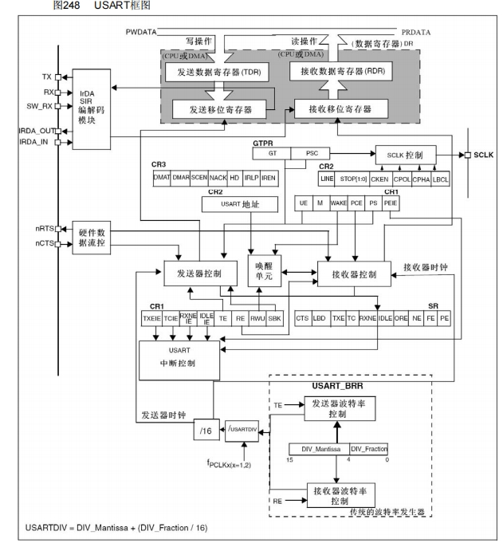
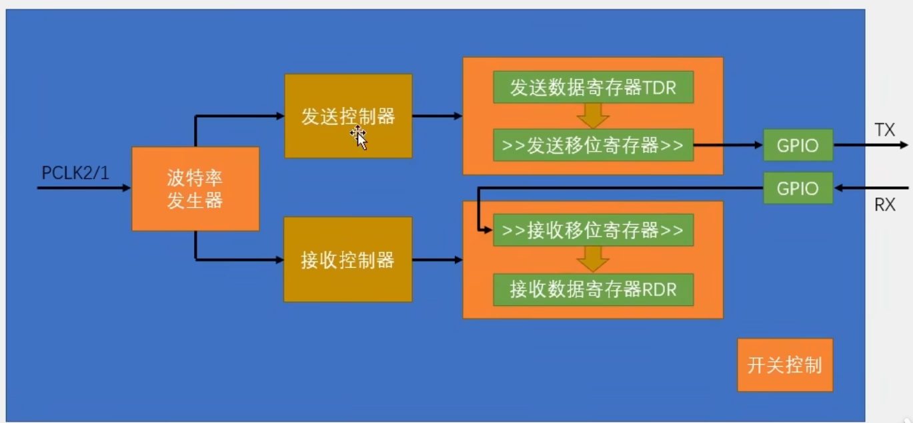
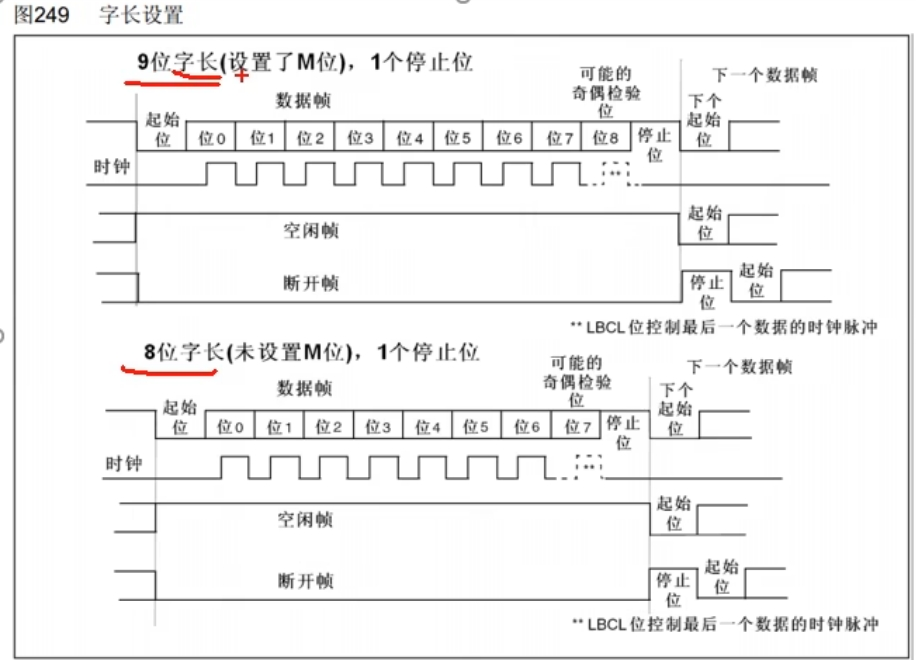
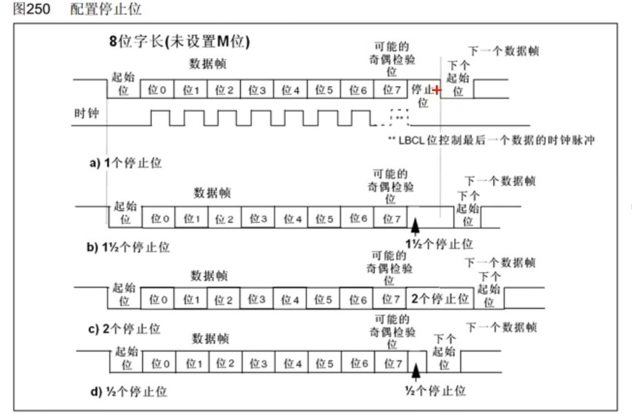
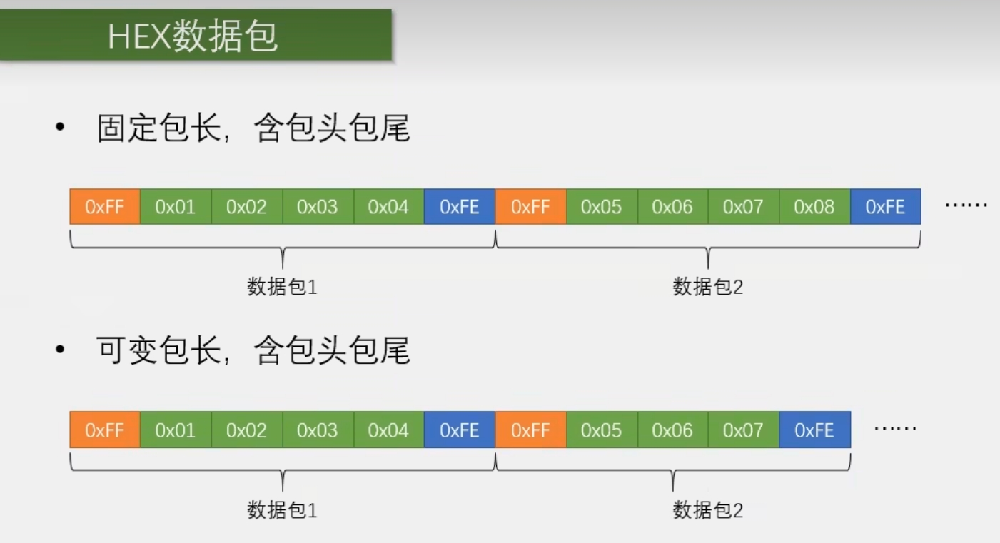
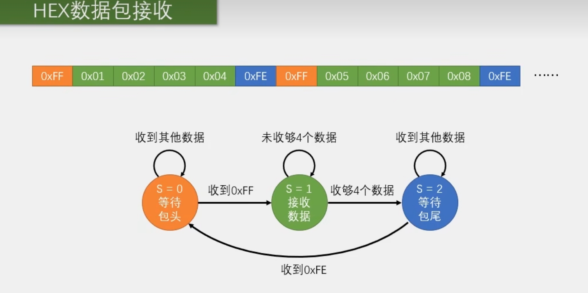
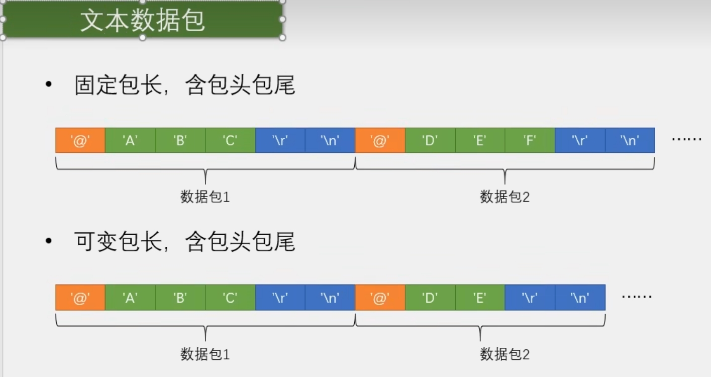
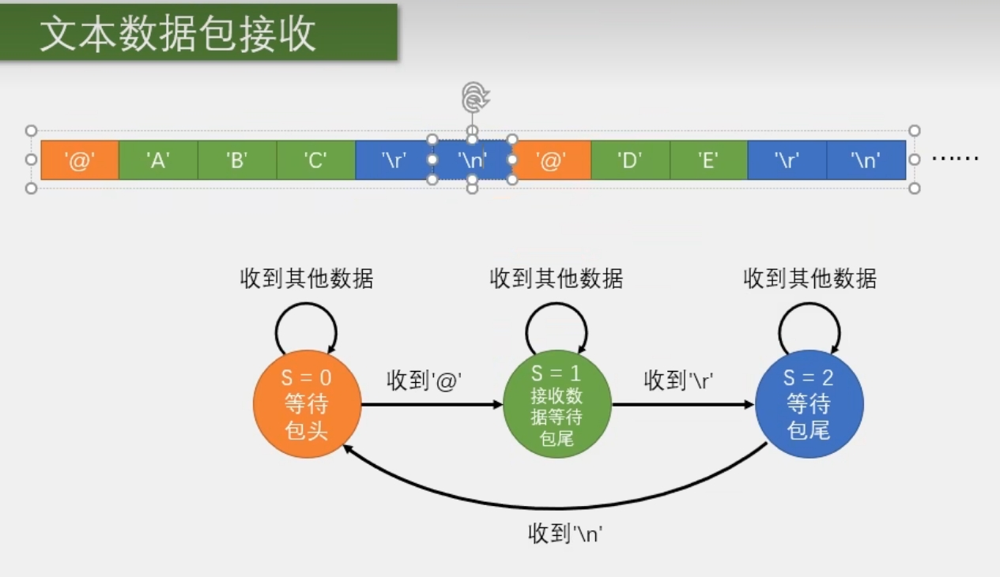

# USART串口

## 通信接口


全双工：有两根通讯线，就是指通信双方能够同时进行双向通信

I2C和SPI有时钟线，所以可以通过时钟线来采样，所以是同步，剩下的需要约定一个频率来采样，这就是异步通信，并且还要加一些帧头帧尾等，进行采样位置的对齐，

单端信号通信的双方必须要共地，就是把GND接在一起

差分信号靠两个差分引脚的电压差来传输信号的

## 硬件电路


### 电平标准

电平标准是数据1和数据0的表达方式，是传输线缆中人为规定的电压与数据的对应关系，串口常用的电平标准有如下三种：

TTL电平:+3.3V或+5V表示1，0V表示0

RS232电平:-3--15V表示1，+3-+15V表示0

RS485电平:两线压差+2~+6V表示1，-2~-6V表示0(差分信号)

### 串口参数及时序

波特率：串口通信的速率（每秒传输码元的个数），在二进制调制的情况下，一个码元就是一个bit，此时波特率就等于比特率，波特率决定了每隔多久发送一位

起始位：标志一个数据帧的开始，固定为低电平

数据位：数据帧的有效载荷，1为高电平，0为低电平，低位先行

校验位：月用于数据验证，根据数据位计算得来

停止位：用于数据帧间隔，固定为高电平

低位先行


## USART简介

USART (Universal Synchronous/Asynchronous Receiver/Transmitter
通用同步/异步收发器

USART是STM32内部集成的硬件外设，可根据数据寄存器的一个字节数据自动生成数据帧时序，从TX引脚发送出去，也可自动接收RX引脚的数据帧时序，拼接为一个字节数据，存放在数据寄存器里自带波特率发生器，最高达4.5Mbits/s

可配置数据位长度(8/9)、停止位长度(0.5/1/1.5/2)

可选校验位(无校验/奇校验/偶校验)

支持同步模式、硬件流控制、DMA、智能卡、IrDA、LIN

STM32F103C8T6 USART资源:USART1、USART2、USART3

## USART框图



 

TDR是只写的，RDR是只读的，进行写操作时，数据就写入到TDR，读操作时，数据就是从RDR读出来的，TDR和RDR共用一个寄存器

### 移位寄存器

#### 发送移位寄存器

作用：把一个字节的数据一位一位地移出去

例如：某时刻给TDR写入了0x55（0101 0101）这个数据，那么此时，硬件检测到你写入数据了，它就会检查，当前移位寄存器是不是有数据正在移位，如果没有，存储在发送数据寄存器的0101 0101就会立刻全部移动到发送移位寄存器，准备发送。

当数据从TDR移动到移位寄存器时，会置一个标志位，叫TXE(TXEmpty)，发送寄存器空，我们检查这个标志位，如果置1了，我们就可以在TDR写入下一个数据了。

注意一下，当TXE标志位置1时，数据其实还没有发送出去，只要数据从TDR转移到发送移位寄存器了，TXE就会置1，我们就可以写入新的数据了

然后发送移位寄存器就会在下面这里的发送器控制的驱动下，向右移位（**低位先行**），然后一位一位地，把数据输出到TX引脚

当数据移位完成后，新的数据就会再次自动地从TDR转移到发送移位寄存器里来，如果当前移位寄存器移位还没有完成，TDR的数据就会进行等待，一但移位完成，就会立刻转移过来

#### 接收移位寄存器

作用：把一个字节的数据一位一位地移到接收数据寄存器

数据从RX引脚通向接收移位寄存器，在接收器控制的驱动下，一位一位地读取RX电平，先放在最高位，然后向右移，移位8次之后，就能接收一个字节了，因为串口协议是**低位先行**，所以接收移位寄存器是从高位往低位这个方向移动的，之后，当一个字节移位完成之后，这一个字节的数据就会整体地，一下子转移到接收数据寄存器RDR里来，在转移的过程中,也会置一个标志位，叫RXNE(RX Not Empty)，接收数据寄存器非空，当我们检测到RXNE置1之后，就可以把数据读走了。

当数据从移位寄存器转移到RDR时，就可以直接移位接收下一帧数据了

### 硬件数据流控制

如果发送设备发的太快，接收设备来不及处理，就会出现丢弃或覆盖数据的现象，流控可以避免这个问题，这里流控有两个引脚，一个是nRTS，
个是nCTS。

nRTS(Request To Send)是请求发送，是输出脚，也就是告诉别人，我当前可以接收吗，当接受不过来时，RTS就会置高电平，对方CTS接收到之后:就会暂停发送，直到这里接收数据寄存器被读走，RTS置低电平，新的数据才会继续发送

nCTS(Clear To Send)是清除发送，是输入脚，用于接收别入nRTS的信号

当我的TX给对方发送数据时候，我们CTS就要接到对方的RTS，用于判断对方能不能接收

【前面加个n意思是低电平有效】

### 时钟信号（SCLK）

SCLK用于产生同步的时钟信号，它是配合发送移位寄存器输出的，发送寄存器每移位一次，同步时钟电平就跳变个周期，时钟告诉对方，我移出去一位数据了，你看要不要让我这个时钟信号来指导你接收一下，只支持输出，不支持输入，所以两个USART之间，不能实现同步的串口通信，所以他的作用是兼容别的协议，比如兼容SPI（一般不用）

### 唤醒单元

这部分的作用是实现串口挂载多设备，在这里可以给串口分配一个地址，当你发送指定地址时，此设备唤醒开始工作，这个设备没收到地址，就会保持沉默（一般不用）

### 中断控制

配置中断是不是能通向NVIC

## USART基本机构



### 波特率发生器

用于产生约定的通信速率，时钟来源是PCLK2或1，产生的时钟通向发送控制器和接收控制器，发送控制器和接收控制器，用来控制发送移位和接收移位

发送器和接收器的波特率由波特率寄存器BRR里的DIV确定

计算公式:波特率=f（pcLk2或1）/(16*DIV)

## 数据帧

### 字长设置



### 配置停止位



## 代码例程

### 串口发送

#### main模块

```c
#include "stm32f10x.h"                  // Device header
#include "Delay.h"
#include "OLED.h"
#include "Serial.h"

int main(void)
{
	/*模块初始化*/
	OLED_Init();						//OLED初始化
	
	Serial_Init();						//串口初始化
	
	/*串口基本函数*/
	Serial_SendByte(0x41);				//串口发送一个字节数据0x41
	
	uint8_t MyArray[] = {0x42, 0x43, 0x44, 0x45};	//定义数组
	Serial_SendArray(MyArray, 4);		//串口发送一个数组
	
	Serial_SendString("\r\nNum1=");		//串口发送字符串
	
	Serial_SendNumber(111, 3);			//串口发送数字
	
	/*下述3种方法可实现printf的效果*/
	
	/*方法1：直接重定向printf，但printf函数只有一个，此方法不能在多处使用*/
	printf("\r\nNum2=%d", 222);			//串口发送printf打印的格式化字符串
										//需要重定向fputc函数，并在工程选项里勾选Use MicroLIB
	
	/*方法2：使用sprintf打印到字符数组，再用串口发送字符数组，此方法打印到字符数组，之后想怎么处理都可以，可在多处使用*/
	char String[100];					//定义字符数组
	sprintf(String, "\r\nNum3=%d", 333);//使用sprintf，把格式化字符串打印到字符数组
	Serial_SendString(String);			//串口发送字符数组（字符串）
	
	/*方法3：将sprintf函数封装起来，实现专用的printf，此方法就是把方法2封装起来，更加简洁实用，可在多处使用*/
	Serial_Printf("\r\nNum4=%d", 444);	//串口打印字符串，使用自己封装的函数实现printf的效果
	Serial_Printf("\r\n");
	
	while (1)
	{
		
	}
}

```

#### serial模块

```c
#include "stm32f10x.h"                  // Device header
#include <stdio.h>
#include <stdarg.h>

/**
  * 函    数：串口初始化
  * 参    数：无
  * 返 回 值：无
  */
void Serial_Init(void)
{
	/*开启时钟*/
	RCC_APB2PeriphClockCmd(RCC_APB2Periph_USART1, ENABLE);	//开启USART1的时钟
	RCC_APB2PeriphClockCmd(RCC_APB2Periph_GPIOA, ENABLE);	//开启GPIOA的时钟
	
	/*GPIO初始化*/
	GPIO_InitTypeDef GPIO_InitStructure;
	GPIO_InitStructure.GPIO_Mode = GPIO_Mode_AF_PP;
	GPIO_InitStructure.GPIO_Pin = GPIO_Pin_9;
	GPIO_InitStructure.GPIO_Speed = GPIO_Speed_50MHz;
	GPIO_Init(GPIOA, &GPIO_InitStructure);					//将PA9引脚初始化为复用推挽输出
	
	/*USART初始化*/
	USART_InitTypeDef USART_InitStructure;					//定义结构体变量
	USART_InitStructure.USART_BaudRate = 9600;				//波特率
	USART_InitStructure.USART_HardwareFlowControl = USART_HardwareFlowControl_None;	//硬件流控制，不需要
	USART_InitStructure.USART_Mode = USART_Mode_Tx;			//模式，选择为发送模式
	USART_InitStructure.USART_Parity = USART_Parity_No;		//奇偶校验，不需要
	USART_InitStructure.USART_StopBits = USART_StopBits_1;	//停止位，选择1位
	USART_InitStructure.USART_WordLength = USART_WordLength_8b;		//字长，选择8位
	USART_Init(USART1, &USART_InitStructure);				//将结构体变量交给USART_Init，配置USART1
	
	/*USART使能*/
	USART_Cmd(USART1, ENABLE);								//使能USART1，串口开始运行
}

/**
  * 函    数：串口发送一个字节
  * 参    数：Byte 要发送的一个字节
  * 返 回 值：无
  */
void Serial_SendByte(uint8_t Byte)
{
	USART_SendData(USART1, Byte);		//将字节数据写入数据寄存器，写入后USART自动生成时序波形
	while (USART_GetFlagStatus(USART1, USART_FLAG_TXE) == RESET);	//等待发送完成
	/*下次写入数据寄存器会自动清除发送完成标志位，故此循环后，无需清除标志位*/
}

/**
  * 函    数：串口发送一个数组
  * 参    数：Array 要发送数组的首地址
  * 参    数：Length 要发送数组的长度
  * 返 回 值：无
  */
void Serial_SendArray(uint8_t *Array, uint16_t Length)
{
	uint16_t i;
	for (i = 0; i < Length; i ++)		//遍历数组
	{
		Serial_SendByte(Array[i]);		//依次调用Serial_SendByte发送每个字节数据
	}
}

/**
  * 函    数：串口发送一个字符串
  * 参    数：String 要发送字符串的首地址
  * 返 回 值：无
  */
void Serial_SendString(char *String)
{
	uint8_t i;
	for (i = 0; String[i] != '\0'; i ++)//遍历字符数组（字符串），遇到字符串结束标志位后停止
	{
		Serial_SendByte(String[i]);		//依次调用Serial_SendByte发送每个字节数据
	}
}

/**
  * 函    数：次方函数（内部使用）
  * 返 回 值：返回值等于X的Y次方
  */
uint32_t Serial_Pow(uint32_t X, uint32_t Y)
{
	uint32_t Result = 1;	//设置结果初值为1
	while (Y --)			//执行Y次
	{
		Result *= X;		//将X累乘到结果
	}
	return Result;
}

/**
  * 函    数：串口发送数字
  * 参    数：Number 要发送的数字，范围：0~4294967295
  * 参    数：Length 要发送数字的长度，范围：0~10
  * 返 回 值：无
  */
void Serial_SendNumber(uint32_t Number, uint8_t Length)
{
	uint8_t i;
	for (i = 0; i < Length; i ++)		//根据数字长度遍历数字的每一位
	{
		Serial_SendByte(Number / Serial_Pow(10, Length - i - 1) % 10 + '0');	//依次调用Serial_SendByte发送每位数字
	}
}

/**
  * 函    数：使用printf需要重定向的底层函数
  * 参    数：保持原始格式即可，无需变动
  * 返 回 值：保持原始格式即可，无需变动
  */
int fputc(int ch, FILE *f)
{
	Serial_SendByte(ch);			//将printf的底层重定向到自己的发送字节函数
	return ch;
}

/**
  * 函    数：自己封装的prinf函数
  * 参    数：format 格式化字符串
  * 参    数：... 可变的参数列表
  * 返 回 值：无
  */
void Serial_Printf(char *format, ...)
{
	char String[100];				//定义字符数组
	va_list arg;					//定义可变参数列表数据类型的变量arg
	va_start(arg, format);			//从format开始，接收参数列表到arg变量
	vsprintf(String, format, arg);	//使用vsprintf打印格式化字符串和参数列表到字符数组中
	va_end(arg);					//结束变量arg
	Serial_SendString(String);		//串口发送字符数组（字符串）
}

```

### 串口发送+接收

#### main模块

```c
#include "stm32f10x.h"                  // Device header
#include "Delay.h"
#include "OLED.h"
#include "Serial.h"

uint8_t RxData;			//定义用于接收串口数据的变量

int main(void)
{
	/*模块初始化*/
	OLED_Init();		//OLED初始化
	
	/*显示静态字符串*/
	OLED_ShowString(1, 1, "RxData:");
	
	/*串口初始化*/
	Serial_Init();		//串口初始化
	
	while (1)
	{
		if (Serial_GetRxFlag() == 1)			//检查串口接收数据的标志位
		{
			RxData = Serial_GetRxData();		//获取串口接收的数据
			Serial_SendByte(RxData);			//串口将收到的数据回传回去，用于测试
			OLED_ShowHexNum(1, 8, RxData, 2);	//显示串口接收的数据
		}
	}
}

```

#### serial模块

```c
#include "stm32f10x.h"                  // Device header
#include <stdio.h>
#include <stdarg.h>

uint8_t Serial_RxData;		//定义串口接收的数据变量
uint8_t Serial_RxFlag;		//定义串口接收的标志位变量

/**
  * 函    数：串口初始化
  * 参    数：无
  * 返 回 值：无
  */
void Serial_Init(void)
{
	/*开启时钟*/
	RCC_APB2PeriphClockCmd(RCC_APB2Periph_USART1, ENABLE);	//开启USART1的时钟
	RCC_APB2PeriphClockCmd(RCC_APB2Periph_GPIOA, ENABLE);	//开启GPIOA的时钟
	
	/*GPIO初始化*/
	GPIO_InitTypeDef GPIO_InitStructure;
	GPIO_InitStructure.GPIO_Mode = GPIO_Mode_AF_PP;
	GPIO_InitStructure.GPIO_Pin = GPIO_Pin_9;
	GPIO_InitStructure.GPIO_Speed = GPIO_Speed_50MHz;
	GPIO_Init(GPIOA, &GPIO_InitStructure);					//将PA9引脚初始化为复用推挽输出
	
	GPIO_InitStructure.GPIO_Mode = GPIO_Mode_IPU;
	GPIO_InitStructure.GPIO_Pin = GPIO_Pin_10;
	GPIO_InitStructure.GPIO_Speed = GPIO_Speed_50MHz;
	GPIO_Init(GPIOA, &GPIO_InitStructure);					//将PA10引脚初始化为上拉输入
	
	/*USART初始化*/
	USART_InitTypeDef USART_InitStructure;					//定义结构体变量
	USART_InitStructure.USART_BaudRate = 9600;				//波特率
	USART_InitStructure.USART_HardwareFlowControl = USART_HardwareFlowControl_None;	//硬件流控制，不需要
	USART_InitStructure.USART_Mode = USART_Mode_Tx | USART_Mode_Rx;	//模式，发送模式和接收模式均选择
	USART_InitStructure.USART_Parity = USART_Parity_No;		//奇偶校验，不需要
	USART_InitStructure.USART_StopBits = USART_StopBits_1;	//停止位，选择1位
	USART_InitStructure.USART_WordLength = USART_WordLength_8b;		//字长，选择8位
	USART_Init(USART1, &USART_InitStructure);				//将结构体变量交给USART_Init，配置USART1
	
	/*中断输出配置*/
	USART_ITConfig(USART1, USART_IT_RXNE, ENABLE);			//开启串口接收数据的中断
	
	/*NVIC中断分组*/
	NVIC_PriorityGroupConfig(NVIC_PriorityGroup_2);			//配置NVIC为分组2
	
	/*NVIC配置*/
	NVIC_InitTypeDef NVIC_InitStructure;					//定义结构体变量
	NVIC_InitStructure.NVIC_IRQChannel = USART1_IRQn;		//选择配置NVIC的USART1线
	NVIC_InitStructure.NVIC_IRQChannelCmd = ENABLE;			//指定NVIC线路使能
	NVIC_InitStructure.NVIC_IRQChannelPreemptionPriority = 1;		//指定NVIC线路的抢占优先级为1
	NVIC_InitStructure.NVIC_IRQChannelSubPriority = 1;		//指定NVIC线路的响应优先级为1
	NVIC_Init(&NVIC_InitStructure);							//将结构体变量交给NVIC_Init，配置NVIC外设
	
	/*USART使能*/
	USART_Cmd(USART1, ENABLE);								//使能USART1，串口开始运行
}

/**
  * 函    数：串口发送一个字节
  * 参    数：Byte 要发送的一个字节
  * 返 回 值：无
  */
void Serial_SendByte(uint8_t Byte)
{
	USART_SendData(USART1, Byte);		//将字节数据写入数据寄存器，写入后USART自动生成时序波形
	while (USART_GetFlagStatus(USART1, USART_FLAG_TXE) == RESET);	//等待发送完成
	/*下次写入数据寄存器会自动清除发送完成标志位，故此循环后，无需清除标志位*/
}

/**
  * 函    数：串口发送一个数组
  * 参    数：Array 要发送数组的首地址
  * 参    数：Length 要发送数组的长度
  * 返 回 值：无
  */
void Serial_SendArray(uint8_t *Array, uint16_t Length)
{
	uint16_t i;
	for (i = 0; i < Length; i ++)		//遍历数组
	{
		Serial_SendByte(Array[i]);		//依次调用Serial_SendByte发送每个字节数据
	}
}

/**
  * 函    数：串口发送一个字符串
  * 参    数：String 要发送字符串的首地址
  * 返 回 值：无
  */
void Serial_SendString(char *String)
{
	uint8_t i;
	for (i = 0; String[i] != '\0'; i ++)//遍历字符数组（字符串），遇到字符串结束标志位后停止
	{
		Serial_SendByte(String[i]);		//依次调用Serial_SendByte发送每个字节数据
	}
}

/**
  * 函    数：次方函数（内部使用）
  * 返 回 值：返回值等于X的Y次方
  */
uint32_t Serial_Pow(uint32_t X, uint32_t Y)
{
	uint32_t Result = 1;	//设置结果初值为1
	while (Y --)			//执行Y次
	{
		Result *= X;		//将X累乘到结果
	}
	return Result;
}

/**
  * 函    数：串口发送数字
  * 参    数：Number 要发送的数字，范围：0~4294967295
  * 参    数：Length 要发送数字的长度，范围：0~10
  * 返 回 值：无
  */
void Serial_SendNumber(uint32_t Number, uint8_t Length)
{
	uint8_t i;
	for (i = 0; i < Length; i ++)		//根据数字长度遍历数字的每一位
	{
		Serial_SendByte(Number / Serial_Pow(10, Length - i - 1) % 10 + '0');	//依次调用Serial_SendByte发送每位数字
	}
}

/**
  * 函    数：使用printf需要重定向的底层函数
  * 参    数：保持原始格式即可，无需变动
  * 返 回 值：保持原始格式即可，无需变动
  */
int fputc(int ch, FILE *f)
{
	Serial_SendByte(ch);			//将printf的底层重定向到自己的发送字节函数
	return ch;
}

/**
  * 函    数：自己封装的prinf函数
  * 参    数：format 格式化字符串
  * 参    数：... 可变的参数列表
  * 返 回 值：无
  */
void Serial_Printf(char *format, ...)
{
	char String[100];				//定义字符数组
	va_list arg;					//定义可变参数列表数据类型的变量arg
	va_start(arg, format);			//从format开始，接收参数列表到arg变量
	vsprintf(String, format, arg);	//使用vsprintf打印格式化字符串和参数列表到字符数组中
	va_end(arg);					//结束变量arg
	Serial_SendString(String);		//串口发送字符数组（字符串）
}

/**
  * 函    数：获取串口接收标志位
  * 参    数：无
  * 返 回 值：串口接收标志位，范围：0~1，接收到数据后，标志位置1，读取后标志位自动清零
  */
uint8_t Serial_GetRxFlag(void)
{
	if (Serial_RxFlag == 1)			//如果标志位为1
	{
		Serial_RxFlag = 0;
		return 1;					//则返回1，并自动清零标志位
	}
	return 0;						//如果标志位为0，则返回0
}

/**
  * 函    数：获取串口接收的数据
  * 参    数：无
  * 返 回 值：接收的数据，范围：0~255
  */
uint8_t Serial_GetRxData(void)
{
	return Serial_RxData;			//返回接收的数据变量
}

/**
  * 函    数：USART1中断函数
  * 参    数：无
  * 返 回 值：无
  * 注意事项：此函数为中断函数，无需调用，中断触发后自动执行
  *           函数名为预留的指定名称，可以从启动文件复制
  *           请确保函数名正确，不能有任何差异，否则中断函数将不能进入
  */
void USART1_IRQHandler(void)
{
	if (USART_GetITStatus(USART1, USART_IT_RXNE) == SET)		//判断是否是USART1的接收事件触发的中断
	{
		Serial_RxData = USART_ReceiveData(USART1);				//读取数据寄存器，存放在接收的数据变量
		Serial_RxFlag = 1;										//置接收标志位变量为1
		USART_ClearITPendingBit(USART1, USART_IT_RXNE);			//清除USART1的RXNE标志位
																//读取数据寄存器会自动清除此标志位
																//如果已经读取了数据寄存器，也可以不执行此代码
	}
}

```

## USART串口数据包

### HEX数据包



### HEX数据包接收



### 文本数据包



### 文本数据包接收


