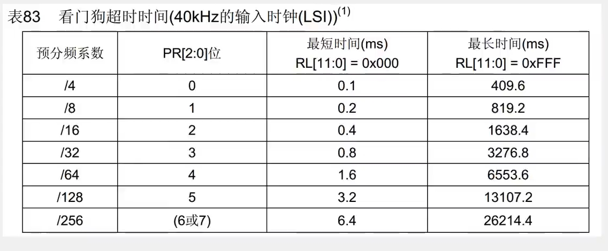
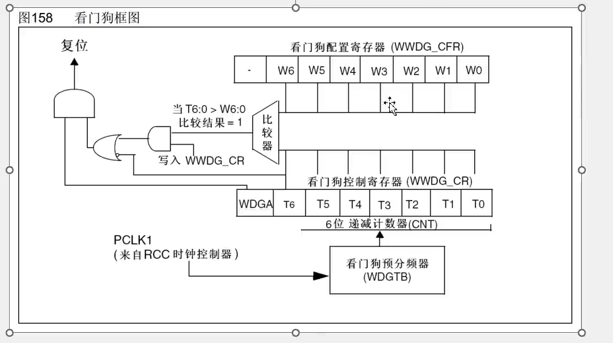
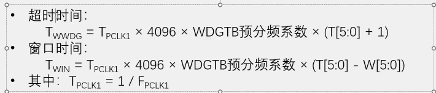
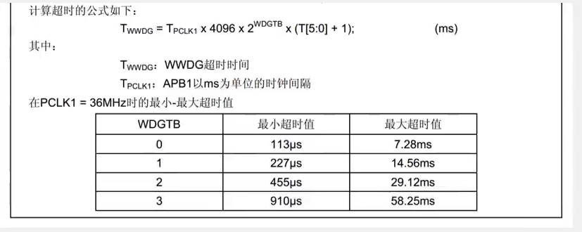
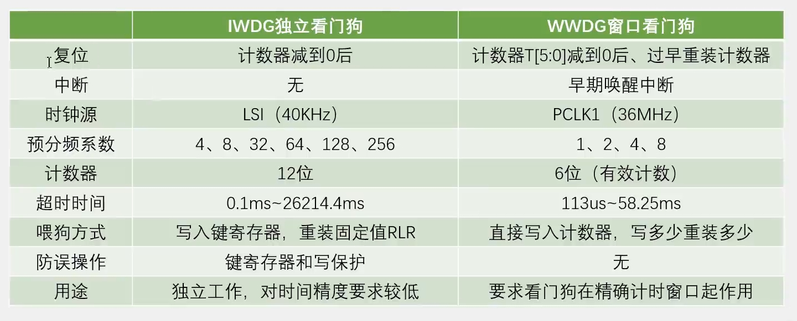

# WDG看门狗

WDG(Watchdog)看门狗

看门狗可以监控程序的运行状态，当程序因为设计漏洞、硬件故障电磁干扰等原因，出现卡死或跑飞现象时，看门狗能及时复位程序，避免程序陷入长时间的罢工状态，保证系统的可靠性和安全性

看门狗本质上是一个定时器，当指定时间范围内，程序没有执行喂狗(重置计数器)操作时，看门狗硬件电路就自动产生复位信号

STM32内置两个看门狗

​	独立看门狗(IWDG):独立工作，对时间精度要求较低

​	窗口看门狗(WWDG):要求看门狗在精确计时窗口起作用

## 看门狗框图

### 独立看门狗


####  看门狗键寄存器

键寄存器本质上是控制寄存器，用于控制硬件电路的工作

在可能存在干扰的情况下，一般通过在整个键寄存器写入特定值来代替控制寄存器写入一位的功能，以降低硬件电路受到干扰的概率


#### 看门狗超时时间

超时时间:TIwDG = TLSI x PR预分频系数 x (RL + 1)
其中:TLsI = 1 / FLsI

例如:T=1/40=0.025ms，当PR=0，RL=0时---->T=0.025x4x1=0.1----->对应第一行



### 窗口看门狗



只有T5~T0是有效的计数值，最高位T6是用来当做溢出标志位，为1时没溢出

WDGA是窗口看门狗的激活位，写入1启动窗口看门狗

#### 窗口看门狗工作特性

递减计数器T[6:0]的值小于0x40时，WWDG产生复位

递减计数器T[6:0]在窗口W[6:0]外被重新装载时，WWDG产生复位

递减计数器T[6:0]等于0x40时可以产生早期唤醒中断(EWI)，用于重装载计数器以避免WWDG复位

定期写入WWDG CR寄存器(喂狗)以避免WWDG复位

#### 窗口看门狗超时时间





WDGTB=0---->1分频	WDGTB=1---->2分频

WDGTB=2---->4分频	WDGTB=3---->8分频

## 独立和窗口的区别



### 代码例程

#### 独立看门狗

```c
#include "stm32f10x.h"                  // Device header
#include "Delay.h"
#include "OLED.h"
#include "Key.h"

int main(void)
{
	/*模块初始化*/
	OLED_Init();						//OLED初始化
	Key_Init();							//按键初始化
	
	/*显示静态字符串*/
	OLED_ShowString(1, 1, "IWDG TEST");
	
	/*判断复位信号来源*/
	if (RCC_GetFlagStatus(RCC_FLAG_IWDGRST) == SET)	//如果是独立看门狗复位
	{
		OLED_ShowString(2, 1, "IWDGRST");			//OLED闪烁IWDGRST字符串
		Delay_ms(500);
		OLED_ShowString(2, 1, "       ");
		Delay_ms(100);
		
		RCC_ClearFlag();							//清除标志位
	}
	else											//否则，即为其他复位
	{
		OLED_ShowString(3, 1, "RST");				//OLED闪烁RST字符串
		Delay_ms(500);
		OLED_ShowString(3, 1, "   ");
		Delay_ms(100);
	}
	
	/*IWDG初始化*/
	IWDG_WriteAccessCmd(IWDG_WriteAccess_Enable);	//独立看门狗写使能
	IWDG_SetPrescaler(IWDG_Prescaler_16);			//设置预分频为16
	IWDG_SetReload(2499);							//设置重装值为2499，独立看门狗的超时时间为1000ms
	IWDG_ReloadCounter();							//重装计数器，喂狗
	IWDG_Enable();									//独立看门狗使能
	
	while (1)
	{
		Key_GetNum();								//调用阻塞式的按键扫描函数，模拟主循环卡死
		
		IWDG_ReloadCounter();						//重装计数器，喂狗
		
		OLED_ShowString(4, 1, "FEED");				//OLED闪烁FEED字符串
		Delay_ms(200);								//喂狗间隔为200+600=800ms
		OLED_ShowString(4, 1, "    ");
		Delay_ms(600);
	}
}

```

#### 窗口看门狗

```c
#include "stm32f10x.h"                  // Device header
#include "Delay.h"
#include "OLED.h"
#include "Key.h"

int main(void)
{
	/*模块初始化*/
	OLED_Init();						//OLED初始化
	Key_Init();							//按键初始化
	
	/*显示静态字符串*/
	OLED_ShowString(1, 1, "WWDG TEST");
	
	/*判断复位信号来源*/
	if (RCC_GetFlagStatus(RCC_FLAG_WWDGRST) == SET)	//如果是窗口看门狗复位
	{
		OLED_ShowString(2, 1, "WWDGRST");			//OLED闪烁WWDGRST字符串
		Delay_ms(500);
		OLED_ShowString(2, 1, "       ");
		Delay_ms(100);
		
		RCC_ClearFlag();							//清除标志位
	}
	else											//否则，即为其他复位
	{
		OLED_ShowString(3, 1, "RST");				//OLED闪烁RST字符串
		Delay_ms(500);
		OLED_ShowString(3, 1, "   ");
		Delay_ms(100);
	}
	
	/*开启时钟*/
	RCC_APB1PeriphClockCmd(RCC_APB1Periph_WWDG, ENABLE);	//开启WWDG的时钟
	
	/*WWDG初始化*/
	WWDG_SetPrescaler(WWDG_Prescaler_8);			//设置预分频为8
	WWDG_SetWindowValue(0x40 | 21);					//设置窗口值，窗口时间为30ms
	WWDG_Enable(0x40 | 54);							//使能并第一次喂狗，超时时间为50ms
	
	while (1)
	{
		Key_GetNum();								//调用阻塞式的按键扫描函数，模拟主循环卡死
		
		OLED_ShowString(4, 1, "FEED");				//OLED闪烁FEED字符串
		Delay_ms(20);								//喂狗间隔为20+20=40ms
		OLED_ShowString(4, 1, "    ");
		Delay_ms(20);
		
		WWDG_SetCounter(0x40 | 54);					//重装计数器，喂狗
	}
}

```

WWDG_SetCounter(0x40 | 54)----->不断写入计数器，进行喂狗